# #此文件为方便gitee网站观阅使用专门创建

> 可能存在更新不及时问题, 建议观看同级目录下的笔记文件
>
> 防止Gitee上点开加载时间过久, 所以只截取了上方`正则学习笔记`部分笔记的部分知识点至此, 方便网站阅读概览, 完整内容请看具体笔记
>
> 除此笔记外大家可以看我其他笔记 :**[全栈笔记](https://gitee.com/hongjilin/hongs-study-notes/tree/master)**、**[编程_前端开发学习笔记](https://gitee.com/hongjilin/hongs-study-notes/tree/master/编程_前端开发学习笔记)**、**[Vue笔记整合](https://gitee.com/hongjilin/hongs-study-notes/tree/master/编程_前端开发学习笔记/Vue笔记整合)** 、**[React笔记](https://gitee.com/hongjilin/hongs-study-notes/tree/master/编程_前端开发学习笔记/React笔记)**、 **[ReactHooks笔记](https://gitee.com/hongjilin/hongs-study-notes/tree/master/编程_前端开发学习笔记/ReactHooks笔记)** 、**[微信小程序学习笔记](https://gitee.com/hongjilin/hongs-study-notes/tree/master/编程_前端开发学习笔记/微信小程序学习笔记)**、**[Chrome开发使用及学习笔记](https://gitee.com/hongjilin/hongs-study-notes/tree/master/编程_前端开发学习笔记/Chrome开发使用及学习笔记)** 以及许多其他笔记就不一一例举了

# #说明

>正则可以说是操作 [ 字符串 ] 最强大的工具了,没有之一,特别是在进行爬虫技术或 前端字符串处理时简直必备技能,然鹅正则总是学了忘、忘了学,用时还需要去百度翻资料,也是严重影响了工作效率,所以我也认真查阅许多资料认真学习梳理成此笔记.
>
>在此我会尽量详细地对查阅的资料进行摘录梳理并加入自己理解,相信看完这个笔记后同学们能快速掌握或者定位知识点
>
>查阅的资料或博客:[【韩顺平讲Java】Java 正则表达式专题 -正则 正则表达式 元字符 限定符 Pattern Matcher 分组 捕获 反向引用等](https://www.bilibili.com/video/BV1Eq4y1E79W?share_source=copy_web) ;[[comer的60分钟正则从入门到深入](https://segmentfault.com/a/1190000013075245)]、[[Vincent Ko的可能是最好的正则表达式的教程笔记了吧...](https://juejin.cn/post/6844903648309297166)]、[gitHub的[learn-regex](https://github.com/ziishaned/learn-regex/blob/master/translations/README-cn.md)]、[阮一峰的ES6文档](https://www.jb51.net/tools/zhengze.html)、[deerchao的正则表达式30分钟入门教程](https://www.jb51.net/tools/zhengze.html) 、博客园的 [只争朝夕，不负韶华的正则常用的六种方法](https://home.cnblogs.com/u/aidixie/)
>

# 一、正则基础概述

> 首先给出正则最基础的知识点概述,好让同学们能回想起一些之前学过的知识点,能更好地进行阅读
>
> 这里分享一个在线练习正则的网站,同学们可以在这里进行练习  --> [ [在线练习](https://regex101.com/) ]
>
> 笔记中例子中如特殊没有指出,则默认使用 `/g` 标志(修饰符)全局搜索作为示范

## 1、什么是正则表达式?

>> 正则表达式是一组由字母和符号组成的特殊文本，它可以用来从文本中找出满足你想要的格式的句子。**通俗的讲就是按照某种规则去匹配符合条件的字符串**
>
>一个正则表达式是一种从左到右匹配主体字符串的模式。 “Regular expression”这个词比较拗口，我们常使用缩写的术语“regex”或“regexp”。 正则表达式可以从一个基础字符串中根据一定的匹配模式替换文本中的字符串、验证表单、提取字符串等等

## 2、基础语法图表

### Ⅰ -  基础语法表格

>首先先给出最最基础部分的匹配规则,这个是肯定要会的
>
>| single char (单字符)                       | quantifiers(数量)             | position(位置)             |
>| ------------------------------------------ | ----------------------------- | -------------------------- |
>| \d   匹配数字                              | * 0个或者更多                 | ^一行的开头                |
>| \w  匹配word(数字、字母)                   | + 1个或更多，至少1个          | $一行的结尾                |
>| \W 匹配**非**word(数字、字母)              | ? 0个或1个,一个Optional       | \b 单词"结界"(word bounds) |
>| \s  匹配white space(包括空格、tab等)       | {min,max}出现次数在一个范围内 |                            |
>| \S  匹配**非**white space(包括空格、tab等) | {n}匹配出现n次的              |                            |
>| .    匹配任何，任何的字符                  |                               |                            |

### Ⅱ -  常用语法示例图解析

> 此处暂时看不懂没关系,后面会进行详细的语法介绍,此处只是让我们对正则表达式更有概念,感觉不好理解可以跳过,学完再回来看
>
> 此示例图解析部分主要摘录自 `comer的60分钟正则从入门到深入`,本人觉得其图画的挺好的,且确实刚开始可以稍微看下正则具体应用,方便后续理解,便摘录下来

#### a)  通用正则表达式

>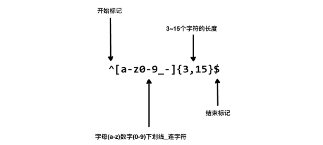 

#### b)  手机号正则

>```js
>/^1[34578][0-9]{9}$/
>```
>
>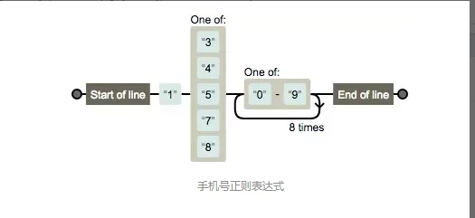 

#### c) 日期匹配与分组替换

>```js
>/^\d{4}[/-]d{1,2}[/-]\d{1,2}$/
>```
>
>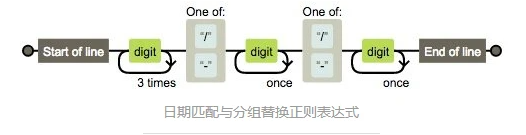 
>
>这个正则比较复杂，画符念咒的地方太多了，一一分析：
>
>- Start of line 是由^生效的表示以此开头
>- 对应结尾End of line 由$生效表示以此结尾
>- 接着看digit 由 d 生效表示数字
>- 3times 由{4} 生效表示重复4次，开始的时候有疑问，为什么不是 4times 。后来明白作者的用意，正则表达式是一个规则，用这个规则去从字符串开始匹配到结束（注意计算机读字符串可是不会分行的，都是一个串，我们看到的多行，人家会认为是个 t ）这里设计好像小火车的轨道一直开到末尾。digit 传过一次，3times表示再来三次循环，共4次，后面的once同理。 自己被自己啰嗦到了。
>- 接下来，是 one of 在手机正则里面已经出现了。表示什么都行。只要符合这两个都让通过。
>
>> 好了这个正则解释完了，接下来用它做什么呢？
>
>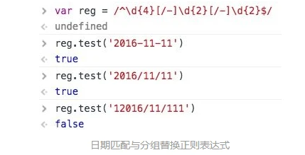 
>
>我们可以验证日期的合法性
>结合URL分组替换所用到的分组特性，我们可以轻松写出日期格式化的方法
>
>> 改造下这个正则
>
>```js
>/^(\d{4})[/-](\d{1,2})[/-](\d{1,2})$/
>```
>
>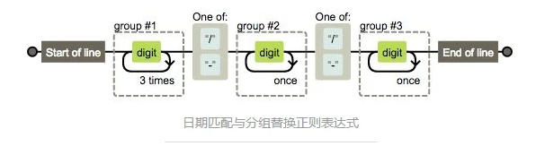 
>
>轻松的可以拿到 group#1 #2 #3 的内容，对应 $1 $2 $3
>
>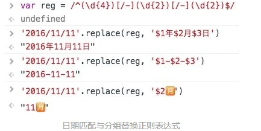 

## 3、基本匹配

>正则表达式其实就是在执行搜索时的格式，它由一些字母(也可以是汉字)和数字组合而成。
>
> 例如：一个正则表达式 `学习的汪 H`，它表示一个规则：由`学`开始，接着是`习`,...最后`H`。它是组个字符与输入的正则表达式作比较,同时大小写敏感
>
>```js
>"学习的汪 H" =>
>努力学习的汪 hongjilin //无符合匹配字符串
>努力学习的汪 Hongjilin   //其中的 [ 学习的汪 H ] 高亮
>```
>
>结果示例:  这里分享一个在线练习正则的网站,同学们可以在这里进行练习  --> [ [在线练习](https://regex101.com/) ]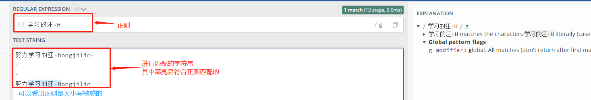

# 二、元字符

> 正则表达式主要依赖于元字符。 元字符不代表他们本身的字面意思，他们都有特殊的含义。**一些元字符写在方括号中的时候有一些特殊的意思**

## 1、元字符列举

>以下是一些元字符的列举：
>
>| 元字符 | 描述                                                         |
>| ------ | ------------------------------------------------------------ |
>| .      | 句号匹配任意单个字符除了换行符。                             |
>| [ ]    | 字符种类。匹配方括号内的任意字符。                           |
>| [^ ]   | 否定的字符种类。匹配除了方括号里的任意字符                   |
>| *      | 匹配>=0个重复的在*号之前的字符。                             |
>| +      | 匹配>=1个重复的+号前的字符。                                 |
>| ?      | 标记?之前的字符为可选.                                       |
>| {n,m}  | 匹配num个大括号之前的字符或字符集 (n <= num <= m).           |
>| (xyz)  | 字符集，匹配与 xyz 完全相等的字符串.                         |
>| \|     | 或运算符，匹配符号前或后的字符.                              |
>| \      | 转义字符,用于匹配一些保留的字符 `[ ] ( ) { } . * + ? ^ $ \ |` |
>| ^      | 从开始行开始匹配.                                            |
>| $      | 从末端开始匹配.                                              |

## 2、点运算符 -->  `.` 

>`.`是元字符中最简单的例子。 `.`匹配任意单个字符，但不匹配换行符。 例如，表达式 [`...o` ] 匹配3个(几个点就几位)任意字符后面跟着是 [ `o` ] 的字符串。
>
>```JS
>'...o' =>  //此处给出三个点 就是前三位为任意
>努力学习的汪 hongjilin   //其中的 [ 汪 ho ] 高亮
>努力学习的汪 Hongjilin   //其中的 [ 汪 Ho ] 高亮
>```
>
>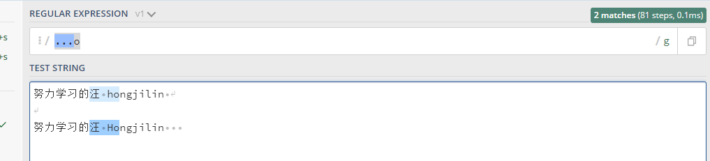 
>
>这时,某个认真看笔记的同学提问: `.` 用来匹配任意字符  那么字符串中的`句号.`,我们又怎么匹配呢?别急,带着这个疑问继续往下看,答案就在下方字符集中

## 3、字符集

>字符集也叫做字符类。 方括号用来指定一个字符集。 在方括号中使用连字符来指定字符集的范围。 在方括号中的字符集不关心顺序。 例如，表达式 [ `学习的汪 [Hh]` ] 匹配 [ `学习的汪 h` ]   和 [ `学习的汪 H` ] 。
>
>```js
>"学习的汪 [Hh]" =>
>努力学习的汪 hongjilin   //其中的 [ 学习的汪 h ] 高亮
>努力学习的汪 Hongjilin   //其中的 [ 学习的汪 H ] 高亮
>```
>
>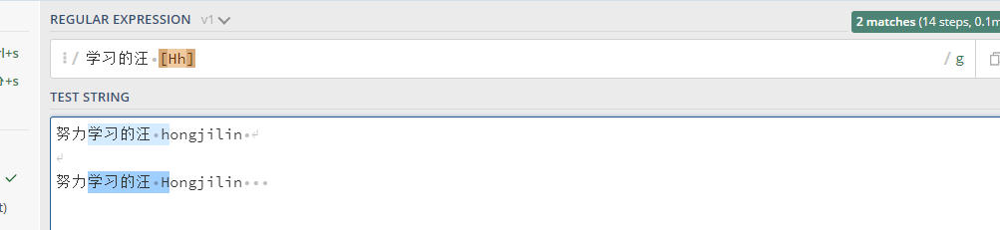 

### Ⅰ- 字符集中匹配句号.   -->>  `[.]`

>前面我们说过`点运算符`,那同学们是否会有个疑惑, `.` 被用来匹配任意字符,那么作为字符串中的`句号.`,又该用什么匹配呢?
>
>方括号的句号就表示句号。 表达式 `lin[.]` 匹配 `lin.`字符串
>
>```js
>"lin[.]" =>
>努力学习的汪 hongjilins 
>努力学习的汪 Hongjilin.  
>```
>
>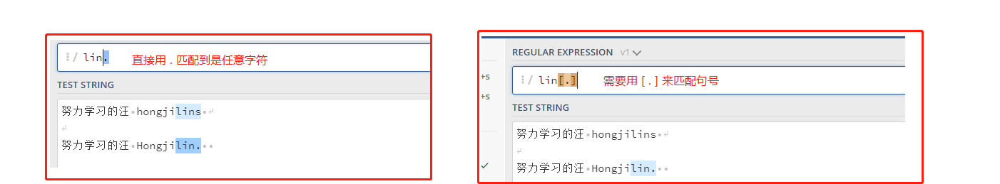 

### Ⅱ -  否定字符集   -->>  `[^]` 

>一般来说 `^` 表示一个字符串的开头，但它用在一个方括号的开头的时候，它表示这个字符集是否定的。 例如，表达式`[^地]学习的[^帅]` 匹配一个字符串为 [ 学习的 ]的, 同时前面一位字符串不能为`地`,后面一位字符串不能为`帅`
>
>```js
>"[^地]学习的[^帅]" => 
>努力学习的汪 hongjilins  //只有此处高亮
>努力学习的帅汪 Hongjilin. 
>帅气地学习的
>```
>
>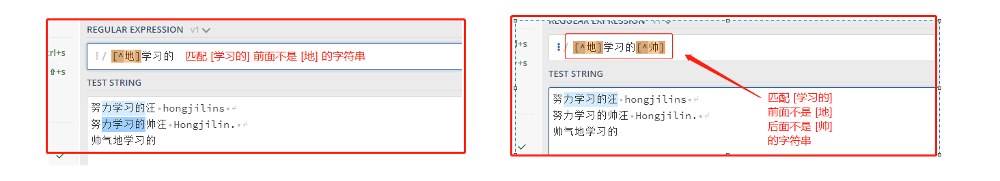  

#### a) 一个特殊的用法

>正则表达式中，点（`.`）是一个特殊字符，代表任意的单个字符，但是有两个例外。一个是四个字节的 UTF-16 字符，这个可以用`u`修饰符解决；另一个是行终止符（line terminator character）。
>
>所谓行终止符，就是该字符表示一行的终结。以下四个字符属于“行终止符”。
>
>- U+000A 换行符（`\n`）
>- U+000D 回车符（`\r`）
>- U+2028 行分隔符（line separator）
>- U+2029 段分隔符（paragraph separator）
>
>```javascript
>/foo.bar/.test('foo\nbar') // false
>```
>
>上面代码中，因为`.`不匹配`\n`，所以正则表达式返回`false`。
>
>但是，很多时候我们希望匹配的是任意单个字符，这时有一种变通的写法。
>
>```javascript
>/foo[^]bar/.test('foo\nbar') // true
>```
>
>当然,这种解决方案毕竟不太符合直觉， [ES2018](https://github.com/tc39/proposal-regexp-dotall-flag) 引入`s`修饰符，使得`.`可以匹配任意单个字符。
>
>```javascript
>/foo.bar/s.test('foo\nbar') // true
>```
>
>详见ES系列笔记正则部分  -->   **[ES6及后续版本学习笔记](https://gitee.com/hongjilin/hongs-study-notes/tree/master/编程_前端开发学习笔记/ES6及后续版本学习笔记)** 

### Ⅲ - 重复次数  -->> `*、+、?`

>后面跟着元字符 `+`，`*` or `?` 的，用来指定匹配子模式的次数。 这些元字符在不同的情况下有着不同的意思。

#### a)  `*` 号

>`*`号匹配 在`*`之前的字符出现`大于等于0`次。 例如，表达式 `a*` 匹配0或更多个以a开头的字符。表达式`[a-z]*` 匹配一个行中所有以小写字母开头的字符串。
>
>```js
>"[a-z]*" =>
>Hong ji lin VERY shuai //部分高亮
>HONGJILINHAOSHUAI	  //全部不亮
>hongjilinhaoshuai	  //全部高亮
>```
>
>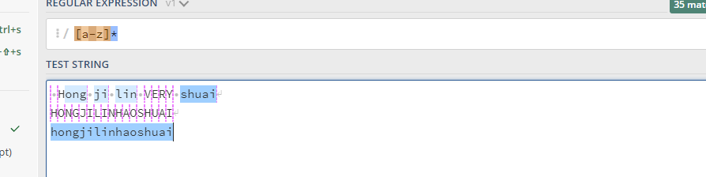 
>
>> `*`号搭配 `.`号
>
>`*`字符和`.`字符搭配可以匹配所有的字符`.*`。 `*`和表示匹配空格的符号`\s`连起来用，如表达式`\s*学习\s*`匹配0或更多个空格开头和0或更多个空格结尾的cat字符串。
>
>```js
>"\s*学习\s*" => 					  //0~无限次,所以只要有[ 学习 ]都会被匹配,同时会被匹配的还有其紧靠的无限次的空格
>努力 学习的汪 hongjilins  		    //[ 学习 ]前一个空格,后面无空格
>努力      学习       的汪hongjilins    //[ 学习 ]前后多个空格
>努力学习的帅汪 Hongjilin. 			   //[ 学习 ] 前后无空格 
>```
>
>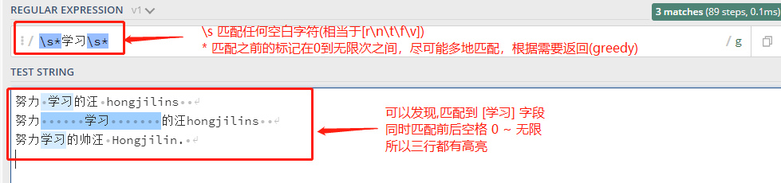 

#### b) `+`号

>`+`号匹配`+`号之前的字符出现 >=1 次。 例如表达式`学习.+汪` 匹配以中文(也可以是字母)`学习`开头以 [汪] 结尾，中间跟着至少一个字符的字符串。
>
>```js
>"学习.+汪" => 
>努力学习的汪 hongjilins   
>努力学习的帅汪 Hongjilin. 
>努力学习 66 汪 Hongjilin. 
>努力的学习汪  			 //此行无匹配结果
>```
>
>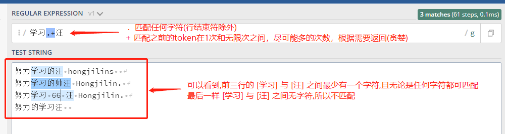 

#### c) `?` 号

>在正则表达式中元字符 `?` 标记在符号前面的字符为可选，即出现 0 或 1 次。 例如，表达式 `学习的[帅]?汪` 匹配字符串 `学习的汪` 和 `学习的帅汪`。
>
>```js
>"学习的[帅]?汪" => 
>努力学习的汪 hongjilins
>努力学习的帅汪 Hongjilin. 
>努力的学习汪 				//无匹配结果
>努力学习的帅气汪 Hongjilin. //无匹配结果
>```
>
>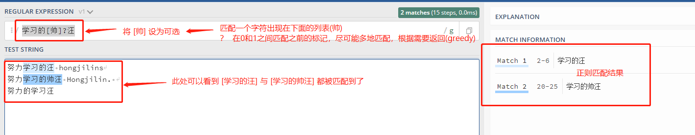

### Ⅳ -  量词  -->> `{}` 

#### a) 正常使用示例

>在正则表达式中 `{}` 是一个量词，常用来限定一个或一组字符可以重复出现的次数。 例如， 表达式 `[0-9]{2,3}` 匹配最少 2 位最多 3 位 0~9 的数字。
>
>```js
>"[0-9]{2,3}" => 
>努力学习的1汪1
>努力学习的233汪
>努力学习的4个4444汪
>努力学习的5个55555汪
>```
>
>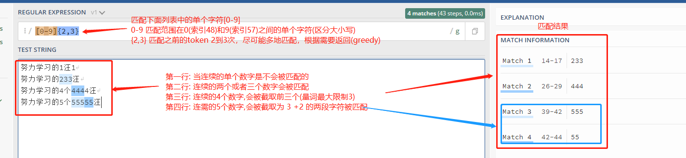

#### b) 省略第二个参数,带逗号

>我们可以省略第二个参数。 例如，`[0-9]{2,}` 匹配至少两位 0~9 的数字。
>
>```js
>"[0-9]{2,}" => 
>努力学习的1汪1
>努力学习的233汪
>努力学习的4个4444汪
>努力学习的5个55555汪
>```
>
>[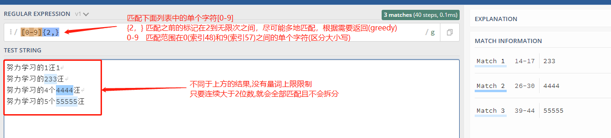  ](https://regex101.com/r/Gdy4w5/1)

#### c) 逗号也省略

>如果逗号也省略掉则表示重复固定的次数。 例如，`[0-9]{2}` 匹配2位数字
>
>```js
>"[0-9]{2}" => 
>努力学习的1汪1
>努力学习的233汪
>努力学习的4个4444汪
>努力学习的5个55555汪
>```
>
>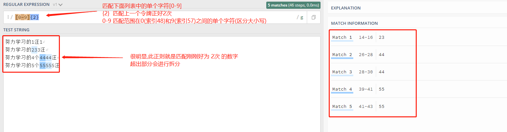 

### Ⅴ-  特征标群  -->>  `(...)` 

>特征标群是一组写在 `(...)` 中的子模式。`(...)` 中包含的内容将会被看成一个整体，和数学中小括号（ ）的作用相同。例如, 表达式 `(ab)*` 匹配连续出现 0 或更多个 `ab`。如果没有使用 `(...)` ，那么表达式 `ab*` 将匹配连续出现 0 或更多个 `b` 。再比如之前说的 `{}` 是用来表示前面一个字符出现指定次数。但如果在 `{}` 前加上特征标群 `(...)` 则表示整个标群内的字符重复 N 次。
>
>我们还可以在 `()` 中用或字符 `|` 表示或。例如，`(学习|打工)的汪` 匹配 `学习的汪` 或 `打工的汪` .
>
>```js
>"(学习|打工)的汪 (hong){2}" => 
>努力学习的汪 hongjilins
>努力学习打工的汪 hongjilins
>努力打工的汪 honghongjilins
>努力学习打工的汪 honghongjilins
>```
>
>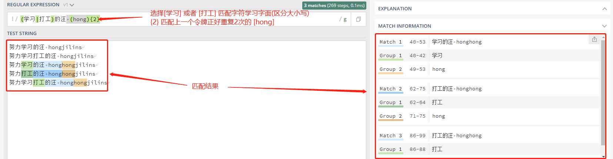

### Ⅵ - 或运算符   -->>  `|`

>或运算符就表示或，用作判断条件。
>
>举个栗子:  `(学习|打工)的(汪|打工人)` 进行匹配
>
>```js
>"(学习|打工)的(汪|打工人)" =>
>努力打工的汪 hongjilins
>努力学习的打工人 honghongjilins
>努力学习打工的打工人汪 hongjilins
>```
>
>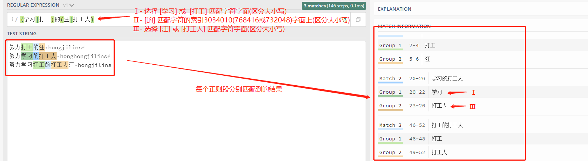 

### Ⅶ -  转码特殊字符   -->>  `\`

>反斜线 `\` 在表达式中用于转码紧跟其后的字符。用于指定 `{ } [ ] / \ + * . $ ^ | ?` 这些特殊字符。如果想要匹配这些特殊字符则要在其前面加上反斜线 `\`。
>
>例如 `.` 是用来匹配除换行符外的所有字符的。如果想要匹配句子中的 `.` 则要写成 `\.` 以下这个例子 `\.?`是选择性匹配`.`
>
>```js
>"(学习|打工)的汪\.? hong\??" =>
>努力打工的汪. hong
>努力学习的汪? hong
>努力学习的汪 hong?
>```
>
>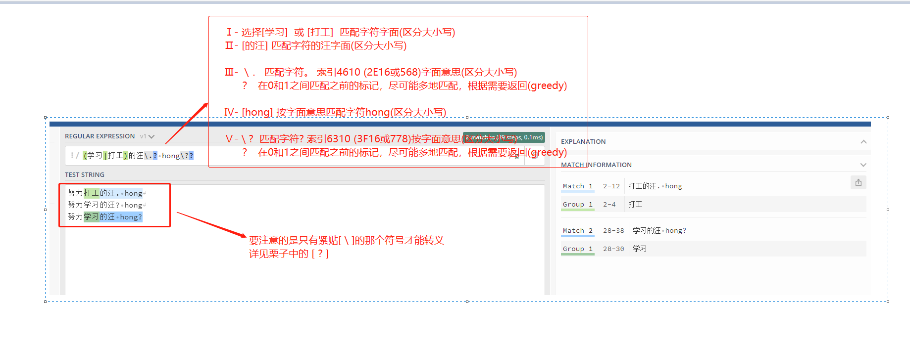 

### Ⅷ -  锚点(边界)  -->>  `^、$、\b、\B`

>在正则表达式中，想要匹配指定开头或结尾的字符串就要使用到锚点。`^` 指定开头，`$` 指定结尾。
>
>通常也会搭配`标志`(修饰符)相关知识点使用
>
>由于还未说到`标志`相关知识,此处例子仍使用 [ /g ]全局搜索,如果对此有疑惑的可以留着疑问看下方的 [五、标志](#五、标志) 

#### a) `^` 号

>`^` 用来检查匹配的字符串是否在所匹配字符串的开头。
>
>例如，在 `abc` 中使用表达式 `^a` 会得到结果 `a`。但如果使用 `^b` 将匹配不到任何结果。因为在字符串 `abc` 中并不是以 `b` 开头。
>
>例如，`^(学习|打工)的汪` 进行匹配
>
>```js
>"^(学习|打工)的汪" =>  //注意:下列字符串要分四次匹配,因为即使换行了,后三行字符串本质上都不在字符串开头
>//或者标志换成 /m 而不是 /g  因为此处还未说到标志,所以默认大家使用/g全局搜索
>学习的汪 hong
>打工的汪 hong
>努力打工的汪 hong
>努力学习的汪
>```
>
>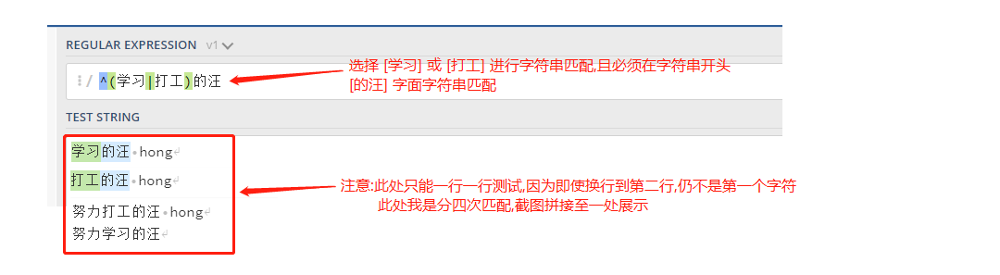 

#### b) `$` 号

>同理于 `^` 号，`$` 号用来匹配字符是否是最后一个。
>
>例如，`学习的(汪|打工人)$` 匹配以 [ 汪 ] 或者 [ 打工人 ]  结尾的字符串。
>
>```js
>"学习的(汪|打工人)$" =>  //注意:下列字符串要分四次匹配,因为即使换行了,前三行字符串本质上都不在字符串结尾
>//或者标志换成 /m 而不是 /g  因为此处还未说到标志,所以默认大家使用/g全局搜索
>努力学习的汪 
>努力学习的打工人
>努力学习的打工人 hongjilins
>努力学习的汪_  //此处 _ 模拟表示空格 
>```
>
>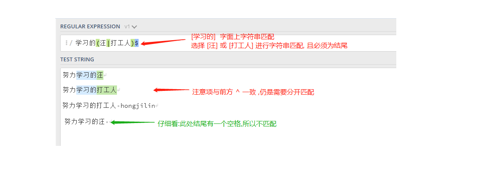 

#### c) 单词边界 `\b`

>\b : 单词边界:指[a-zA-z0-9]之外的字符,举个栗子:`\bis\b`
>
>```js
>'\bis\b'=>
>My name is hongjilin
>my name@is@hong jilin
>myname学is习hongjilin
>mynameishongjilin //只有此处不被匹配
>```
>
>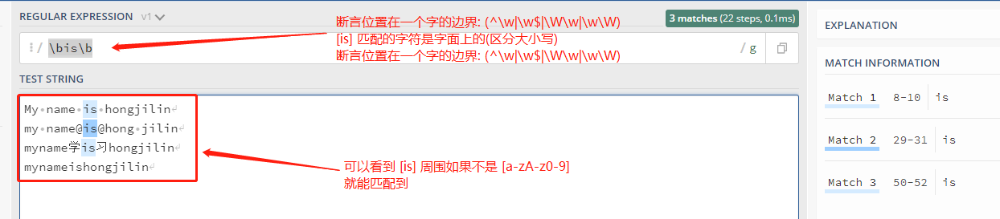 

#### d) 非单词边界 `\B`

>```js
>'\Bis\B'=>
>My name is hongjilin
>my name@is@hong jilin
>myname学is习hongjilin
>mynameishongjilin //只有此处被匹配,与单词边界切好相反
>```
>
>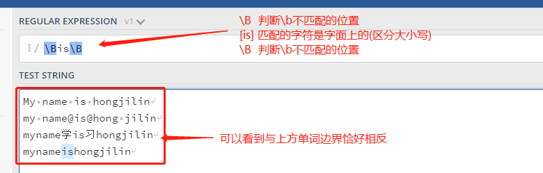 


# 三、简写字符集

>这些简写字符集,简洁明了且非常常用,但是也因为这样当初没有仔细去记,用时还得查阅资料十分不便,建议背下来
>
>正则表达式提供一些常用的字符集简写。如下:   
>
>| 简写 | 描述                                               |
>| ---- | -------------------------------------------------- |
>| .    | 除换行符外的所有字符                               |
>| \w   | 匹配所有字母数字，等同于 `[a-zA-Z0-9_]`            |
>| \W   | 匹配所有非字母数字，即符号，等同于： `[^\w]`       |
>| \d   | 匹配数字： `[0-9]`                                 |
>| \D   | 匹配非数字： `[^\d]`                               |
>| \s   | 匹配所有空格字符，等同于： `[\t\n\f\r\p{Z}]`       |
>| \S   | 匹配所有非空格字符： `[^\s]`                       |
>| \f   | 匹配一个换页符                                     |
>| \n   | 匹配一个换行符                                     |
>| \r   | 匹配一个回车符                                     |
>| \t   | 匹配一个制表符                                     |
>| \v   | 匹配一个垂直制表符                                 |
>| \p   | 匹配 CR/LF（等同于 `\r\n`），用来匹配 DOS 行终止符 |

# 四、零宽度断言 (前后预查)

>先行断言和后发断言都属于**非捕获簇**（不捕获文本 ，也不针对组合计进行计数）。 先行断言用于判断所匹配的格式是否在另一个确定的格式之前，匹配结果不包含该确定格式（`仅作为约束`）。
>
>例如，我们想要获得所有跟在 `$` 符号后的数字，我们可以使用正后发断言 `(?<=\$)[0-9\.]*`。 这个表达式匹配 `$` 开头，后面可以跟着`单个字符`:[0~9]、[.]、[?],这些字符可以出现大于等于 0 次。
>
>```js
>"(?<=\$)[0-9\.\?]*" =>
>$0.,1,2,3,$4,5,6,$?7,8,$..9.9?
>//0.     //4    //?7   //..9.9?
>```
>
>零宽度断言如下：
>
>| 符号 | 描述            |
>| ---- | --------------- |
>| ?=   | 正先行断言-存在 |
>| ?!   | 负先行断言-排除 |
>| ?<=  | 正后发断言-存在 |
>| ?<!  | 负后发断言-排除 |

## 1、 正先行断言  -->>  `?=...`

>`?=...` 正先行断言，表示第一部分表达式之后必须跟着 `?=...`定义的表达式。
>
>返回结果只包含满足匹配条件的第一部分表达式(即不会返回先行断言匹配部分的内容)。 定义一个正先行断言要使用 `()`。在括号内部使用一个问号和等号： `(?=...)`。
>
>正先行断言的内容写在括号中的等号后面。 例如，表达式 `学习的汪(?=\shong)` 首先匹配 [ 学习的汪 ]，然后在括号中我们又定义了正先行断言 `(?=\shong)` ，即  [ 学习的汪 ]后面紧跟着 [ `(空格)hong `]。
>
>```js
>"学习的汪(?=\shong)" =>  //此处断言中的可以再加如`+` 、`*` ......,此处举其中一个栗子说明
>努力学习的汪 hong //只有此处被匹配到    返回: [学习的汪]  -->断言中的匹配项作为约束不会返回
>努力学习的汪 帅
>努力学习的汪hong  //此处后面没有空格
>```
>
>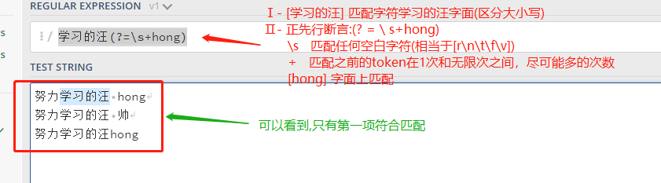 

## 2、负先行断言  -->>  `?!...` 

>负先行断言 `?!` 用于筛选所有匹配结果，筛选条件为 其后不跟随着断言中定义的格式。 `正先行断言` 定义和 `负先行断言` 一样，区别就是 `=` 替换成 `!` 也就是 `(?!...)`。
>
>表达式 `学习的汪(?!\s+hong)` 首先匹配 [ 学习的汪 ]，然后在括号中我们又定义了负先行断言 `(?!\shong)` ,即  [ 学习的汪 ]后面不跟着 [ `(空格)hong ` ]。
>
>```js
>"学习的汪(?!\s+hong)" => 
>努力学习的汪 hong  //只有此处不被匹配到
>努力学习的汪 帅
>努力学习的汪hong
>```
>
>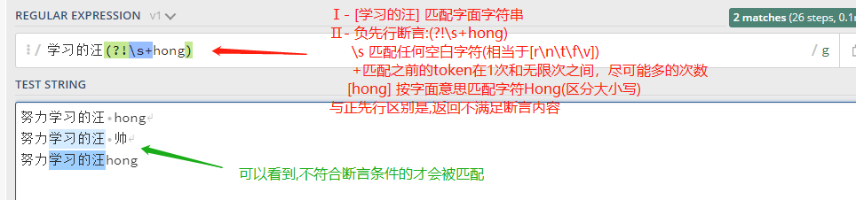 

## 3、 正后发断言  -->>  `?<= ...`

>正后发断言 记作`(?<=...)` 用于筛选所有匹配结果，筛选条件为 其前跟随着断言中定义的格式。 例如，表达式 `(?<=[学习|打工])的(汪|打工人)` 匹配  [汪]  和  [打工人] ，且需要其前方跟着 [学习] 或  [打工] 。
>
>```js
>"(?<=[学习|打工])的(汪|打工人)" => 
>努力学习的汪
>努力打工的打工人
>努力学习汪
>```
>
>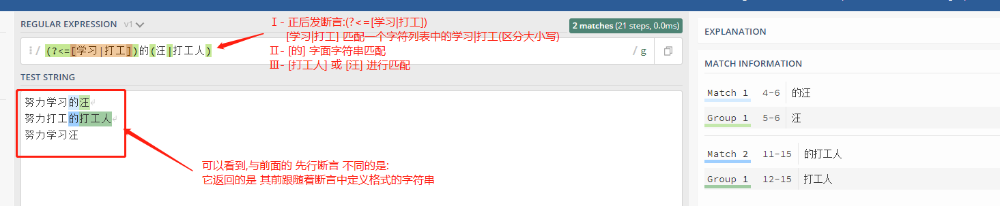 

## 4、负后发断言  -->>  `?<!...`

>负后发断言 记作 `(?<!...)` 用于筛选所有匹配结果，筛选条件为 其前 **不** 跟随着断言中定义的格式。 例如，表达式 `(?<![学习|打工])的(汪|打工人)` 匹配  [汪]  和  [打工人] ，且需要其前方 **不** 跟着 [学习] 或  [打工] 。
>
>```js
>"/(?<![学习|打工])的(汪|打工人)/g" => 
>努力学习的汪
>努力打工的打工人
>努力学习汪
>```
>
>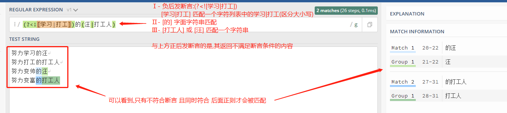

# 五、标志(修饰符)

>标志也叫模式修正符，因为它可以用来修改表达式的搜索结果。 这些标志可以任意的组合使用，它也是整个正则表达式的一部分。
>
>| 标志 | 描述                                                  |
>| ---- | ----------------------------------------------------- |
>| i    | 忽略大小写。                                          |
>| g    | 全局搜索。                                            |
>| m    | 多行修饰符：锚点元字符 `^` `$` 工作范围在每行的起始。 |

## 1、全局搜索 (Global search)  -->>  `\g`

>修饰符 `g` 常用于执行一个全局搜索匹配，即（不仅仅返回第一个匹配的，而是返回全部）。 例如，表达式 `/学习的汪/g` 表示搜索 任意字符（除了换行）+ `学习的汪`，并返回全部结果。
>
>```
>"/学习的汪/g" => 
>努力学习的汪
>努力学习的汪
>非常努力学习的汪
>```
>
>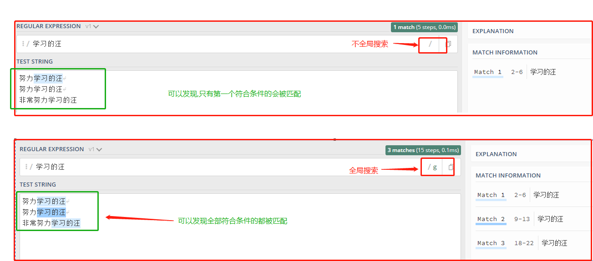

## 2、忽略大小写 (Case Insensitive)  -->>  `/i`

>修饰语 `i` 用于忽略大小写。 例如，表达式 `/Hong/gi` 表示在全局搜索 `Hong`，在后面的 `i` 将其条件修改为忽略大小写，则变成搜索 [hong(忽略大小写)]，`g` 表示全局搜索。
>
>```js
>"/Hong/gi" =>  //默认情况下是大小写敏感的,但此处这样标志后,就成为忽略大小写
>hongjilin
>Hongjilin
>HONGJILIN
>hOngjilin
>```
>
>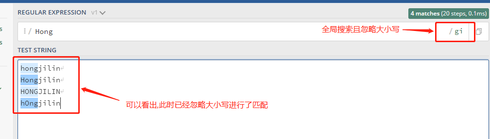

## 3、 多行注释符

>多行修饰符 `m` 常用于执行一个多行匹配。
>
>像之前介绍的 `(^,$)` 用于检查格式是否是在待检测字符串的开头或结尾。但我们如果想要它在每行的开头和结尾生效，我们需要用到多行修饰符 `m`。
>
>例如，表达式 `/学习的(汪|打工人)$/gm` 表示 [学习的] 后面跟着 [汪] 或 [打工人] ，末尾可选除换行符外任意字符。根据 `m` 修饰符，现在表达式匹配每行的结尾。-->此处举出上方锚点的例子
>
>```js
>"/学习的(汪|打工人)$/gm" =>  //在之前说到 锚点 时提到,如果是 /g 只能一行一行匹配,而如果换成这个就可以直接匹配
>努力学习的汪
>努力学习的打工人
>努力学习的打工人 hongjilins
>努力学习的汪_  //此处 _ 模拟表示空格 
>```
>
>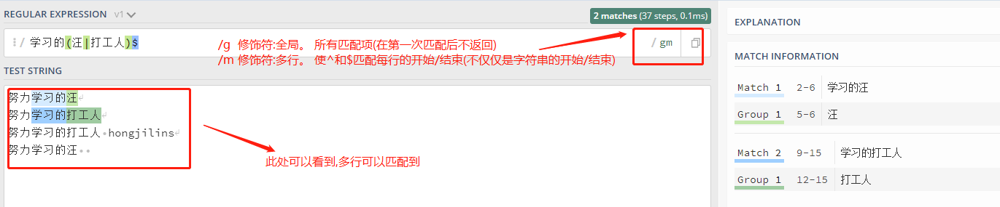

# 六 、贪婪匹配与惰性匹配 (Greedy vs lazy matching)

## 1、贪婪匹配

>正则表达式默认采用贪婪匹配模式，在该模式下意味着会匹配尽可能长的子串。
>
>```js
>"/(.*汪)/" => 
>努力学习的汪 非常认真读书的汪  的汪  的汪
>```
>
>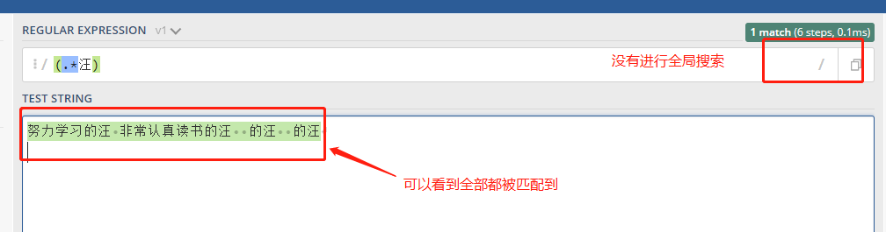 

## 2、 惰性匹配

>我们可以使用 `?` 将贪婪匹配模式转化为惰性匹配模式。
>
>```js
>"/(.*?汪)/" => 
>努力学习的汪 非常认真读书的汪  的汪  的汪
>```
>
>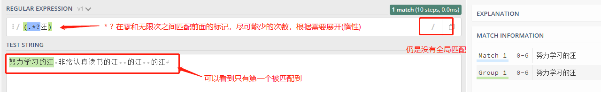

# 七、正则常用方法

>**正则中常用方法主要分为两类，一类是：RegExp对象方法；一类是：支持正则表达式的String对象的方法。**
>
>此处主要列举常用的

## 1、 RegExp对象方法:

>RegExp对象方法:exce()、test() 、compile()

### Ⅰ-  exce()方法

#### a) 概念与介绍

>1. exec() 方法用于检索字符串中的正则表达式的匹配，如果字符串中有匹配的值返回该匹配值构成的数组 ，
>2. 该数组还有继承的属性：
>   - index：表示第一个匹配的字符在原字符串中的位置，
>   - input:表示原字符串，
>   - groups：表示当初中命名的分组时匹配到的分组对象；
>3. exec()方法没有匹配到数据时返回 null。

#### b) 当正则匹配中没有分组时

>```js
>const str="努力666 123 学习! 456 的打工人! qrw";
>const patt=/\d+/;
>const result=patt.exec(str);
>console.log(result)
>```
>
>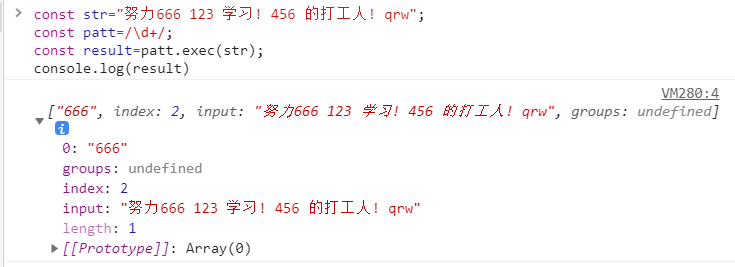 

#### c ) 当正则匹配中有分组且分组存在名字时

>```js
>const str="努力666 123 学习! 456 的打工人! qrw";
>const patt=/(?<努力>\d)+/;
>const result=patt.exec(str);
>console.log(result)
>```
>
>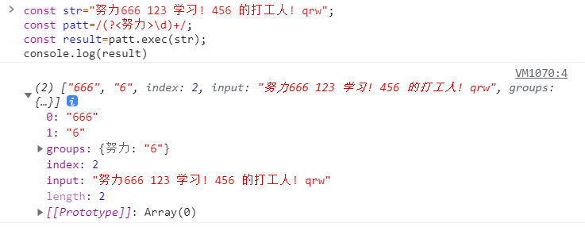 

#### d) 没有匹配到符合正则的字符时

>```js
>const str="努力学习的汪";
>const patt=/\d+/;
>const result=patt.exec(str);
>console.log(result)  //返回 null
>```
>
> 

### Ⅱ - test()方法

>介绍：方法用于检测一个字符串是否匹配某个模式；如果字符串中有匹配的值返回 true ，否则返回 false。
>
>```js
>const str="努力学习的汪";
>//查找"学习"
>const reg1=/学习/g;
>const result1=reg1.test(str);
>console.log(result1); //true
>//查找 "打工"
>const reg2=/打工/g;
>const result2=reg2.test(str);
>console.log(result2); //false
>```
>
>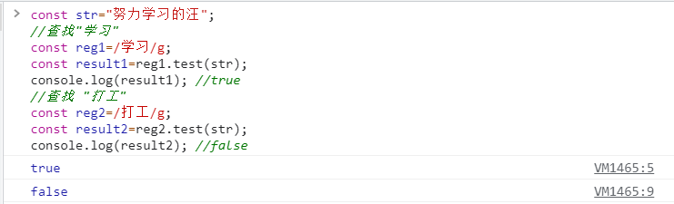 

### Ⅲ -  compile()方法

>该方法的作用是能够对正则表达式进行编译，被编译过的正则在使用的时候效率会更高，适合于对一个正则多次调用的情况下，如果对一个正则只使用一两次，那么该方法没有特别显著的效应。
>
>```js
>const reg=/[abc]/gi;
>console.log(reg.test('a'));//true
>reg=/[cde]/gi;
>console.log(reg.test('a')); //false
>reg.compile(reg);
>console.log(reg.test('a')); //false
>```
>
>被编译的正则和没有编译的正则在测试结果上没有任何区别，只是多次调用的效率上会更高一些

## 2、支持正则表达式的String对象的方法:

>字符串对象共有 4 个方法，可以使用正则表达式：`match()`、`replace()`、`search()`和`split()`。
>
>ES6 将这 4 个方法，在语言内部全部调用`RegExp`的实例方法，从而做到所有与正则相关的方法，全都定义在`RegExp`对象上。
>
>- [ String.prototype.match ] 调用 `RegExp.prototype[Symbol.match]`
>- [ String.prototype.replace ]  调用 `RegExp.prototype[Symbol.replace]`
>- [ String.prototype.search ]  调用 `RegExp.prototype[Symbol.search]`
>- [ String.prototype.split ]  调用 `RegExp.prototype[Symbol.split]`
>
>ES系列更多笔记可以点此跳转  -->> **[ES6及后续版本学习笔记](https://gitee.com/hongjilin/hongs-study-notes/tree/master/编程_前端开发学习笔记/ES6及后续版本学习笔记)** 

### Ⅰ- search()方法

#### a) 概念与介绍

>用于检索字符串中指定的子字符串，或检索与正则表达式相匹配的子字符串。
>如果找到任何匹配的子串，则返回 该子串在原字符串中的第一次出现的位置。　　
>如果没有找到任何匹配的子串，则返回 -1。

#### b) 举个栗子

>```js
>const str1 = '努力学习 123 的汪 456';
>const reg1 = /\d+/; 
>console.log(str1.search(reg1));//5
>console.log(str1.search("的汪"));//9
>const str2 = 'hello world';
>const reg2 = /\d+/;
>console.log(str2.search(reg2));//-1
>console.log(str2.search("打工人"));//-1
>```
>
>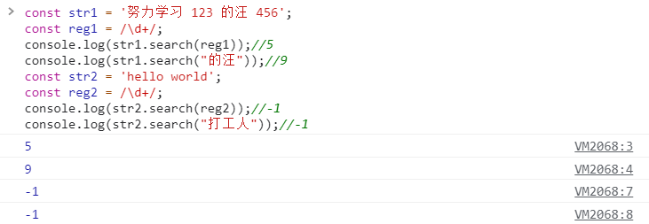 

### Ⅱ - replace()方法

#### a) 概念与介绍

>用于在字符串中用一些字符替换另一些字符，或替换一个与正则表达式匹配的子串。原字符串不变，创建一个新的字符串
>
>创建一个新的字符串，原字符串不变

#### b) 替换第一个

>```js
>const str="努力学习的汪! 努力学习的汪!! 努力学习的汪!!!"; 
>const n=str.replace('学习',"打工");
>console.log(str) //原字符串不变
>console.log(n) //新字符串
>```
>
>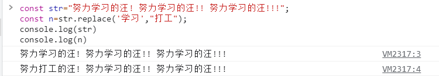 

#### c) 替换全部

>```js
>const str="努力学习的汪! 努力学习的汪!! 努力学习的汪!!!"; 
>const n=str.replace(/学习/g,"打工");   //替换全部
>const a=str.replace(/学习/,"打工"); //仍是替换单行
>console.log(str) //原字符串不变
>console.log(a) //仍是替换单行
>console.log(n) //新字符串 全部替换
>```
>
>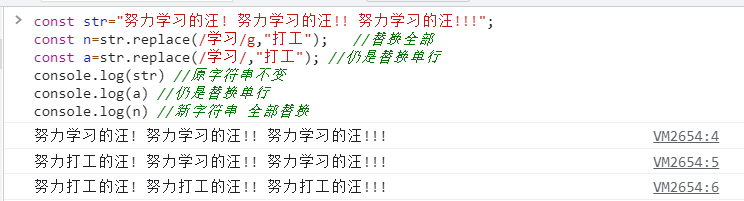 

### Ⅲ - split()方法

#### a) 概念与介绍

>用于把一个字符串按符合匹配条件的方式分割成一个字符串数组。不改变原字符串

#### b) 举个栗子

>```js
>const str="How 1are 2you 3? 4I'm 5fine! 6thanks";
>const a=str.split(" ");
>const b=str.split(" ",2);
>const c=str.split(/\d/);
>const d=str.split(/\d/,3);
>console.log(a);  // ["How", "1are", "2you", "3?", "4I'm", "5fine!", "6thanks"]
>console.log(b);  // ["How", "1are"]
>console.log(c);  // ["How ", "are ", "you ", "? ", "I'm ", "fine! ", "thanks"]
>console.log(d);  // ["How ", "are ", "you "]
>```
>
>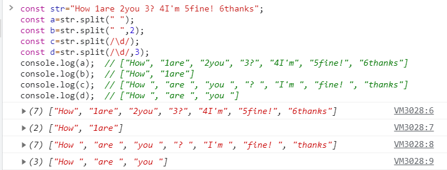 

### Ⅳ- match()方法

#### a) 概念与介绍

>1. 概念: match() 方法可在字符串内检索指定的值，或找到一个或多个正则表达式的匹配
>2. 注意点: match() 方法将检索字符串 String，以找到一个或多个与 regexp 匹配的文本。这个方法的行为在很大程度上有赖于 regexp 是否具有标志 g。
>   - 如果 regexp 没有标志 g，那么 match() 方法就只能在 stringObject 中执行一次匹配，**与exce的完全一致**
>   - 如果 regexp 有标志 g，它将找到全部符合正则子字符串，并返回一个数组。
>   - 如果没有找到任何匹配的文本，无论有没有g，match() 将返回 null

#### b) 没有g的正则匹配

>```js
>const str = '努力学习 123 的汪 456';
>const reg=/\d+/;
>const result=str.match(reg); 
>console.log(result)  //没有 全局搜索 的时候返回与 exce() 完全一致
>```
>
>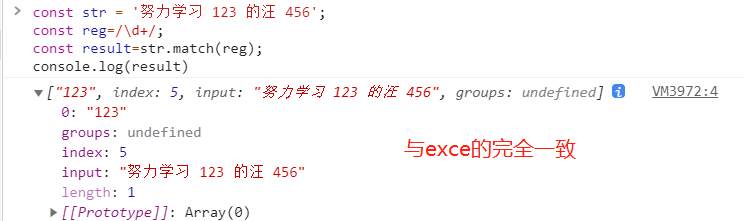 

#### c)  有g的正则匹配

>```js
>const str = '努力学习 123 的汪 456';
>const reg=/\d+/g;
>const result=str.match(reg); 
>console.log(result)  //返回数组
>```
>
>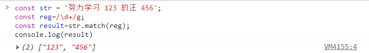 

#### d) 没有匹配到子字符串

>```js
>const str = '努力学习 123 的汪 456';
>const reg=/打工/g;
>const result=str.match(reg); 
>console.log(result)  //匹配不到返回null
>```
>
>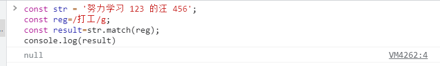 

# 八、ES系列中正则的拓展

>  更多ES系列知识点笔记  -->  **[ES6及后续版本学习笔记](https://gitee.com/hongjilin/hongs-study-notes/tree/master/编程_前端开发学习笔记/ES6及后续版本学习笔记)** 

## 1、概括与总结

>- **变更RegExp构造函数入参**：允许首参数为`正则对象`，尾参数为`正则修饰符`(返回的正则表达式会忽略原正则表达式的修饰符)
>- **正则方法调用变更**：字符串对象的`match()`、`replace()`、`search()`、`split()`内部调用转为调用`RegExp`实例对应的`RegExp.prototype[Symbol.方法]`
>- **u修饰符**：Unicode模式修饰符，正确处理大于 [ \uFFFF ] 的 [ Unicode字符 ]
> - `点字符`(.)
> - `Unicode表示法`
> - `量词`
> - `预定义模式`
> - `i修饰符`
> - `转义`
>- **y修饰符**：粘连修饰符，确保匹配必须从剩余的第一个位置开始全局匹配(与`g修饰符`作用类似)
>- **unicode**：是否设置`u修饰符`
>- **sticky**：是否设置`y修饰符`
>- **flags**：返回正则表达式的修饰符
>
>> 重点难点
>
>- `y修饰符`隐含头部匹配标志`^`
>- 单单一个`y修饰符`对`match()`只能返回第一个匹配，必须与`g修饰符`联用才能返回所有匹配

## 2、 RegExp 构造函数

>在 ES5 中，`RegExp`构造函数的参数有两种情况。
>
>第一种情况是，参数是字符串，这时第二个参数表示正则表达式的修饰符（flag 标志）。
>
>```javascript
>var regex = new RegExp('xyz', 'i');
>// 等价于
>var regex = /xyz/i;
>```
>
>第二种情况是，参数是一个正则表示式，这时会返回一个原有正则表达式的拷贝。
>
>```javascript
>var regex = new RegExp(/xyz/i);
>// 等价于
>var regex = /xyz/i;
>```
>
>但是，ES5 不允许此时使用第二个参数添加修饰符，否则会报错。
>
>```javascript
>var regex = new RegExp(/xyz/, 'i');
>// Uncaught TypeError: Cannot supply flags when constructing one RegExp from another
>```
>
>ES6 改变了这种行为。如果`RegExp`构造函数第一个参数是一个正则对象，那么可以使用第二个参数指定修饰符。而且，返回的正则表达式会忽略原有的正则表达式的修饰符，只使用新指定的修饰符。
>
>```javascript
>new RegExp(/abc/ig, 'i').flags
>// "i"
>```
>
>上面代码中，原有正则对象的修饰符是`ig`，它会被第二个参数`i`覆盖。

## 3、字符串的正则方法

>字符串对象共有 4 个方法，可以使用正则表达式：`match()`、`replace()`、`search()`和`split()`。
>
>ES6 将这 4 个方法，在语言内部全部调用`RegExp`的实例方法，从而做到所有与正则相关的方法，全都定义在`RegExp`对象上。
>
>- [ String.prototype.match ] 调用 `RegExp.prototype[Symbol.match]`
>- [ String.prototype.replace ]  调用 `RegExp.prototype[Symbol.replace]`
>- [ String.prototype.search ]  调用 `RegExp.prototype[Symbol.search]`
>- [ String.prototype.split ]  调用 `RegExp.prototype[Symbol.split]`

## 4、 u 修饰符

>ES6 对正则表达式添加了`u`修饰符，含义为“Unicode 模式”，用来正确处理大于`\uFFFF`的 Unicode 字符。也就是说，会正确处理四个字节的 UTF-16 编码。
>
>```javascript
>/^\uD83D/u.test('\uD83D\uDC2A') // false
>/^\uD83D/.test('\uD83D\uDC2A') // true
>```
>
>上面代码中，`\uD83D\uDC2A`是一个四个字节的 UTF-16 编码，代表一个字符。但是，ES5 不支持四个字节的 UTF-16 编码，会将其识别为两个字符，导致第二行代码结果为`true`。加了`u`修饰符以后，ES6 就会识别其为一个字符，所以第一行代码结果为`false`。
>
>一旦加上`u`修饰符号，就会修改下面这些正则表达式的行为:

### Ⅰ-  点字符

>点（`.`）字符在正则表达式中，含义是除了换行符以外的任意单个字符。对于码点大于`0xFFFF`的 Unicode 字符，点字符不能识别，必须加上`u`修饰符。
>
>```javascript
>var s = '𠮷';
>/^.$/.test(s) // false
>/^.$/u.test(s) // true
>```
>
>上面代码表示，如果不添加`u`修饰符，正则表达式就会认为字符串为两个字符，从而匹配失败。

### Ⅱ - Unicode 字符表示法

>ES6 新增了使用大括号表示 Unicode 字符，这种表示法在正则表达式中必须加上`u`修饰符，才能识别当中的大括号，否则会被解读为量词。
>
>```javascript
>/\u{61}/.test('a') // false
>/\u{61}/u.test('a') // true
>/\u{20BB7}/u.test('𠮷') // true
>```
>
>上面代码表示，如果不加`u`修饰符，正则表达式无法识别`\u{61}`这种表示法，只会认为这匹配 61 个连续的`u`。

### Ⅲ -  量词

>使用`u`修饰符后，所有量词都会正确识别码点大于`0xFFFF`的 Unicode 字符。
>
>```javascript
>/a{2}/.test('aa') // true
>/a{2}/u.test('aa') // true
>/𠮷{2}/.test('𠮷𠮷') // false
>/𠮷{2}/u.test('𠮷𠮷') // true
>```

### Ⅳ - 预定义模式

>`u`修饰符也影响到预定义模式，能否正确识别码点大于`0xFFFF`的 Unicode 字符。
>
>```javascript
>/^\S$/.test('𠮷') // false
>/^\S$/u.test('𠮷') // true
>```
>
>上面代码的`\S`是预定义模式，匹配所有非空白字符。只有加了`u`修饰符，它才能正确匹配码点大于`0xFFFF`的 Unicode 字符。
>
>利用这一点，可以写出一个正确返回字符串长度的函数。
>
>```javascript
>function codePointLength(text) {
>  var result = text.match(/[\s\S]/gu);
>  return result ? result.length : 0;
>}
>var s = '𠮷𠮷';
>s.length // 4
>codePointLength(s) // 2
>```

### Ⅴ -  i 修饰符

>有些 Unicode 字符的编码不同，但是字型很相近，比如，`\u004B`与`\u212A`都是大写的`K`。
>
>```javascript
>/[a-z]/i.test('\u212A') // false
>/[a-z]/iu.test('\u212A') // true
>```
>
>上面代码中，不加`u`修饰符，就无法识别非规范的`K`字符。

### Ⅵ -  转义

>没有`u`修饰符的情况下，正则中没有定义的转义（如逗号的转义`\,`）无效，而在`u`模式会报错。
>
>```javascript
>/\,/ // /\,/
>/\,/u // 报错
>```
>
>上面代码中，没有`u`修饰符时，逗号前面的反斜杠是无效的，加了`u`修饰符就报错。

### Ⅶ- RegExp.prototype.unicode 属性 

>正则实例对象新增`unicode`属性，表示是否设置了`u`修饰符。
>
>```javascript
>const r1 = /hello/;
>const r2 = /hello/u;
>
>r1.unicode // false
>r2.unicode // true
>```
>
>上面代码中，正则表达式是否设置了`u`修饰符，可以从`unicode`属性看出来。

## 5、  y 修饰符

>提前剧透，`y`修饰符号相当于 `/g`隐含了头部匹配的标志`^`。带着这个思维就相对容易理解下方的`粘连`一次

### Ⅰ -  正常使用举例说明

>除了`u`修饰符，ES6 还为正则表达式添加了`y`修饰符，叫做“粘连”（sticky）修饰符。实际上相当于默认加了一个`^`
>
>`y`修饰符的作用与`g`修饰符类似，也是全局匹配，后一次匹配都从上一次匹配成功的下一个位置开始。不同之处在于，`g`修饰符只要剩余位置中存在匹配就可，而`y`修饰符确保匹配必须从剩余的第一个位置开始，这也就是“粘连”的涵义。
>
>```javascript
>var s = 'aaa_aa_a';
>var r1 = /a+/g;
>var r2 = /a+/y;
>
>r1.exec(s) // ["aaa"]  -->此时剩余字符串[_aa_a]
>r2.exec(s) // ["aaa"]  -->此时剩余字符串[_aa_a]
>
>r1.exec(s) // ["aa"]
>r2.exec(s) // null     -->y必须从第一个位置开始匹配,实际上相当于默认加了一个`^`,所以匹配不到
>```
>
>上面代码有两个正则表达式，一个使用`g`修饰符，另一个使用`y`修饰符。这两个正则表达式各执行了两次，第一次执行的时候，两者行为相同，剩余字符串都是`_aa_a`。由于`g`修饰没有位置要求，所以第二次执行会返回结果，而`y`修饰符要求匹配必须从头部开始，所以返回`null`。
>
>如果改一下正则表达式，保证每次都能头部匹配，`y`修饰符就会返回结果了。
>
>```javascript
>var s = 'aaa_aa_a';
>var r = /a+_/y;
>
>r.exec(s) // ["aaa_"]
>r.exec(s) // ["aa_"]
>```
>
>上面代码每次匹配，都是从剩余字符串的头部开始。

### Ⅱ -  使用`lastIndex`属性进行说明

>使用`lastIndex`属性，可以更好地说明`y`修饰符。
>
>```javascript
>const REGEX = /a/g;
>// 指定从2号位置（y）开始匹配
>REGEX.lastIndex = 2;
>// 匹配成功
>const match = REGEX.exec('xaya');
>// 在3号位置匹配成功
>match.index // 3
>// 下一次匹配从4号位开始
>REGEX.lastIndex // 4
>// 4号位开始匹配失败
>REGEX.exec('xaya') // null
>```
>
>上面代码中，`lastIndex`属性指定每次搜索的开始位置，`g`修饰符从这个位置开始向后搜索，直到发现匹配为止。
>
>`y`修饰符同样遵守`lastIndex`属性，但是要求必须在`lastIndex`指定的位置发现匹配。
>
>```javascript
>const REGEX = /a/y;
>// 指定从2号位置开始匹配
>REGEX.lastIndex = 2;
>// 不是粘连，匹配失败
>REGEX.exec('xaya') // null
>// 指定从3号位置开始匹配
>REGEX.lastIndex = 3;
>// 3号位置是粘连，匹配成功
>const match = REGEX.exec('xaya');
>match.index // 3
>REGEX.lastIndex // 4
>```
>
>实际上，`y`修饰符号隐含了头部匹配的标志`^`。
>
>```javascript
>/b/y.exec('aba')// null
>```
>
>上面代码由于不能保证头部匹配，所以返回`null`。`y`修饰符的设计本意，就是让头部匹配的标志`^`在全局匹配中都有效。

### Ⅲ - 使用字符串对象的`replace`方法的举例

>下面是字符串对象的`replace`方法的例子。
>
>```javascript
>const REGEX = /a/gy;
>'aaxa'.replace(REGEX, '-') // '--xa'
>```
>
>上面代码中，最后一个`a`因为不是出现在下一次匹配的头部，所以不会被替换。
>
>单单一个`y`修饰符对`match`方法，只能返回第一个匹配，必须与`g`修饰符联用，才能返回所有匹配。
>
>```javascript
>'a1a2a3'.match(/a\d/y) // ["a1"]
>'a1a2a3'.match(/a\d/gy) // ["a1", "a2", "a3"]
>```
>
>`y`修饰符的一个应用，是从字符串提取 token（词元），`y`修饰符确保了匹配之间不会有漏掉的字符。
>
>```javascript
>const TOKEN_Y = /\s*(\+|[0-9]+)\s*/y;
>const TOKEN_G  = /\s*(\+|[0-9]+)\s*/g;
>
>tokenize(TOKEN_Y, '3 + 4')
>// [ '3', '+', '4' ]
>tokenize(TOKEN_G, '3 + 4')
>// [ '3', '+', '4' ]
>
>function tokenize(TOKEN_REGEX, str) {
>  let result = [];
>  let match;
>  while (match = TOKEN_REGEX.exec(str)) {
>    result.push(match[1]);
>  }
>  return result;
>}
>```
>
>上面代码中，如果字符串里面没有非法字符，`y`修饰符与`g`修饰符的提取结果是一样的。但是，一旦出现非法字符，两者的行为就不一样了。
>
>```javascript
>tokenize(TOKEN_Y, '3x + 4')
>// [ '3' ]
>tokenize(TOKEN_G, '3x + 4')
>// [ '3', '+', '4' ]
>```
>
>上面代码中，`g`修饰符会忽略非法字符，而`y`修饰符不会，这样就很容易发现错误。

### Ⅳ -  RegExp.prototype.sticky 属性

>与`y`修饰符相匹配，ES6 的正则实例对象多了`sticky`属性，表示是否设置了`y`修饰符。
>
>```javascript
>var r = /hello\d/y;
>r.sticky // true
>```

## 6、s 修饰符：dotAll 模式

>正则表达式中，点（`.`）是一个特殊字符，代表任意的单个字符，但是有两个例外。一个是四个字节的 UTF-16 字符，这个可以用`u`修饰符解决；另一个是行终止符（line terminator character）。
>
>所谓行终止符，就是该字符表示一行的终结。以下四个字符属于“行终止符”。
>
>- U+000A 换行符（`\n`）
>- U+000D 回车符（`\r`）
>- U+2028 行分隔符（line separator）
>- U+2029 段分隔符（paragraph separator）
>
>```javascript
>/foo.bar/.test('foo\nbar') // false
>```
>
>上面代码中，因为`.`不匹配`\n`，所以正则表达式返回`false`。
>
>但是，很多时候我们希望匹配的是任意单个字符，这时有一种变通的写法。
>
>```javascript
>/foo[^]bar/.test('foo\nbar') // true
>```
>
>这种解决方案毕竟不太符合直觉， [ES2018](https://github.com/tc39/proposal-regexp-dotall-flag) 引入`s`修饰符，使得`.`可以匹配任意单个字符。
>
>```javascript
>/foo.bar/s.test('foo\nbar') // true
>```
>
>这被称为`dotAll`模式，即点（dot）代表一切字符。所以，正则表达式还引入了一个`dotAll`属性，返回一个布尔值，表示该正则表达式是否处在`dotAll`模式。
>
>```javascript
>const re = /foo.bar/s;
>// 另一种写法
>// const re = new RegExp('foo.bar', 's');
>re.test('foo\nbar') // true
>re.dotAll // true
>re.flags // 's'
>```
>
>`/s`修饰符和多行修饰符`/m`不冲突，两者一起使用的情况下，`.`匹配所有字符，而`^`和`$`匹配每一行的行首和行尾。

## 7、 RegExp.prototype.flags 属性 

>ES6 为正则表达式新增了`flags`属性，会返回正则表达式的修饰符。
>
>```javascript
>// ES5 的 source 属性
>// 返回正则表达式的正文
>/abc/ig.source
>// "abc"
>
>// ES6 的 flags 属性
>// 返回正则表达式的修饰符
>/abc/ig.flags
>// 'gi'
>```

## 8、 Unicode 属性类

>ES2018 [引入](https://github.com/tc39/proposal-regexp-unicode-property-escapes)了一种新的类的写法`\p{...}`和`\P{...}`，允许正则表达式匹配符合 Unicode 某种属性的所有字符。
>
>```javascript
>const regexGreekSymbol = /\p{Script=Greek}/u;
>regexGreekSymbol.test('π') // true
>```
>
>上面代码中，`\p{Script=Greek}`指定匹配一个希腊文字母，所以匹配`π`成功。
>
>Unicode 属性类要指定属性名和属性值。
>
>```javascript
>\p{UnicodePropertyName=UnicodePropertyValue}
>```
>
>对于某些属性，可以只写属性名，或者只写属性值。
>
>```javascript
>\p{UnicodePropertyName}
>\p{UnicodePropertyValue}
>```
>
>`\P{…}`是`\p{…}`的反向匹配，即匹配不满足条件的字符。
>
>注意，这两种类只对 Unicode 有效，所以使用的时候一定要加上`u`修饰符。如果不加`u`修饰符，正则表达式使用`\p`和`\P`会报错，ECMAScript 预留了这两个类。
>
>由于 Unicode 的各种属性非常多，所以这种新的类的表达能力非常强。
>
>```javascript
>const regex = /^\p{Decimal_Number}+$/u;
>regex.test('𝟏𝟐𝟑𝟜𝟝𝟞𝟩𝟪𝟫𝟬𝟭𝟮𝟯𝟺𝟻𝟼') // true
>```
>
>上面代码中，属性类指定匹配所有十进制字符，可以看到各种字型的十进制字符都会匹配成功。
>
>`\p{Number}`甚至能匹配罗马数字。
>
>```javascript
>// 匹配所有数字
>const regex = /^\p{Number}+$/u;
>regex.test('²³¹¼½¾') // true
>regex.test('㉛㉜㉝') // true
>regex.test('ⅠⅡⅢⅣⅤⅥⅦⅧⅨⅩⅪⅫ') // true
>```
>
>下面是其他一些例子。
>
>```javascript
>// 匹配所有空格
>\p{White_Space}
>
>// 匹配各种文字的所有字母，等同于 Unicode 版的 \w
>[\p{Alphabetic}\p{Mark}\p{Decimal_Number}\p{Connector_Punctuation}\p{Join_Control}]
>
>// 匹配各种文字的所有非字母的字符，等同于 Unicode 版的 \W
>[^\p{Alphabetic}\p{Mark}\p{Decimal_Number}\p{Connector_Punctuation}\p{Join_Control}]
>
>// 匹配 Emoji
>/\p{Emoji_Modifier_Base}\p{Emoji_Modifier}?|\p{Emoji_Presentation}|\p{Emoji}\uFE0F/gu
>
>// 匹配所有的箭头字符
>const regexArrows = /^\p{Block=Arrows}+$/u;
>regexArrows.test('←↑→↓↔↕↖↗↘↙⇏⇐⇑⇒⇓⇔⇕⇖⇗⇘⇙⇧⇩') // true
>```

## 9、 具名组匹配

### Ⅰ-  简介

>正则表达式使用圆括号进行组匹配。
>
>```javascript
>const RE_DATE = /(\d{4})-(\d{2})-(\d{2})/;
>```
>
>上面代码中，正则表达式里面有三组圆括号。使用`exec`方法，就可以将这三组匹配结果提取出来。
>
>```javascript
>const RE_DATE = /(\d{4})-(\d{2})-(\d{2})/;
>
>const matchObj = RE_DATE.exec('1999-12-31');
>const year = matchObj[1]; // 1999
>const month = matchObj[2]; // 12
>const day = matchObj[3]; // 31
>```
>
>组匹配的一个问题是，每一组的匹配含义不容易看出来，而且只能用数字序号（比如`matchObj[1]`）引用，要是组的顺序变了，引用的时候就必须修改序号。
>
>ES2018 引入了[具名组匹配](https://github.com/tc39/proposal-regexp-named-groups)（Named Capture Groups），允许为每一个组匹配指定一个名字，既便于阅读代码，又便于引用。
>
>```javascript
>const RE_DATE = /(?<year>\d{4})-(?<month>\d{2})-(?<day>\d{2})/;
>
>const matchObj = RE_DATE.exec('1999-12-31');
>const year = matchObj.groups.year; // 1999
>const month = matchObj.groups.month; // 12
>const day = matchObj.groups.day; // 31
>```
>
>上面代码中，“具名组匹配”在圆括号内部，模式的头部添加 [ “问号 + 尖括号 + 组名” ] （`?<year>`），然后就可以在`exec`方法返回结果的`groups`属性上引用该组名。同时，数字序号（`matchObj[1]`）依然有效。
>
>具名组匹配等于为每一组匹配加上了 ID，便于描述匹配的目的。如果组的顺序变了，也不用改变匹配后的处理代码。
>
>如果具名组没有匹配，那么对应的`groups`对象属性会是`undefined`。
>
>```javascript
>const RE_OPT_A = /^(?<as>a+)?$/;
>const matchObj = RE_OPT_A.exec('');
>
>matchObj.groups.as // undefined
>'as' in matchObj.groups // true
>```
>
>上面代码中，具名组`as`没有找到匹配，那么`matchObj.groups.as`属性值就是`undefined`，并且`as`这个键名在`groups`是始终存在的。

### Ⅱ -  解构赋值和替换

>有了具名组匹配以后，可以使用解构赋值直接从匹配结果上为变量赋值。
>
>```javascript
>let {groups: {one, two}} = /^(?<one>.*):(?<two>.*)$/u.exec('foo:bar');
>one  // foo
>two  // bar
>```
>
>字符串替换时，使用`$<组名>`引用具名组。
>
>```javascript
>let re = /(?<year>\d{4})-(?<month>\d{2})-(?<day>\d{2})/u;
>
>'2015-01-02'.replace(re, '$<day>/$<month>/$<year>')
>// '02/01/2015'
>```
>
>上面代码中，`replace`方法的第二个参数是一个字符串，而不是正则表达式。
>
>`replace`方法的第二个参数也可以是函数，该函数的参数序列如下。
>
>```javascript
>'2015-01-02'.replace(re, (
>   matched, // 整个匹配结果 2015-01-02
>   capture1, // 第一个组匹配 2015
>   capture2, // 第二个组匹配 01
>   capture3, // 第三个组匹配 02
>   position, // 匹配开始的位置 0
>   S, // 原字符串 2015-01-02
>   groups // 具名组构成的一个对象 {year, month, day}
> ) => {
> let {day, month, year} = groups;
> return `${day}/${month}/${year}`;
>});
>```
>
>具名组匹配在原来的基础上，新增了最后一个函数参数：具名组构成的一个对象。函数内部可以直接对这个对象进行解构赋值。

### Ⅲ -  引用

>如果要在正则表达式内部引用某个“具名组匹配”，可以使用`\k<组名>`的写法。
>
>```javascript
>const RE_TWICE = /^(?<word>[a-z]+)!\k<word>$/;
>RE_TWICE.test('abc!abc') // true
>RE_TWICE.test('abc!ab') // false
>```
>
>数字引用（`\1`）依然有效。
>
>```javascript
>const RE_TWICE = /^(?<word>[a-z]+)!\1$/;
>RE_TWICE.test('abc!abc') // true
>RE_TWICE.test('abc!ab') // false
>```
>
>这两种引用语法还可以同时使用。
>
>```javascript
>const RE_TWICE = /^(?<word>[a-z]+)!\k<word>!\1$/;
>RE_TWICE.test('abc!abc!abc') // true
>RE_TWICE.test('abc!abc!ab') // false
>```

## 10、String.prototype.matchAll()

>如果一个正则表达式在字符串里面有多个匹配，现在一般使用`g`修饰符或`y`修饰符，在循环里面逐一取出。
>
>```javascript
>var regex = /t(e)(st(\d?))/g;
>var string = 'test1test2test3';
>
>var matches = [];
>var match;
>while (match = regex.exec(string)) {
>  matches.push(match);
>}
>
>matches
>// [
>//   ["test1", "e", "st1", "1", index: 0, input: "test1test2test3"],
>//   ["test2", "e", "st2", "2", index: 5, input: "test1test2test3"],
>//   ["test3", "e", "st3", "3", index: 10, input: "test1test2test3"]
>// ]
>```
>
>上面代码中，`while`循环取出每一轮的正则匹配，一共三轮。
>
>[ES2020](https://github.com/tc39/proposal-string-matchall) 增加了`String.prototype.matchAll()`方法，可以一次性取出所有匹配。不过，它返回的是一个遍历器（Iterator），而不是数组。
>
>```javascript
>const string = 'test1test2test3';
>const regex = /t(e)(st(\d?))/g;
>
>for (const match of string.matchAll(regex)) {
>  console.log(match);
>}
>// ["test1", "e", "st1", "1", index: 0, input: "test1test2test3"]
>// ["test2", "e", "st2", "2", index: 5, input: "test1test2test3"]
>// ["test3", "e", "st3", "3", index: 10, input: "test1test2test3"]
>```
>
>上面代码中，由于`string.matchAll(regex)`返回的是遍历器，所以可以用`for...of`循环取出。相对于返回数组，返回遍历器的好处在于，如果匹配结果是一个很大的数组，那么遍历器比较节省资源。
>
>遍历器转为数组是非常简单的，使用`...`运算符和`Array.from()`方法就可以了。
>
>```javascript
>// 转为数组的方法一
>[...string.matchAll(regex)]
>
>// 转为数组的方法二
>Array.from(string.matchAll(regex))
>```


# 九、常用正则收录

## 1、正则表达式只保留数字

>1. 正则代码
>
>  ```jsx
>str=str.replaceAll("[^0-9]", "");//此表达式匹配错误
>str=str.replace(/\D/g,''); //正确	
>  ```
>
>2. 调用代码示例
>
>  ```jsx
>onChange={(e)=> store.changeSearchParamsValue('storeId')(e.target.value.replace(/\D/g,''))} 
>@action changeSearchNumberParamsValue = (type) => (value) => {
>    //this.searchParams[type] = value.replace(/\D/g,''); 外面限制好后传入
>     this.searchParams[type] = value;
>  };
>  ```
>
>3. 实现效果
>
>  > 输入非数字内容则无法键入(替换为空)

## 2、限制不能为空以及中文

>```jsx
>str=str.replace(/\s/g, '').replace(/[\u4E00-\u9FA5]|[\uFE30-\uFFA0]/gi, '');
>```

# ** `更多请看上方具体笔记内容` **
