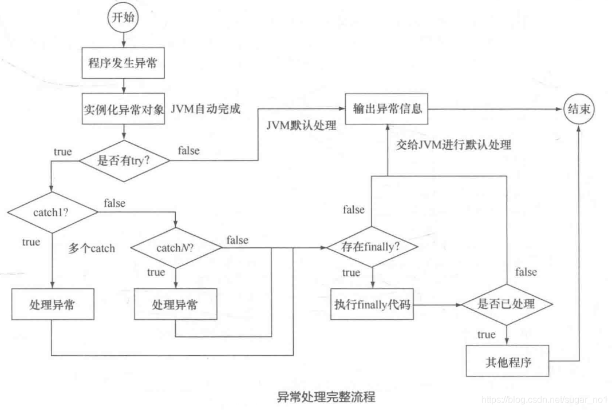

> 本笔记是本人学习java一阶段笔记,是java基础
>
> 本人笔记分享:[`全部笔记`](https://gitee.com/hongjilin/hongs-study-notes) [`java笔记`](https://gitee.com/hongjilin/hongs-study-notes/tree/master/%E7%BC%96%E7%A8%8B_%E5%90%8E%E5%8F%B0%E6%9C%8D%E5%8A%A1%E7%AB%AF%E5%AD%A6%E4%B9%A0%E7%AC%94%E8%AE%B0/Java/)

# JAVASE笔记总纲

# #目录

>[TOC]

# ------------------==(Java壹)==---------------------

# 对象与类相关概念 =>day7_22观阅视频补充

## 一.java中类与对象的关系与区别

######    1.什么是类？

类就是具备某些共同特征的实体的集合，它是一种抽象的数据类型，它是对所具有相同特征实体的抽象。在面向对象的程序设计语言中，类是对一类“事物”的属性与行为的抽象。

######    2.什么是对象？

对象就是一个真实世界中的实体，对象与实体是一一对应关系的，意思就是现实世界的每一个实体都是一个对象，所以对象是一个具体的概念。

######    3.类是对象的一个集合，对象是类的实例。

## 二.面向对象(OO)的含义与优点

######    1.面向对象(OO)的优点=>

1. 与人类的思维习惯一致:把人类解决问题的思维过程转变为程序能够理解的过程
2. 信息隐藏,提高了程序的可维护性和安全性:
     1. 封装实现了模块化和信息隐藏
     2. 封装使得在对象外部不能随意访问对象的属性和方法
3. 提高了程序的可重用性
     1. 一个类乐意创建多个对象实例,增加了重用性

######      2.OO的分类与含义

-  OOP:面向对象的变成
-  OOA:面向对象的分析
-  OOD:面向对象的设计

## 三.成员变量与局部变量

##### 		1.变量优先级判断

​				a. 范围越小,优先级越高

​				b. 越晚出现,优先级越高

#####   		2.成员变量与局部变量的区别

###### 				a.作用域不同=>

​						\*  局部变量的作用域仅限与定义它的方法

​						\* 成员变量的作用域在整个类内部都是可见的

###### 				b.初始值不同=>

​						\* java会给成员变量一个初始值

​						\* java不会给局部变量赋予初始值

######    			c.在同一个方法中,不允许有同名局部变量;在不同方法中可以有同名方法

###### 				d.两类变量同名时,局部变量具有更高优先级

## 四.JavaDoc注释(生成注释文档)

1. ###### 生成注释(两个**号是JavaDoc,一个\*号是多行注释)

```
/**+回车
```

```java
/**
 * @author 洪
 * @version 1.0
 */
```

2. ###### 导出以及查看文档

 3.    右键项目导出(Export)=>java=>javadoc=>选择导出位置

       2. 在生成文件中查看index.html

​					

## 五.本章总结

#### (1).对象与类总结=>

1. 对象是用来描述客观事物的一个实体

2. 类定义了对象将会拥有的特征(属性)和行为(方法)

3. 类是对象的类型,对象是类的实例

4. 使用类的步骤
 5. 定义类:使用关键字class
     2. 创建类的对象:使用关键字new
     3. 使用类的属性与方法:使用"."等操作符

#### (2).类的无参方法=>

###### 	1.定义类的方法必须包括:

      1. 方法的名称
      2. 方法返回值的类型
      3. 方法的主体

######      2.调用类方法的两种形式:

      1. 同一个类中的方法,直接使用"==方法名()=="调用
      2. 不同类的方法,先==创建对象==,在使用=="对象名.方法名()"==调用

######      3.成员变量和局部变量的不同点:

1.    作用域不同:

            1.    成员变量在整个类都是可见的
            2.    局部变量仅限于定义它的方法内

2. 初始值不同:

     	   1.    java会为成员变量赋予初值
               	   2.    java不会为局部变量赋予初值

3.    在同一个方法中,不允许有同名局部变量;在不同方法中可以有同名方法

      两类变量同名时,局部变量具有更高优先级

######    4.注释符:

1.  单行注释://
2.  多行注释/* */
3.  JavaDoc注释/** */


##### (3).类的带参方法:

   1.    带参方法定义的一般形式:

         ```
         <访问修饰符> 返回类型 <方法名> (<形式参数>){
         			//方法的主体
         }
         ```

2. 参数的概念:

 3.    形参是在定义方法时对参数的称呼

       2. 实参是在调用时传递给方法的实际的值

4. 调用带参方法时要求实参与形参要匹配

## 六.遗留问题及解决

###### 1.Srring明明是引用类型参数,但是为什么没有改变


# ------------------==(Java贰)==---------------------

# 字符串String =>day7_23笔记总结

## 一.字符串(String)类:

##### 		1.字符串用途:

​				a.用于字符串常量,也就是说字符串的值不会改变

##### 		2. String代码解释=>

```java
/*1.赋值时相当于执行一次new操作*/
String name=new  String()
name="hong"  
=>name=new String("hong")

/*2.当赋值为""时,有创建空间,只是里面没有值*/
String name="";
=>String name= new String("")

/*3.赋值为null时相当于没有创建空间*/
String name=null;=>String name;

/*4.引用类型判断时,通常都要先判断是否为空再判断空字符串*/
if(name!=null&&name.equal(""))
```

##### 		3.字符串主要构造函数方法=>

| 方法                                          | 说明                                                         |
| :-------------------------------------------- | :----------------------------------------------------------- |
| String()                                      | 生成一个空串                                                 |
| String(String  value)                         | 用已知串生成一个串对象                                       |
| String(char value[])                          | 用字符数组生成一个串对象                                     |
| String(char value[] , int offset , int count) | 用字符数组value的offset位置开始的count个字符,建立一个字符串对象,之后并不影响原来的字符串数组 |
| String(StringBuffer  value)                   | 用已经存在的StringBuffer对象初始化String对象                 |
|                                               |                                                              |


##### 4.字符串比较方法=>

1.   equals()=>  检查组成字符串内容的字符是否一致
2.   "=="符号比较=>  判断两个字符串在内存中的首地址,即判断是否是同一个字符串对象
3.   equalslgnoreCase()方法=>  忽略大小写比较
4.   toLowerCase()方法=>  将双方变为小写字符比较
5.   toUpperCase()方法=>  将双方变为大写字符比较
6.   compareTo()方法=> 按字典顺序比较两个字符串

##### 5.字符串连接方法=>

1.   使用"+"
2.   使用String类的concat()方法

##### 6.字符串常用提取方法=>

| 方法                                                         | 说明                                                         |
| ------------------------------------------------------------ | :----------------------------------------------------------- |
| public int **indexOf**(int ch)<br />public int **indexOf**(String value) | 搜索第一个出现的字符ch(或字符串value)                        |
| public int **lastIndexOf**(int ch)<br />public int **lastIndexOf**(String value) | 搜索最后一个出现的字符ch(或字符串value)                      |
| public char **charAt**(int index)                            | 查找字符串的第index个字符                                    |
| public String **substring**(int index)                       | 提取从位置索引开始的字符串部分                               |
| public String **substring**(int beginindex,int endindex)     | 提取beginindex和endindex之间的字符串部分                     |
| public String **trim**()                                     | 返回一个前后不含任何空格的调用字符串的副本                   |
| public boolean **startWith**(String prefix)<br />public boolean **endWith**(String suffix) | 测试字符串的起始字符串和结束字符串(验证开头和结尾是否为输入的字符出啊) |
| public String **replace**(char oldChar , char new Char)      | 字符串替换                                                   |
| String.**split**(char value)                                 | 字符串拆分                                                   |


## 二.StringBuffer类(String增强版)

##### 	1.StringBuffer用途

​		a.用于字符串变量,也就是说字符串的值可以改变

##### 	2.StringBuffer的代码声明与使用=>

```java
/*1.StringBuffer的声明*/
StringBuffer sb=new StringBuffer();//创建空StringBuffer对象
StringBuffer sb=new StringBuffer(5);//创建长度为5StringBuffer对象
StringBuffer sb=new StringBuffer("hello World");//创建一个变量存储字符串"hello World"

/*2.StringBuffer的使用*/
sb.toString();//转化为String类型
sb.append("**");//追加字符串
```

##### 	3.StringBuffer类的常用方法=>

| 方法                                                         | 说明                                                      |
| ------------------------------------------------------------ | --------------------------------------------------------- |
| **setLength**(int newlength)                                 | 重新设置字符串的长度,新串会为旧串的截余(常用来截取前几位) |
| **setCharAt**(int index, char ch)                            | 重设指定位置的字符串                                      |
| **append**(Object obj)                                       | 将指定对象转化为字符串添加到原串尾部                      |
| **insert**(int offset ,Object obj)                           | 将指定对象转换为字符串,然后插入到从offset开始的位置       |
| **capacity**                                                 | 求字符串容量(不等于字符串长度)                            |
| **deleteCharAt**( int index)<br />**delete**(int start,int end) | 删除字符                                                  |
| **reverse()**                                                | 翻转字符串                                                |
|                                                              |                                                           |
|                                                              |                                                           |


# ---------------==(叁)==------------------

# 对象和封装=>day7_30笔记总结

## 一.封装

##### 	1.封装的概念

> 在面向对象程式设计方法中，封装（英语：Encapsulation）是指一种将抽象性函式接口的实现细节部分包	   		装、隐藏起来的方法。
>
> 封装可以被认为是一个保护屏障，防止该类的代码和数据被外部类定义的代码随机访问。
>
> 要访问该类的代码和数据，必须通过严格的接口控制。
>
> 封装最主要的功能在于我们能修改自己的实现代码，而不用修改那些调用我们代码的程序片段。
>
> 适当的封装可以让程式码更容易理解与维护，也加强了程式码的安全性。


##### 	2.封装的优点

			1. 良好的封装能够减少耦合。
	
	  			2. 类内部的结构可以自由修改。
	  			3. 可以对成员变量进行更精确的控制。
	  			4. 隐藏信息，实现细节。


## 二.final的使用

##### 	1.修饰类

当用final去修饰一个类的时候，表示这个类不能被继承。注意：

a. 被final修饰的类，final类中的成员变量可以根据自己的实际需要设计为fianl。

b. final类中的成员方法都会被隐式的指定为final方法。说明：在自己设计一个类的时候，要想好这个类将来是否			会被继承，如果可以被继承，则该类不能使用fianl修饰，在这里呢，一般来说工具类我们往往都会设计成为一			个fianl类。在JDK中，被设计为final类的有String、System等。代码：


##### 2.修饰方法

被final修饰的方法不能被重写。注意：

a. 一个类的private方法会隐式的被指定为final方法。

b. 如果父类中有final修饰的方法，那么子类不能去重写。

**代码：**


##### **3. 修饰成员变量**

a. 必须要赋初始值，而且是只能初始化一次。

**代码：**


##### 4.**修饰成员变量**

a. 必须初始化值。

b. 被fianl修饰的成员变量赋值，有两种方式：1、直接赋值 2、全部在构造方法中赋初值。

c. 如果修饰的成员变量是基本类型，则表示这个变量的值不能改变。

d. 如果修饰的成员变量是一个引用类型，则是说这个引用的地址的值不能修改，但是这个引用所指向的对象里面的内容还是可以改变的。

**代码：**


## 三.Static(静态关键字)的使用

##### 	1.static的作用:

static的主要作用在于创建独立于具体对象的域变量或者方法

##### 	2.static要解决什么问题？

我们知道，当我们通过new关键字去创建对象的时候，那么数据的存储空间才会被分配，类中的成员方法才能被对象		所使用。但是呢有两种特殊的情况：

1. 我们通过new关键字创建的对象共享同一个资源，而不是说每个对象都拥有自己的数据，或者说根本就不需要去创建对象，这个资源和对象之间是没有关系的。
2. 希望某个方法不与包含它的类的任何对象联系在一起。总结下来就是说：**即使没有创建对象，也能使用属性和调用方法**，static目的就是在于解决这个问题。

#####     3.static特点=>

1. static可以修饰变量，方法
2. 被static修饰的变量或者方法是独立于该类的任何对象，也就是说，这些变量和方法不属于任何一个实例对象，而是被类的实例对象所共享。
3. 在类被加载的时候，就会去加载被static修饰的部分。
4. 被static修饰的变量或者方法是优先于对象存在的，也就是说当一个类加载完毕之后，即便没有创建对象，也可以去访问。

##### 4.**static静态变量**

> 被static修饰的成员变量叫做静态变量，也叫做类变量，说明这个变量是属于这个类的，而不是属于是对象，没有被static修饰的成员变量叫做实例变量，说明这个变量是属于某个具体的对象的。

##### 5.**静态变量和实例变量的区别**

1. 实例变量：每次创建对象，都会为每个对象分配成员变量内存空间，实例变量是属于实例对象的，**在内存中，创建几次对象，就有几份成员变量**。

   2.静态变量：静态变量由于不属于任何实例对象，是属于类的，所以在内存中只会有一份，在类的加载过程中，JVM为静态变量分配一次内存空间

##### 6.**static静态方法**

> 被static修饰的方法也叫做静态方法，因为对于静态方法来说是不属于任何实例对象的，那么就是说在静态方法内部是不能使用this的，因为既然不属于任何对象，那么就更谈不上this了。

##### 7.**static使用注意事项**

1. 在静态方法中没有this关键字因为静态是随着类的加载而加载，而this是随着对象的创建而存在的。
2. 静态比对象优先存在。静态可以访问静态的，但是静态不能访问非静态的。
3. 非静态的可以去访问静态的

##### 8.总结

1. 静态只能访问静态。
2. 非静态既可以访问非静态的，也可以访问静态的。


## 四.构造函数单例模式(提升知识点)

### 	1、概述

单例模式的**定义**就是**确保某一个类只有一个实例，并且提供一个全局访问点。**属于设计模式三大类中的**`创建型模式`**。
 单例模式具有典型的三个**特点**：

- 只有一个实例。
- 自我实例化。
- 提供全局访问点。

其**UML**结构图非常简单，就只有一个类，如下图：


### 2、优缺点

- **优点**：由于单例模式只生成了一个实例，所以能够节约系统资源，减少性能开销，提高系统效率，同时也能够严格控制客户对它的访问。
- **缺点**：也正是因为系统中只有一个实例，这样就导致了单例类的职责过重，违背了“单一职责原则”，同时也没有抽象类，这样扩展起来有一定的困难。

### 3、常见实现方式

常见的单例模式实现方式有五种：`饿汉式`、`懒汉式`、`双重检测锁式`、`静态内部类式`和`枚举单例`。而在这五种方式中**`饿汉式`**和**`懒汉式`**又最为常见。下面将一一列举这五种方式的实现方法：

- **饿汉式**：**线程安全**，调用效率高。但是不能延时加载。示例：


```java
public class SingletonDemo1 {

    //线程安全的
    //类初始化时，立即加载这个对象
    private static SingletonDemo1 instance = new SingletonDemo1();

    private SingletonDemo1() {
    }

    //方法没有加同步块，所以它效率高
    public static SingletonDemo1 getInstance() {
        return instance;
    }
}
```

由于该模式在加载类的时候对象就已经创建了，所以加载类的速度比较慢，但是获取对象的速度比较快，且是**线程安全**的。

- **懒汉式**：**线程不安全**。示例：


```java
public class SingletonDemo2 {

    //线程不安全的

    private static SingletonDemo2 instance = null;

    private SingletonDemo2() {
    }

    //运行时加载对象
    public static SingletonDemo2 getInstance() {
        if (instance == null) {
            instance = new SingletonDemo2();
        }
        return instance;
    }

}
```

由于该模式是在运行时加载对象的，所以加载类比较快，但是对象的获取速度相对较慢，且**线程不安全**。**如果想要线程安全的话可以加上`synchronized`关键字**，但是这样会付出惨重的效率代价。

- **懒汉式（双重同步锁）**


```java
public class SingletonDemo3 {

    private static volatile SingletonDemo3 instance = null;

    private SingletonDemo3() {
    }

    //运行时加载对象
    public static SingletonDemo3 getInstance() {
        if (instance == null) {
            synchronized(SingletonDemo3.class){
                 if(instance == null){
                     instance = new SingletonDemo3();
                 }
            }
        }
        return instance;
    }

}
```

```java
//调用
Book book=Book.getInfo();
```

由于剩下的几种实现方式暂没有接触过，可暂时参考[一张图搞定Java设计模式，单例模式](https://links.jianshu.com/go?to=https%3A%2F%2Fbaijiahao.baidu.com%2Fs%3Fid%3D1570148907639754%26wfr%3Dspider%26for%3Dpc)。

**注**：注意单例模式所属类的**构造方法是私有的**，所以单例类是**不能被继承的**。

### 4、常见应用场景

- 网站计数器。
- 项目中用于读取配置文件的类。
- 数据库连接池。因为数据库连接池是一种数据库资源。
- Spring中，每个`Bean`默认都是单例的，这样便于Spring容器进行管理。
- Servlet中`Application`
- Windows中任务管理器，回收站。
  等等。


# ------------------==(Java肆)==---------------------

# 继承与重写=>day7_29笔记总结

## 一.访问修饰符

| 修饰符      | 当前类 | 同一包内 | 子孙类(同一包) | 子孙类(不同包)  | 其他包 |
| :---------- | :----- | :------- | :------------- | :-------------- | :----- |
| `public`    | √      | √        | √              | √               | √      |
| `protected` | √      | √        | √              | √/×（子类可以） | ×      |
| `default`   | √      | √        | √              | ×               | ×      |
| `private`   | √      | ×        | ×              | ×               | ×      |

## 二.重写

###### **2.1)方法的重载:** 

​	在同一个类中,出现多个同名的方法,参数列表不同,与返回值类型,修饰	符无关

>- 方法名称必须相同。
>- 参数列表必须不同。
>- 方法的返回类型可以相同也可以不相同。
>- 仅仅返回类型不同不足以称为方法的重载

###### **2.2)方法的重写:**

​	 子类中出现和父类中一模一样的方法(包括返回值类型,方法名,参数列表)

######  2.3)**方法重写的注意事项:**

1.重写的方法必须要和父类一模一样(包括返回值类型,方法名,参数列表)

2.重写的方法可以使用@Override注解来标识

3.**子类中重写的方法的访问权限不能低于父类中方法的访问权限**

**权限修饰符 : private <  默认(什么都不写) <  protected < public**

######  2.4)为什么要重写方法:

1.当父类中的方法无法满足子类需求的时候,需要方法重写

2.当子类具有特有的功能的时候,就需要方法重写

###### 2.5)重写的应用

子类可以根据需要，定义特定于自己的行为。既沿袭了父类的功能名称，又根据子类的需要重新实现父类方法，从而进行扩展增强。

## 三.抽象类

### 1、概述

当父类知道子类应该包含什么样的方法，但无法确定子类如何实现这些方法；在分析事物时，会发现事物的共性，将共性抽取出，实现的时候，就会有这样的情况：方法功能声明相同，但方法功能主体不同，这时，将方法声明抽取出，那么，此方法就是一个抽象方法。

###### **1、抽象的定义格式**

>- 抽象方法的定义格式：public abstract 返回值类型 方法名（参数）；
>- 抽象类的定义格式：abstract class 类名{}

###### **2、抽象的特点**

>- 抽象类和抽象方法都需要被 abstract 修饰，抽象方法一定要定义在抽象类中
>- 抽象不能直接创建对象，因为调用抽象方法没有意义
>- 只有覆盖了抽象类中所有的抽象方法后，其子类才可以创建对象，否则该子类还是一个抽象类
>- 之所以继承抽象类，更多的是在思想，是面对共性类型操作会更简单

###### **3、抽象类的注意事项**

>- 抽象类一定是个父类，因为是不断抽取而来的
>- 抽象类中可以不定义抽象方法，其存在的意义就是不让该类创建对象，方法可以直接让子类去使用
>- 抽象关键字 abstract 不可以和以下关键字共存：
>  private：私有的方法子类是无法继承到的，也不存在覆盖，如果 abstract 和 private 一起使用修饰方法， abstract 既要子类去实现这个方法，而 private 修饰子类根本无法得到父类这个方法，互相矛盾
>   final：final 修饰的类不能被继承，而抽象类一定是父类
>   static：static 修饰的表示静态的，不能被修改的，但可以直接被类所调用，而abstract修饰的是抽象的，即没有方法实体，也不能直接被调用

### **2、代码实例**

###### 			1.先创建Develop.java父类，创建Develop抽象类，并创建抽象方法

```java
package MyAbstract;
/**
 * 定义开发人员类，所有开发人员都具有工作的共性，
 * 对工作共性进行抽取，然后形成一个Develop类
 * 定义方法：工作
 * 抽象类不能实例化对象，即不能new，抽象方法没有主体，不能运行
 * 抽象类的使用：可以定义类继承抽象类，将抽象方法进行重写，创建子类的对象
 */
public abstract class Develop {
    //定义工作方法，但具体怎么工作，并不明白，所以干脆不说，即抽象方法
    //必须使用abstract关键字修饰
    //抽象的方法必须存在抽象类中，类也必须使用abstract关键字修饰
    public abstract void work();
}
```

###### 			2.再创建Php.java子类，重写父类的抽象方法

```java
package MyAbstract;
/**
 * 定义PHP开发人员
 * 继承抽象类Develop，重写抽象的方法
 */
public class Php extends Develop {
    //重写父类的抽象方法，去掉abstract关键字，加上方法主体
    public void work()
    {
        System.out.println("正在开发网页！");
    }
}
```

###### 			3.在Main.java中调用

```java
package MyAbstract;
public class Main {
    public static void main(String[] args)
    {
        Php ph = new Php();
        ph.work();
    }
}
```

###### 实例解析=>

- 将共性“研发人员”抽取出来形成一个Develop类并定义方法：工作
- 抽象类不能实例化，即不能 new 抽象方法没有主体
- 可以定义类来继承抽象类，将抽象类进行重写，然后创建子类的对象
- 重写父类的抽象方法时，去掉abstract关键字，加上方法主体

## 四.final修饰符

​	1.修饰的类,不能在被继承

​	2.修饰的方法不能被子类重写

​	3.修饰的变量将变成厂里,只能在初始化时进行赋值

# ---------------==(Java捌)==------------------

# 系统常用类=>day8_7笔记总结

## 一.Object类

### 	1.Object类的作用:

##### 		1)在java中,所有的类,不管有没有定义其弗雷,都已Object类作为直接或间			接的父类,也就是说,所有的类都继承自Object类

##### 		2)Object类定义了基本的成员变量和成员函数

### 	2.常见的需要改写的方法:

###### 			1) 将对象转换成字符串的 toString() 

###### 			2) equals()方法

###### 			3) 实现接口	implements  Comparable<T>  中的 compareTo(T) 定义自己需要的比较方式  

###### 				eg:(所有可以 “排序” 的类都实现java.lang.Comparable接口，Comparable接口中只有一个方								法。)

## 2.System类

### 1.System类的概述

1. Java.lang包下的,父类object类,被final类修饰(终止类)

2. System 类包含一些有用的类字段和方法。它不能被实例化。(私有了构造方法private)

3. 其内部的成员变量和成员方法都是static的，所以可以通过System类名直接调用

### 2.常用的System方法

#### 	1.system例举

- 标准输入输出， 如out、in、err
- 外部定义的属性和环境变量的访问，如getenv()/setenv()和getProperties()/setProperties()
- 加载文件和类库的方法，如load()和loadLibrary()、
- 快速拷贝数组的方法：arraycopy()
- jvm操作：如gc()、runFinalization()、exit()，该部分并未在源码的java doc中提到，可能因为本身不建议主动调用吧。而且这几个方法都仅仅是Runtime.getRuntime()的调用，两者没有区别
- 获取时间方法：==System.nanoTime 和 System.currentTimeMillis==

#### 2.system方法使用方式与功能

System类中提供了一些系统级的操作方法，这些方法实现的功能分别如下：

##### 	1、数组拷贝=>arraycopy方法

> 该方法的作用是数组拷贝，也就是将一个数组中的内容复制到另外一个数组中的指定位置，由于该方法是native方法，所以性能上比使用循环高效

```java
/*该代码的作用是将数组a中，从下标为1开始，复制到数组b从下标3开始的位置，总共复制2个。也就是将a[1]复制给b[3]，将a[2]复制给b[4]，这样经过复制以后数组a中的值不发生变化，而数组b中的值将变成{0,0,0,2,3}。*/
public static void arraycopy(Object src, int srcPos, Object dest, int destPos, int length)
//使用示例：
int[] a = {1,2,3,4};int[] b = new int[5];
System.arraycopy(a,1,b,3,2);
```

##### 	2、获取当前计算机时间=>currentTimeMillis方法

> 该方法的作用是返回当前的计算机时间，时间的表达格式为当前计算机时间和GMT时间(格林威治时间)1970年1月1号0时0分0秒所差的毫秒数。例如：

```java
/*则获得的将是一个长整型的数字，该数字就是以差值表达的当前时间。*/
public static long currentTimeMillis()
//使用该方法获得的时间不够直观，但是却很方便时间的计算。例如，计算程序运行需要的时间则可以使用如下的代码：
//使用示例
  long l = System. currentTimeMillis();
long start = System. currentTimeMillis();
for(int i = 0;i < 100000000;i++){
int a = 0;
}
long end = System. currentTimeMillis();
long time = end – start;
/*则这里变量time的值就代表该代码中间的for循环执行需要的毫秒数，使用这种方式可以测试不同算法的程序的执行效率高低，也可以用于后期线程控制时的精确延时实现。*/
```

##### 	3、退出程序=>exit方法

> 该方法的作用是退出程序。其中status的值为0代表正常退出，非零代表异常退出。使用该方法可以在图形界面编程中实现程序的退出功能等。

```java
public static void exit(int status)
```

##### 	4、请求系统垃圾回收=>gc方法

>该方法的作用是请求系统进行垃圾回收。至于系统是否立刻回收，则取决于系统中垃圾回收算法的实现以及系统执行时的情况。

```java
public static void gc()
```

### 3.System功能方法表=>

###### 3.1)对照表

| 功能                          | 描述                              |
| ----------------------------- | --------------------------------- |
| java.version                  | Java 运行时环境版本               |
| java.vendor                   | Java 运行时环境供应商             |
| java.vendor.url               | Java 供应商的 URL                 |
| java.home                     | Java 安装目录                     |
| java.vm.specification.version | Java 虚拟机规范版本               |
| java.vm.specification.vendor  | Java 虚拟机规范供应商             |
| java.vm.specification.name    | Java 虚拟机规范名称               |
| java.vm.version               | Java 虚拟机实现版本               |
| java.vm.vendor                | Java 虚拟机实现供应商             |
| java.vm.name                  | Java 虚拟机实现名称               |
| java.specification.version    | Java 运行时环境规范版本           |
| java.specification.vendor     | Java 运行时环境规范供应商         |
| java.specification.name       | Java 运行时环境规范名称           |
| java.class.version            | Java 类格式版本号                 |
| java.class.path               | Java 类路径                       |
| java.library.path             | 加载库时搜索的路径列表            |
| java.io.tmpdir                | 默认的临时文件路径                |
| java.compiler                 | 要使用的 JIT 编译器的名称         |
| java.ext.dirs                 | 一个或多个扩展目录的路径          |
| os.name                       | 操作系统的名称                    |
| os.arch                       | 操作系统的架构                    |
| os.version                    | 操作系统的版本                    |
| file.separator                | 文件分隔符（在 UNIX 系统中是“/”） |
| path.separator                | 路径分隔符（在 UNIX 系统中是“:”） |
| line.separator                | 行分隔符（在 UNIX 系统中是“/n”）  |
| user.name                     | 用户的账户名称                    |
| user.home                     | 用户的主目录                      |
| user.dir                      | 用户的当前工作目录                |

###### 3.2)测试使用

```java
public class SystemTest {
	public static void main(String[] args) {
		System.out.println("Java 运行时环境版本         :" + System.getProperty("java.version"));
		System.out.println("Java 运行时环境供应商     :" + System.getProperty("java.vendor"));
		System.out.println("Java 运行时环境规范版本    :" + System.getProperty("java.specification.version"));
		System.out.println("Java 运行时环境规范供应商:" + System.getProperty("java.specification.vendor"));
		System.out.println("Java 运行时环境规范名称    :" + System.getProperty("java.specification.name"));
		System.out.println("操作系统的名称:" + System.getProperty("os.name"));
		System.out.println("操作系统的架构:" + System.getProperty("os.arch"));
		System.out.println("操作系统的版本:" + System.getProperty("os.version"));
		System.out.println("用户的账户名称          :" + System.getProperty("user.name"));
		System.out.println("用户的主目录              :" + System.getProperty("user.home"));
		System.out.println("用户的当前工作目录  : " + System.getProperty("user.dir"));
	}
}
```

## 3.数据类型类

### 	1.数值类:

###### 	1.1)数值类的定义与功能:

a.在java中,对应byte,short,int,long,float,double等简单数据类型,分别有一个对			应的数值类:==Byte,Short,Integer,Long,Float,Double==

b.他们都是从数据类Number继承而来的

c.数值类的作用是拓展数据处理的功能

d.针对字符类型char,Java提供了==字符类Character==;

e.针对booleab,java提供了==Boolean==类

###### 		1.2)数值类转换

​	a.将数据准换成字符串:toString()

​	b.将字符串转化为数字: ==valueOf()   parseInt()和parseDouble()==

### 2.字符类:百度去

### 3.数学类Math:

##### 	1.Math作用:

>提供执行任意精度整数运算（ BigInteger ）和任意精度十进制运算（ BigDecimal ）的类。
>
>float和double类型的主要设计目标是为了科学计算和工程计算。他们执行二进制浮点运算，这是为了在广域数值范围上提供较为精确的快速近似计算而精心设计的。然而，它们没有提供完全精确的结果，所以不应该被用于要求精确结果的场合。但是，商业计算往往要求结果精确，这时候BigDecimal就派上大用场啦。

##### 	2.BigDecimal(任意精度整数运算)=>

###### 		2.1)BigDecimal概念

>float和double类型的主要设计目标是为了科学计算和工程计算。他们执行二进制浮点运算，这是为了在广域数值范围上提供较为精确的快速近似计算而精心设计的。然而，它们没有提供完全精确的结果，所以不应该被用于要求精确结果的场合。但是，商业计算往往要求结果精确，这时候BigDecimal就派上大用场啦。

###### 		2.2)十进制字符串 转 BigDecimal

```java
//BigInteger构造函数中有一个将十进制字符串转成成BigInteger,注意：BigInteger没有无参构造函数
BigInteger  bigInteger = new BigInteger("100")//100
  //BigInteger还可以通过valueOf方法将普通数值转成大数值
  BigInteger valueOf = BigInteger.valueOf(1000);
System.out.println(valueOf);
```

###### 		2.3)BigInteger提供的数学计算方式

```java
   //BigInteger提供了各种数学计算的方式，比如绝对值，异或运算	
	public static void main(String[] args) {
        BigInteger bigInteger = new BigInteger("100");
        BigInteger valueOf = BigInteger.valueOf(1000);
        //加法
        BigInteger add = valueOf.add(bigInteger);
        //减法
        BigInteger subtract = valueOf.subtract(bigInteger);
        //除法
        BigInteger divide = valueOf.divide(bigInteger);
        //乘法
        BigInteger multiply = valueOf.multiply(bigInteger);
        //转成double  当然floatValue，intValue，longValue
        double v = valueOf.doubleValue();
        //比较是否相等
        boolean equals = valueOf.equals(bigInteger);
        //求负数
        BigInteger negate = valueOf.negate();
        //转换成字符串
        String s = valueOf.toString();
    }
```

###### 2.4)普通计算精度丢失示例

```java
    public static void main(String[] args) {
        System.out.println(0.2 + 0.1);
        System.out.println(0.3 - 0.1);
        System.out.println(0.2 * 0.1);
        System.out.println(0.3 / 0.1);
    }
//运行结果
0.30000000000000004   0.19999999999999998   0.020000000000000004    2.9999999999999996
```

> 你认为你看错了，但结果却是是这样的。问题在哪里呢？原因在于我们的计算机是二进制的。浮点数没有办法是用二进制进行精确表示。我们的CPU表示浮点数由两个部分组成：**指数和尾数**，这样的表示方法一般都会失去一定的精确度，有些浮点数运算也会产生一定的误差。如：2.4的二进制表示并非就是精确的2.4。反而最为接近的二进制表示是 2.3999999999999999。浮点数的值实际上是由一个特定的数学公式计算得到的。

###### 2.5)BigDecimal构造方法

 1.public BigDecimal(double val) 将double表示形式转换为BigDecimal *不建议使用

2.public BigDecimal(int val)　　将int表示形式转换成BigDecimal

3.public BigDecimal(String val)　　将String表示形式转换成BigDecimal

```java
    public static void main(String[] args)
    {
    	 BigDecimal bigDecimal = new BigDecimal(2);
        BigDecimal bDouble = new BigDecimal(2.3);
        BigDecimal bString = new BigDecimal("2.3");
        System.out.println("bigDecimal=" + bigDecimal);
        System.out.println("bDouble=" + bDouble);
        System.out.println("bString=" + bString); }
//运行结果
bigDecimal=2
bDouble=2.29999999999999982236431605997495353221893310546875
bString=2.3
123456789
```

###### 2.6)BigDecimal生命是精度丢失

**为什么会出现这种情况呢？**

> JDK的描述：1、参数类型为double的构造方法的结果有一定的不可预知性。有人可能认为在Java中写入newBigDecimal(0.1)所创建的BigDecimal正好等于 0.1（非标度值 1，其标度为 1），但是它实际上等于0.1000000000000000055511151231257827021181583404541015625。这是因为0.1无法准确地表示为 double（或者说对于该情况，不能表示为任何有限长度的二进制小数）。这样，传入到构造方法的值不会正好等于 0.1（虽然表面上等于该值）。
>
> 2、另一方面，String 构造方法是完全可预知的：写入 newBigDecimal(“0.1”) 将创建一个 BigDecimal，它正好等于预期的 0.1。因此，比较而言，通常建议优先使用String构造方法。

**当double必须用作BigDecimal时，请使用Double.toString(double)转成String，然后使用String构造方法，			或使用BigDecimal的静态方法valueOf，如下**

```java
    public static void main(String[] args)
    {
        BigDecimal bDouble1 = BigDecimal.valueOf(2.3);
        BigDecimal bDouble2 = new BigDecimal(Double.toString(2.3));

        System.out.println("bDouble1=" + bDouble1);
        System.out.println("bDouble2=" + bDouble2);
  }
//运行结果
bDouble1=2.3    bDouble2=2.3

```

###### 2.7)除法运算divide注意点

> BigDecimal除法可能出现不能整除的情况，比如 4.5/1.3，这时会报错java.lang.ArithmeticException: Non-terminating decimal expansion; no exact representable decimal result.
>
> 其实divide方法有可以传三个参数
>
> public BigDecimal divide(BigDecimal divisor, int scale, int roundingMode)
> 第一参数表示除数， 第二个参数表示小数点后保留位数，
> 第三个参数表示舍入模式，只有在作除法运算或四舍五入时才用到舍入模式，有下面这几种

```java
ROUND_CEILING    //向正无穷方向舍入
ROUND_DOWN    //向零方向舍入
ROUND_FLOOR    //向负无穷方向舍入
ROUND_HALF_DOWN    //向（距离）最近的一边舍入，除非两边（的距离）是相等,如果是这样，向下舍入, 例如1.55 保留一位小数结果为1.5
ROUND_HALF_EVEN    //向（距离）最近的一边舍入，除非两边（的距离）是相等,如果是这样，如果保留位数是奇数，使用ROUND_HALF_UP，如果是偶数，使用ROUND_HALF_DOWN
ROUND_HALF_UP    //向（距离）最近的一边舍入，除非两边（的距离）是相等,如果是这样，向上舍入, 1.55保留一位小数结果为1.6
ROUND_UNNECESSARY    //计算结果是精确的，不需要舍入模式
ROUND_UP    //向远离0的方向舍入
123456789101112131415
```

> 按照各自的需要，可传入合适的第三个参数。四舍五入采用 ROUND_HALF_UP
>
> 需要对BigDecimal进行截断和四舍五入可用setScale方法，例：

```java
public static void main(String[] args)
    {
        BigDecimal a = new BigDecimal("4.5635");
        a = a.setScale(3, RoundingMode.HALF_UP);    //保留3位小数，且四舍五入
        System.out.println(a);//4.564
    }
1234567
```

> 减乘除其实最终都返回的是一个新的BigDecimal对象，因为BigInteger与BigDecimal都是不可变的（immutable）的，在进行每一步运算时，都会产生一个新的对象。

```java
    public static void main(String[] args)
    {
        BigDecimal a = new BigDecimal("4.5");
        BigDecimal b = new BigDecimal("1.5");
        BigDecimal add = a.add(b);

        System.out.println(add);//6.0
        System.out.println(a);  //输出4.5. 加减乘除方法会返回一个新的BigDecimal对象，原来的a不变


    }
1234567891011
```

###### **注意**：

>(1)商业计算使用BigDecimal。

(2)**尽量使用参数类型为String的构造函数**。

(3) BigDecimal都是不可变的（immutable）的，在进行每一步运算时，都会产生一个新的对象，所以在做加减乘除运算时千万要保存操作后的值。

(4)我们往往容易忽略JDK底层的一些实现细节，导致出现错误，需要多加注意。

(5)**BigInteger不能通过基本数据类型的加减乘除(+,-,*,/)方式处理，而是通过方法来处理**

#### 3.Math常用静态方法

| 序号 | 方法与描述                                                   |
| :--- | :----------------------------------------------------------- |
| 1    | [xxxValue()](https://www.runoob.com/java/number-xxxvalue.html) 将 Number 对象转换为xxx数据类型的值并返回。 |
| 2    | [compareTo()](https://www.runoob.com/java/number-compareto.html) 将number对象与参数比较。 |
| 3    | [equals()](https://www.runoob.com/java/number-equals.html) 判断number对象是否与参数相等。 |
| 4    | [valueOf()](https://www.runoob.com/java/number-valueof.html) 返回一个 Number 对象指定的内置数据类型 |
| 5    | [toString()](https://www.runoob.com/java/number-tostring.html) 以字符串形式返回值。 |
| 6    | [parseInt()](https://www.runoob.com/java/number-parseInt.html) 将字符串解析为int类型。 |
| 7    | [abs()](https://www.runoob.com/java/number-abs.html) 返回参数的绝对值。 |
| 8    | [ceil()](https://www.runoob.com/java/number-ceil.html) 返回大于等于( >= )给定参数的的最小整数，类型为双精度浮点型。 |
| 9    | [floor()](https://www.runoob.com/java/number-floor.html) 返回小于等于（<=）给定参数的最大整数 。 |
| 10   | [rint()](https://www.runoob.com/java/number-rint.html) 返回与参数最接近的整数。返回类型为double。 |
| 11   | [round()](https://www.runoob.com/java/number-round.html) 它表示**四舍五入**，算法为 **Math.floor(x+0.5)**，即将原来的数字加上 0.5 后再向下取整，所以，Math.round(11.5) 的结果为12，Math.round(-11.5) 的结果为-11。 |
| 12   | [min()](https://www.runoob.com/java/number-min.html) 返回两个参数中的最小值。 |
| 13   | [max()](https://www.runoob.com/java/number-max.html) 返回两个参数中的最大值。 |
| 14   | [exp()](https://www.runoob.com/java/number-exp.html) 返回自然数底数e的参数次方。 |
| 15   | [log()](https://www.runoob.com/java/number-log.html) 返回参数的自然数底数的对数值。 |
| 16   | [pow()](https://www.runoob.com/java/number-pow.html) 返回第一个参数的第二个参数次方。 |
| 17   | [sqrt()](https://www.runoob.com/java/number-sqrt.html) 求参数的算术平方根。 |
| 18   | [sin()](https://www.runoob.com/java/number-sin.html) 求指定double类型参数的正弦值。 |
| 19   | [cos()](https://www.runoob.com/java/number-cos.html) 求指定double类型参数的余弦值。 |
| 20   | [tan()](https://www.runoob.com/java/number-tan.html) 求指定double类型参数的正切值。 |
| 21   | [asin()](https://www.runoob.com/java/number-asin.html) 求指定double类型参数的反正弦值。 |
| 22   | [acos()](https://www.runoob.com/java/number-acos.html) 求指定double类型参数的反余弦值。 |
| 23   | [atan()](https://www.runoob.com/java/number-atan.html) 求指定double类型参数的反正切值。 |
| 24   | [atan2()](https://www.runoob.com/java/number-atan2.html) 将笛卡尔坐标转换为极坐标，并返回极坐标的角度值。 |
| 25   | [toDegrees()](https://www.runoob.com/java/number-todegrees.html) 将参数转化为角度。 |
| 26   | [toRadians()](https://www.runoob.com/java/number-toradians.html) 将角度转换为弧度。 |
| 27   | [random()](https://www.runoob.com/java/number-random.html) 返回一个随机数。 |

### 4.时间类型Date:

###### 4.1)Date类对象创建：

```
//1.创建一个代表系统当前日期的Date对象
 Date d = new Date();
 
 使用带参数的构造方法Date(int year, int month, int day) ，可以构造指定日期的Date类对象，Date类中年份的参数应该是实际需要代表的年份减去1900，实际需要代表的月份减去1以后的值。
//2.创建一个代表2014年6月12号的Date对象
Date d1 = new Date(2014-1900, 6-1, 12); （注意参数的设置）
```

###### 4.2）Date时间格式转换

```java
　/*java.text.SimpleDateFormat是一个以与语言环境有关的方式来格式化和解析日期的具体类.
　注意：yyyy-MM-dd HH:mm:ss这里的大小写要明确，可以参见JDK API  java.text.SimpleDateFormat 　　*/
       DateFormat dateFormat = new SimpleDateFormat("yyyy-MM-dd HH:mm:ss");
       //创建日期的对象，通过format()方法将日期对象格式化，格式化后是String类型
       Date date = new Date();
       System.out.println(dateFormat.format(date));
```

### 5.随机数类Random

```
	Random ran=new Random();
	System.out.println(ran.nextInt(5));
```

# ------------------==(Java玖)==---------------------

# 异常、log4j使用=>day8_7

### 一、Java如何进行异常处理

Java异常机制用到的几个关键字：try、catch、finally、throw、throws。

>-  **try**     -- 用于监听。将要被监听的代码(可能抛出异常的代码)放在try语句块之内，当try语句块内发生异常时，异常就被抛出。
>-  **catch**  -- 用于捕获异常。catch用来捕获try语句块中发生的异常。
>-  **finally** -- finally语句块总是会被执行。它主要用于回收在try块里打开的物力资源(如数据库连接、网络连接和磁盘文件)。只有finally块，执行完成之后，才会回来执行try或者catch块中的return或者throw语句，如果finally中使用了return或者throw等终止方法的语句，则就不会跳回执行，直接停止。
>-  **throw**  -- 用于抛出异常。
>-  **throws** -- 用在方法签名中，用于声明该方法可能抛出的异常。**主方法上也可以使用throws抛出。**如果在主方法上使用了throws抛出，就表示在主方法里面可以不用强制性进行异常处理，如果出现了异常，就交给JVM进行默认处理，则此时会导致程序中断执行


### 二、异常的使用及执行流程

###### **1、异常的处理方案**

```
try...catch、try...catch...finally、try...finally
   try{
     可能会发生的异常
   }catch(异常类型 异常名(变量)){
     针对异常进行处理的代码
   }catch(异常类型 异常名(变量)){
     针对异常进行处理的代码
   }...
  [finally{
     释放资源代码；
   }]
```

###### 注意：

- catch 不能独立于 try 存在。
- catch里面不能没有内容
- 在 try/catch 后面添加 finally 块并非强制性要求的。
- try 代码后不能既没 catch 块也没 finally 块。
- try里面越少越好。
- try, catch, finally 块之间不能添加任何代码。
- finally里面的代码最终一定会执行（除了JVM退出）
- 如果程序可能存在多个异常，需要多个catch进行捕获。
- 异常如果是同级关系，catch谁前谁后没有关系
  如果异常之间存在上下级关系，上级需要放在后面

###### **2、异常的执行流程**




### 三、异常方法

下面的列表是 Throwable 类的主要方法:

| **序号** | **方法及说明**                                               |
| :------- | :----------------------------------------------------------- |
| 1        | **public String getMessage()** 返回关于发生的异常的详细信息。这个消息在Throwable 类的构造函数中初始化了。 |
| 2        | **public Throwable getCause()** 返回一个Throwable 对象代表异常原因。 |
| 3        | **public String toString()** 使用getMessage()的结果返回类的串级名字。 |
| 4        | **public void printStackTrace()** 打印toString()结果和栈层次到System.err，即错误输出流。 |
| 5        | **public StackTraceElement [] getStackTrace()** 返回一个包含堆栈层次的数组。下标为0的元素代表栈顶，最后一个元素代表方法调用堆栈的栈底。 |
| 6        | **public Throwable fillInStackTrace()** 用当前的调用栈层次填充Throwable 对象栈层次，添加到栈层次任何先前信息中。 |

### 四、Java 内置异常类

| **异常**                        | **描述**                                                     |
| :------------------------------ | :----------------------------------------------------------- |
| `ArithmeticException`           | 当出现异常的运算条件时，抛出此异常。例如，一个整数"除以零"时，抛出此类的一个实例。 |
| ArrayIndexOutOfBoundsException  | 用非法索引访问数组时抛出的异常。如果索引为负或大于等于数组大小，则该索引为非法索引。 |
| ArrayStoreException             | 试图将错误类型的对象存储到一个对象数组时抛出的异常。         |
| ClassCastException              | 当试图将对象强制转换为不是实例的子类时，抛出该异常。         |
| IllegalArgumentException        | 抛出的异常表明向方法传递了一个不合法或不正确的参数。         |
| IllegalMonitorStateException    | 抛出的异常表明某一线程已经试图等待对象的监视器，或者试图通知其他正在等待对象的监视器而本身没有指定监视器的线程。 |
| IllegalStateException           | 在非法或不适当的时间调用方法时产生的信号。换句话说，即 Java 环境或 Java 应用程序没有处于请求操作所要求的适当状态下。 |
| IllegalThreadStateException     | 线程没有处于请求操作所要求的适当状态时抛出的异常。           |
| `IndexOutOfBoundsException`     | 指示某排序索引（例如对数组、字符串或向量的排序）超出范围时抛出。 |
| NegativeArraySizeException      | 如果应用程序试图创建大小为负的数组，则抛出该异常。           |
| NullPointerException            | 当应用程序试图在需要对象的地方使用 `null` 时，抛出该异常     |
| `NumberFormatException`         | 当应用程序试图将字符串转换成一种数值类型，但该字符串不能转换为适当格式时，抛出该异常。 |
| SecurityException               | 由安全管理器抛出的异常，指示存在安全侵犯。                   |
| StringIndexOutOfBoundsException | 此异常由 `String` 方法抛出，指示索引或者为负，或者超出字符串的大小。 |
| UnsupportedOperationException   | 当不支持请求的操作时，抛出该异常。                           |
| ClassNotFoundException          | 应用程序试图加载类时，找不到相应的类，抛出该异常。           |
| CloneNotSupportedException      | 当调用 `Object` 类中的 `clone` 方法克隆对象，但该对象的类无法实现 `Cloneable` 接口时，抛出该异常。 |
| IllegalAccessException          | 拒绝访问一个类的时候，抛出该异常。                           |
| InstantiationException          | 当试图使用 `Class` 类中的 `newInstance` 方法创建一个类的实例，而指定的类对象因为是一个接口或是一个抽象类而无法实例化时，抛出该异常。 |
| InterruptedException            | 一个线程被另一个线程中断，抛出该异常。                       |
| NoSuchFieldException            | 请求的变量不存在                                             |
| NoSuchMethodException           | 请求的方法不存在                                             |


### 五、异常相关问题

##### 5.1)Error与Exception的区别：

> Error（错误）是系统中的错误，程序员是不能改变的和处理的，是在程序编译时出现的错误，只能通过修改程序才能修正。一般是指与虚拟机相关的问题，如系统崩溃，虚拟机错误，内存空间不足，方法调用栈溢等。对于这类错误的导致的应用程序中断，仅靠程序本身无法恢复和和预防，遇到这样的错误，建议让程序终止。
>
> Exception（异常）表示程序可以处理的异常，可以捕获且可能恢复。遇到这类异常，应该尽可能处理异常，使程序恢复运行，而不应该随意终止异常。


##### **5.2)在catch捕获异常时，为什么不考虑使用Throwable类型，而只是使用Exception来进行接收？**

> Throwable表示的范围要比Exception大。实际上程序使用Throwable来进行处理，没有任何语法问题，但是却会存在逻辑问题。因为此时出现的（或者说用户能够处理的）只有Exception类型，而如果使用Throwable接收，还会表示可以处理Error的错误，而用户是处理不了Error错误的，所以在开发中用户可以处理的异常都要求以Exception类为主。

##### **5.3)异常是一起处理好还是分开处理好？**

> **根据实际的开发要求是否严格来决定。**在实际的项目开发项目工作中，所有的异常是统一使用Exception处理还是分开处理，完全根据开发者的项目开发标准来决定。如果项目开发环境严谨，基本上要求针对每一种异常分别进行处理，并且要详细记录下异常产生的时间以及产生的位置，这样可以方便程序维护人员进行代码的维护。**再次注意：处理多个异常时，捕获范围小的异常要放在捕获范围大的异常之前处理。**

##### **5.4)throw和throws的区别？**

> throw和throws都是在异常处理中使用的关键字，区别如下：
>
> - throw：指的是在方法中人为抛出一个异常对象（这个异常对象可能是自己实例化或者抛出已存在的）；
> - throws：在方法的声明上使用，表示此方法在调用时必须处理异常。


##### **5.5)检查型异常（Checked Exception）与非检查型异常（Unchecked Exception）区别？**

>- 所有的检查性异常都继承自java.lang.Exception；所有的非检查性异常都继承自java.lang.RuntimeEx ception。
>- 检查性异常和非检查性异常最主要的区别在于其处理异常的方式：检查性异常必须使用try catch或者throws等关键字进行处理，否则编译器会报错;非检查性异常一般是程序代码写的不够严谨而导致的问题，可以通过修改代码来规避。
>- 常见的运行时异常：空指针异常(NullPointerException)、除零异常(ArithmeticException)、数组越界异常(ArrayIndexOutOfBoundsException)等;
>- 常见的检查性异常：输入输出异常(IOException)、文件不存在异常(FileNotFoundException)、SQL语句异常(SQLException)等。


### 六、自定义异常

在 Java 中你可以自定义异常。如果要自定义异常类，则扩展Exception类即可，因此这样的自定义异常都属于检查异常（checked exception）。如果要自定义非检查异常，则扩展自RuntimeException。

按照国际惯例，自定义的异常应该总是包含如下的构造函数：

- 一个无参构造函数
- 一个带有String参数的构造函数，并传递给父类的构造函数。
- 一个带有String参数和Throwable参数，并都传递给父类构造函数
- 一个带有Throwable 参数的构造函数，并传递给父类的构造函数。

下面是IOException类的完整源代码，可以借鉴。

```java
package java.io;

public class IOException extends Exception {
    static final long serialVersionUID = 7818375828146090155L;

    public IOException() {
	super();
    }
    public IOException(String message) {
	super(message);
    }
    public IOException(String message, Throwable cause) {
        super(message, cause);
    }
    public IOException(Throwable cause) {
        super(cause);
    }

}
```

**finally块和return**

- 首先一个不容易理解的事实：在 try块中即便有return，break，continue等改变执行流的语句，finally也会执行。
- finally中的return 会覆盖 try 或者catch中的返回值。
- finally中的return或异常会抑制（消灭）前面try或者catch块中的异常。

### 七、logger4j使用步骤

使用log4j的步骤

第一步 :在项目中加入log4j,所使用的JAR文件

第二步:创建log4j.properties文件(在src目录下)

第三步,编写log4j.properties,配置日志信息:

```
### \u8BBE\u7F6ELogger\u8F93\u51FA\u7EA7\u522B\u548C\u8F93\u51FA\u76EE\u7684\u5730 ###
log4j.rootLogger=debug,stdout,logfile

### \u628A\u65E5\u5FD7\u4FE1\u606F\u8F93\u51FA\u5230\u63A7\u5236\u53F0 ###
log4j.appender.stdout=org.apache.log4j.ConsoleAppender
log4j.appender.stdout.Target=System.err
log4j.appender.stdout.layout=org.apache.log4j.SimpleLayout

### \u628A\u65E5\u5FD7\u4FE1\u606F\u8F93\u51FA\u5230\u6587\u4EF6\uFF1Ajbit.log ###
log4j.appender.logfile=org.apache.log4j.FileAppender
log4j.appender.logfile.File=log.log
log4j.appender.logfile.layout=org.apache.log4j.PatternLayout
log4j.appender.logfile.layout.ConversionPattern=%d{yyyy-MM-dd HH:mm:ss} %l %F %p %m%n

```


第四步：创建Logger对象

```
		Logger logger = Logger.getLogger(类.class.getName());
```

第五步：调用方法：logger.debug(message);

# ------------------==(Java拾)==---------------------

# 集合框架=>day8_8笔记总结

## 一、Collection

#### 1.Collection接口的方法

> Collection接口定义了很多方法，开发者如果要开发自己的集合类，可以继承AbstractCollection抽象类，该类实现了Collection的很多方法，但是还有`size()`和`Iterator()`没实现

| 方法             | 描述                                 |
| ---------------- | ------------------------------------ |
| `iterator()`     | 获取迭代器                           |
| `size()`         | 元素个数                             |
| `isEmpty()`      | 判断有无元素                         |
| `clear()`        | 清空集合                             |
| `contains()`     | 是否包含给定元素                     |
| `containsAll()`  | 是否包含给定集合所有元素             |
| `add()`          | 添加元素                             |
| `addAll()`       | 添加给定集合所有元素                 |
| `remove()`       | 删除元素                             |
| `removeAll()`    | 删除给定集合中所有元素               |
| `retainAll()`    | 删除给定集合中不存在的元素，即取交集 |
| `toArray()`      | 返回集合的对象数组                   |
| `toArray(array)` | 同上，不过指定一个数组参数           |


#### 2.Collection包含了List和Set两大分支。

> (1)Collection接口存储-组不唯一,无序的对象
>
> (2) List是一个有序的队列，实现类有4个：LinkedList, ArrayList, Vector, Stack。
>
> (3) Set是一个不允许有重复元素的集合。实现类有3个：TreeSet、HastSet、LinkHastSe


#### 3.List接口常用方法

| 方法名                        | 说明                                                         |
| ----------------------------- | ------------------------------------------------------------ |
| boolean add(Object 0)         | 在列表的末尾顺序添加元素，起始索引位置从0开始                |
| void add(int index, Object 0) | 在指定的索引位置添加元素。索引位置必须介于0和列表中元素个数之间 |
| int size()                    | 返回列表中的元素个数                                         |
| Object get(int index)         | 返回指定索引位置处的元素。取出的元素是Object类型，使用前需要进行强制类型转换 |
| boolean contains(Object 0)    | 判断列中是否存在指定元素                                     |
| boolean remove(Object 0)      | 从列表中删除元素                                             |
| Object remove(int index)      | 从列表中删除指定位置元素，起始索引位置从0开始                |

##### 	3.1)**ArrayList**

###### 			a)什么是**ArrayList**

> (1) ArrayList就是动态数组 动态的增加和减少元素 
>
> (2) 实现了ICollection和IList接口
>
> (3)灵活的设置数组的大小

###### 		  b)**如何使用ArrayList**

```java
ArrayList List = new ArrayList(); 
for( int i=0;i <10;i++ ) //给数组增加10个Int元素 
List.Add(i); 
//..程序做一些处理 
List.RemoveAt(5);//将第6个元素移除 
for( int i=0;i <3;i++ ) //再增加3个元素 
List.Add(i+20); 
Int32[] values = (Int32[])List.ToArray(typeof(Int32));//返回ArrayList包含的数组
```

##### 3.2)LinkedList的特殊方法

| 方法名                  | 说明                            |
| ----------------------- | ------------------------------- |
| void addFirst(Object 0) | 在列表的首部添加元素            |
| void addLast(Object o)  | 在列表的末尾添加元素            |
| Object getFirst()       | 返回列表中的第一个元素          |
| Object getlast()        | 返回列表中的最后一个元素        |
| Object removeFirst()    | 删除并返回列表中的第一个元素    |
| Object removel ast()    | 删除并返回列表中的最后一个元素. |


## 	二、Map

### 		1.Map概念

> **一个映射接口，即key-value键值对**。
>
> （1）AbstractMap是个**抽象类**，它实现了Map接口中的大部分API。实现类有6个：TreeMap、HashMap、LinkHashMap、IdentityHashMap、		WeakHashMap、HashTable
>
> （2）SortedMap 是继承于Map的**接口**。内容是**排序的键值对**，通过比较器(Comparator)

### 		2.Map常见方法

| 方法名                             | 说明                                               |
| ---------------------------------- | -------------------------------------------------- |
| Object put(Object key, Object val) | 以“键-值对”的方式进行存储                          |
| Object get (Object key)            | 根据键返回相关联的值，如果不存在指定的键，返回null |
| Object remove (Object key)         | 删除由指定的键映射的“键值对”                       |
| int size()                         | 返回元素个数                                       |
| Set keySet ()                      | 返回键的集合                                       |
| Collection values ()               | 返回值的集合                                       |
| boolean containsKey (Object key)   | 如果存在由指定的键映射的“键值对”，返回true         |

## 三、Iterator 迭代器

### 1.如何遍历List集合:

##### 	1.1)通过for循环和get()方法配合实现遍历

##### 	1.2)通过迭代器实遍历:

> Cillection 接口的iterate()方法返回一个Iterator,然后通过Iterator接口的两个方法可以实现遍历
>
> ①boolean hasNext():判断是否存在另一个可访问的元素
>
> ②Object next():返回要访问的下一个元素

### 2.ArrayList使用迭代器:

##### 	2.1)Array使用迭代器删除l两种

> 在迭代器内部也维护一个字段expectedModCount，同样记录当前集合修改的次数，初始化为集合的modCount值。当我们在调用Iterator进行遍历操作时，如果有其他线程修改list会出现modCount!=expectedModCount的情况，就会报并发修改异常java.util.ConcurrentModificationException。

```java
public static void main(String[] args)
    {
   　　　 ArrayList<String> aList=new ArrayList<String>();
         aList.add("bbc");
         aList.add("abc");
         aList.add("ysc");
         aList.add("saa");
         System.out.println("移除前："+aList);
        //使用迭代器
         Iterator<String> it=aList.iterator();
         while(it.hasNext())
         {
            if("abc".equals(it.next()))
            {
              it.remove();     //  aList.remove("abc"); 错误
            }
         }
         System.out.println("移除后："+aList);
  }
```

```java
    public static void fun2() {
        //迭代器删除
        // 创建集合 保存 a b c d e
        ArrayList<String> aList = new ArrayList<>();
        aList.add("a");
        aList.add("b");
        aList.add("b");
        aList.add("c");
        aList.add("d");
        aList.add("e");
        // 获取迭代器
        ListIterator<String> listIterator = aList.listIterator();
        while(listIterator.hasNext()){
            String next = listIterator.next();
            if(next.equals("b")){
                //使用迭代器删除
                listIterator.remove();
            }
        }
        System.out.println(aList);
    }123456789101112131415161718192021
```

##### 2.2)快速遍历

```java
    //fun1();
        //fun2();
        // 创建集合 保存 a b c d e
        ArrayList<String> aList = new ArrayList<>();
        aList.add("a");
        aList.add("b");
        aList.add("b");
        aList.add("c");
        aList.add("d");
        aList.add("e");
        // 增强for循环便令 底层是使用迭代器遍历的
        // 增强for循环 只能 用来 遍历 也叫 快速遍历
        // 双层遍历的时候 使用的比较多
        for (String string : aList) {
            System.out.println(string);
        }
    }
```


### 3.Map遍历的两种方式

##### 3.1)通过键找值:

```java
public static void main(String[] args) {
         Map<String,Integer> map = new HashMap<String,Integer>();
         map.put("二阳",23);
         map.put("二峥",24);
         map.put("二光",25);
         Set<String> keys=map.keySet();              //把键其中起来,存入到set集合中.
         for(String key:keys) //遍历键集合，获取每一个键。增强for循环
                   Integer value=map.get(key);            //让键去找值 get(Object key)
                   System.out.println(key+"***"+value);
        }
}
```

##### 3.2)键值对形式查找：

```java
public static void main(String[] args) {
         Map<String,Integer> map = new HashMap<String,Integer>();
         map.put("二阳",23);
         map.put("二峥",24);
         map.put("二光",25);
         Set<Map.Entry<String,Integer>> set=map.entrySet(); //获取键值对集合。Set<> entrySet()
         for(Map.Entry<String,Integer> me:set){  //遍历键值对集合，获取到每一个键值对。增强for，迭代器
                   String key=me.getKey();   //通过键值对获取键getKey()
                   Integer value=me.getValue();  //通过键值对获取值getValue()
                   System.out.println(key+"***"+value);
         }
}
```

## 四、泛型集合

##### 4.1)泛型的集合使用示例

```java
    /*
     * 创建一个保存人的 集合 存2人
     * 创建一个保存学生的集合 存2人
     */
     public static void fun1() {
         ArrayList<Person> pList = new ArrayList<>();
            pList.add(new Person("ygs", 21));
            pList.add(new Person("sxm", 20));

        ArrayList<Student> sList = new ArrayList<>();
            sList.add(new Student("hzn", 19));
            sList.add(new Student("sxd", 21));
            // 学生的集合 全部添加到 人的集合中
            // ? extends Person 只能填Person的子类
            pList.addAll(sList);
            //sList.addAll(pList); 会报错
            System.out.println(pList);
    }
```


## 五、Arrays方法中数组转集合

##### 	5.1)代码示例

```java
 int[] array = {1, 2, 3, 4, 5};
    // 没有经过自动装箱的数组
    // 在转化成集合的时候
    // 相当于 把数组当做集合中的一个元素
    // 转为了集合
    List<int[]> asList = Arrays.asList(array);
    //集合长度为1
    System.out.println(asList);
    // 打印出来的是一个地址
    // 因为传进数组里的元素是基本数据类型
    // 没有经过自动装箱
    // 而集合中储存的是 引用数据类型
    // 所以打印出来的是地址

    //自动装箱为 Integer类型
    Integer[] array2 = {1, 2 ,3 , 4, 5};
    List<Integer> asList2 = Array.asList(array2);
    System.out.println(asList2);
    //集合 asList2 的长度为 5

    String[] array3 = {"nihao","fanchilema"}
    //数组转集合
    List<String> asList3 = Arrays.asList(array3);
    System.out.println(asList3);
    // 使用 asLis数组转集合 得到一个集合
    // 注意: 这个集合不允许 进行添加或删除的操作
    // 不能进行添加或删除的操作 那么这么转化有什么意义?
    //虽然不能进行删除和添加 但是可以调用集合其他方法

    //查看是否包含
    boolean isContains = asList3.contain("nihao");
    System.out.println(isContains);
```


## 六、ArraysList删除相关

### 前言

在遍历`ArrayList`时候进行删除一不小心就会报错，之前遇到直接查询答案用`Iterator`遍历再删除就可以了，没深究，今天有时间想好好研究下，就准备把List的所有遍历方法都尝试一下，看看哪些会报错，为什么会错，没想到在准备测试数据阶段就载了个跟头

### 准备数据阶段

看下面的代码，会报错吗？什么错？

```cpp
   private List list;
   @Test
   public void t10() {
       for (Integer tar : list) {
           if (tar >= 2)
               list.remove(tar);
       }
   }

   @Before
   public void before() {
       Integer[] arr = {0, 1, 2, 3, 4};
       list = Arrays.asList(arr);
   }
```

我说一个异常，大家肯定熟悉`ConcurrentModificationException`，这个异常是遍历时不正确删除导致的，具体哪些不正确我下面再说。问题是上面的代码不是报这个错，而是：


```css
java.lang.UnsupportedOperationException
at java.util.AbstractList.remove(AbstractList.java:161)
```

### Arrays.asList的真面目

找到我们上面遇到的异常处，什么鬼？`AbstractList`不想和你说话，并向你抛出了一个异常：


```java
/**
 * {@inheritDoc}
 *
 * <p>This implementation always throws an
 * {@code UnsupportedOperationException}.
 *
 * @throws UnsupportedOperationException {@inheritDoc}
 * @throws IndexOutOfBoundsException     {@inheritDoc}
 */
public E remove(int index) {
    throw new UnsupportedOperationException();
}
```

确实什么事都没做直接抛，注释也说了这个实现总会抛出异常，不只这一个方法，像`add(int index, E element)`, `remove(int index)`也是直接抛的，这是个抽象类嘛，实现的一部分可以共用，另一部分要子类具体实现的，说明`Attars.asList`返回的`List`并没有实现这个方法，进到`Arrays`里面：


```csharp
public static <T> List<T> asList(T... a) {
    return new ArrayList<>(a);
}
```

哇，是`ArrayList`，真的是我们熟悉的那个`ArraysList`吗，不，根本没有这个构造，它的真面目是：


```php
private static class ArrayList<E> extends AbstractList<E>
    implements RandomAccess, java.io.Serializable
{
    private static final long serialVersionUID = -2764017481108945198L;
    private final E[] a;

    ArrayList(E[] array) {
        a = Objects.requireNonNull(array);
    }
    
    。。。。。。
}
```

只是`Arrays`中的一个静态内部类，`Objects.requireNonNull`是一个是否为空的判断，不用管它。对于这个`ArrayList`,没有实现`add(E e)`, `remove(int index)`和`remove(Object o)`等方法，自然是不可修改的。它的用处也不算少见，要想操作数据可以:


```php
    List<Integer> list = new ArrayList<>();
    list.addAll(Arrays.asList(arr));
```

### ArrayList遍历删除

### 错误1

由于`foreach`语法比`fori`简单好用，大多数场合我们是能用就用，懒就要有懒的代价啊，要是用`fori`，你怎么删除都不会报错，但删除后可能并不是你想要的效果哟！详见错误3。回到正题，`foreach`其实是用`Iterator`来遍历的,对于集合来说，只要实现了`java.lang.Iterable`接口，就可以使用`foreach`。
 看下面代码，有什么错误？


```php
    Integer[] arr = {0, 1, 2, 3, 4};
    List<Integer> list = new ArrayList<>();
    list.addAll(Arrays.asList(arr));
    for (Integer tar : list) {
        if (tar == 2){
            list.remove(tar);
        }
    }
```

答案：报错`ConcurrentModificationException`
 位置在下面代码的倒数第三行，下面是 `ArrayList`中的迭代器。当我们使用`foreach`时，就是使用这个迭代器工作的，`cursor`是游标，指示当前已取出元素的下一个元素，`lastRet`指示当前已取出元素，`expectedModCount`是期待的修改次数,`modCount`是实际修改次数，每次循环都会先调用`hasNext()`，当游标不等于(即小于)`list.size()`时说明还有下一个元素，再调用`next`取出下一个值，`next()`方法的第一个方法就是`checkForComodification()`，检查期待的修改次数是否与实际相等，不相等就抛异常，`expectedModCount`变量范围是这个迭代器，使用`list.remove(Object obj)`只会使`modCount++`,`expectedModCount`的值不变自然就出错了。所以采用`Iterator`遍历是个明智的选择，它的`remove()`方法里面`ArrayList.this.remove(lastRet)`会 让`modCount++`，但随后又把`modCount`的值赋给了`expectedModCount`，继续循环不会出问题。


```java
    private class Itr implements Iterator<E> {
    int cursor;       // index of next element to return
    int lastRet = -1; // index of last element returned; -1 if no such
    int expectedModCount = modCount;

    public boolean hasNext() {
        return cursor != size;
    }

    @SuppressWarnings("unchecked")
    public E next() {
        checkForComodification();
        int i = cursor;
        if (i >= size)
            throw new NoSuchElementException();
        Object[] elementData = ArrayList.this.elementData;
        if (i >= elementData.length)
            throw new ConcurrentModificationException();
        cursor = i + 1;
        return (E) elementData[lastRet = i];
    }

    public void remove() {
        if (lastRet < 0)
            throw new IllegalStateException();
        checkForComodification();

        try {
            ArrayList.this.remove(lastRet);
            cursor = lastRet;
            lastRet = -1;
            expectedModCount = modCount;
        } catch (IndexOutOfBoundsException ex) {
            throw new ConcurrentModificationException();
        }
    }

    final void checkForComodification() {
        if (modCount != expectedModCount)
            throw new ConcurrentModificationException();
    }
}
```

##### 小提问：把上面的遍历`tar == 2`改成`tar == 3`还会错吗？

如果你把上面的解释仔细看了的话，想必已经知道答案了，不会。
 解答：当`tar == 3`时，当前游标`cursor`是4,`size`是5,但当删除了`tar`，`size`就变成了4,和`cursor`相等了，到下一次循环，`hasNext()`判断时为`false`，所以结束了循环，不给它抛异常的机会。

### 错误2

你以为用了`Iterator`遍历就高枕无忧了吗？下面代码正确吗？


```php
    Integer[] arr = {0, 1, 2, 3, 4};
    List<Integer> list = new ArrayList<>();
    list.addAll(Arrays.asList(arr));
    for (Iterator<Integer> iter = list.iterator(); iter.hasNext(); ) {
        Integer tar = iter.next();
        if (tar == 2)
            list.remove(tar);
    }
```

依然微笑的给你抛个异常,虽然用的是`Iterator`遍历，但是删除方法依然是`ArrayList`自己的，不是`iter.remove()`，这个错误和错误1是一样的，属于脱裤子放屁。

### 错误3

这个是特殊的，不报错，但是你处理完成后的数据很可能不是你想要的。
 猜猜看剩下什么？


```cpp
    Integer[] arr = {0, 1, 2, 3, 4, 5, 6, 7, 8, 9, 10, 11, 12};
    List<Integer> list = new ArrayList<>();
    list.addAll(Arrays.asList(arr));
    for (int i = 0; i < list.size(); i++) {
        if (list.get(i) > 3)
            list.remove(i);
    }
```

答案：[0,1,2,3,5,7,9,11]
 解析：这一切都是字母`i`的锅，删除4之前，`i = 4`，`list.get(i) = 4`, 删除4之后`i`不变，但是`list.get(i) = 5`, 因为后面的元素都向前进了一步，所以每删除一个，这个被删除元素的下一个就幸免于难了。
 解决方法：`list.remove(i--)`， 真是机智又优雅, 开心，其实我最喜欢的遍历方法就是这个。

### 总结

上面的错误方法都附了解答，有些小伙伴不喜欢看步骤，就要答案，那么总结下`ArrayList`的正确遍历方法


```cpp
Integer[] arr = {0, 1, 2, 3, 4, 5, 6, 7};
List<Integer> list = new ArrayList<>();
list.addAll(Arrays.asList(arr));
//第一种
for (Iterator<Integer> iter = list.iterator(); iter.hasNext(); ) {
    Integer tar = iter.next();
    if (tar == 2)
        iter.remove();
}
//第二种
for (int i = 0; i < list.size(); i++) {
    if (list.get(i) > 3)
        list.remove(i--);
} 
```

上面只是针对在遍历时需要多次删除时使用，如果你不删除，或者只删除一次然后`break`结束循环，你随便用任何你喜欢的方式。
 还有`remove(int index)`和`remove(Object o)`两个方法，你可以认为是一样的，`remove(Object o)`无非是内部遍历查找`equals`为`true`的元素或者都为`null`的元素，然后调用`fastRemove(int index)`删除，干说无力，还是贴上代码


```csharp
public E remove(int index) {
    rangeCheck(index);

    modCount++;
    E oldValue = elementData(index);

    int numMoved = size - index - 1;
    if (numMoved > 0)
        System.arraycopy(elementData, index+1, elementData, index,
                         numMoved);
    elementData[--size] = null; // clear to let GC do its work

    return oldValue;
}

private void rangeCheck(int index) {
    if (index >= size)
        throw new IndexOutOfBoundsException(outOfBoundsMsg(index));
}


public boolean remove(Object o) {
    if (o == null) {
        for (int index = 0; index < size; index++)
            if (elementData[index] == null) {
                fastRemove(index);
                return true;
            }
    } else {
        for (int index = 0; index < size; index++)
            if (o.equals(elementData[index])) {
                fastRemove(index);
                return true;
            }
    }
    return false;
}

private void fastRemove(int index) {
    modCount++;
    int numMoved = size - index - 1;
    if (numMoved > 0)
        System.arraycopy(elementData, index+1, elementData, index,
                         numMoved);
    elementData[--size] = null; // clear to let GC do its work
}
```


# ------------------==(Java拾壹)==---------------------

# 多线程=>day8_10笔记总结

## 一、什么是进程和线程?

>- **进程** - 进程是具有一定独立功能的程序（例如QQ.exe），关于某个数据集合上的一次运行活动，进程是系统进行资源分配和调度的一个独立单位。
>
>- **线程** - 线程是进程的一个实体，是CPU调度和分派的基本单位，它是比进程更小的能独立运行的基本单位；线程自己基本上不拥有系统资源，只拥有一点在运行中必不可少的资源(如程序计数器，一组寄存器和栈)，但是它可与同属一个进程的其他的线程共享进程所拥有的全部资源。
>
> 一个线程可以创建和撤销另一个线程；同一个进程中的多个线程之间可以并发执行。
>
> 相对进程而言，线程是一个更加接近于执行体的概念，它可以与同进程中的其他线程共享数据，但拥有自己的栈空间，拥有独立的执行序列。
>
> 在串行程序基础上引入线程和进程是为了提高程序的并发度，从而提高程序运行效率和响应时间。

## 二、两种实现多线程方式:

###### 方式一：实现Runnable接口,实现run方法

```java
//自定义Runnable
class MyRunnable implements Runnable{
    @Override
    public void run () {
        //需要处理的任务
    }
}
//创建Runnable对象
Runnable r = new MyRunnable();
//创建Thread对象
Thread t = new Thread(r);
//启动线程
t.start();
```

###### 方式二: 继承Thread类并重写run方法

```java
//复写Thread类的run方法
Thread thread= new Thread(){
            @Override
            public void run () {
                //需要做的任务
            }
        };
thread.start();
```

###### eg: 这二种创建线程的方式有什么区别？

> 这个主要是因为Java类是单继承的，而接口可以支持多继承，使用Thread类的方式创建新线程时，最大的局限就是不支持多继承。所以具体选择哪种方式来创建线程，就看你是不是需要具体多继承的特性；其他没有本质的区别。

## 三、常见的Thread方法

| 方法                            | 功能                                  |
| ------------------------------- | ------------------------------------- |
| static Thread currentThread()   | 得到当前线程                          |
| final String getName()          | 返回线程的名称                        |
| final void setName(String name) | 将线程的名称设置为name指定的名称      |
| void start()                    | 调用run()方法启动线程，开始线程的执行 |
| void run()                      | 存放线程体代码                        |

## 四、线程调度方法

| 方法                           | 功能                                                         |
| :----------------------------- | ------------------------------------------------------------ |
| setPriority(int newPriority)   | 更改线程的优先级                                             |
| static void sleep(long millis) | 在指定的毫秒数内让当前正在执行的线程休眠,<br />但是不释放锁，时间到后进入就绪状态等待调度 |
| void join()                    | 把指定的线程加入到当前线程，可以将两个交替执行的<br />线程合并为顺序执行的线程比如在线程 B 中调用了线程 A 的 join() 方法，<br />直到线程 A 执行完毕后才会继续执行线程 B,(即等待该线程终止) |
| void yield()                   | 暂停当前正在执行的线程对象，并执行其他线程。<br />理论上，yield意味着放手，放弃，投降。 |
| void interrupt()               | 中断线程                                                     |
| boolean isAlive()              | 测试线程是否处于活动状态                                     |
| void stop()                    | //停止该线程。这一方法已过时                                 |

## 五、线程的状态

新生>>可运行>>阻塞>>死亡

## 六、join()代码示例

```java
class ThreadDemo extends Thread {
     @Override
     public void run() {
            for (int x = 0; x < 100; x++) {
                System.out.println(getName() + ":" + x);
            }
        }
    }
public class test {
    public static void main(String[] args) {
        ThreadDemo ty1 = new ThreadDemo();
        ThreadDemo ty2 = new ThreadDemo();
        ThreadDemo ty3 = new ThreadDemo();
        ty1.setName("A");
        ty2.setName("B");
        ty3.setName("C");
       ty2.start();
        ty1.start();
        try {
            ty1.join();
        } catch (Exception e) {
            e.printStackTrace();
        }

        ty3.start();
    }}
运行程序可以发现，名字A的线程加塞进B(B先运行)穿插运行运行完之后才开始运行C
```

## 七、sleep()方法和yield()方法区别

> sleep()方法和yield()方法都是Thread类的静态方法（注意两个方法都是**作用于当前线程**），都会使当前处于运行状态的线程放弃CPU，把运行机会让给别的线程。

两者的区别在于：

> 1.sleep()方法会给其他线程运行的机会，不考虑其他线程的优先级，因此会给较低优先级线程一个运行的机会；yield()方法只会给相同优先级或者更高优先级的线程一个运行的机会。
>
> 2.当线程执行了sleep(long millis)方法，将转到阻塞状态，参数millis指定睡眠时间；当线程执行了yield()方法，将转到就绪状态。
>
> 3.sleep()方法声明抛出InterruptedException异常，而yield()方法没有声明抛出任何异常。
>
> 4.sleep()方法比yield()方法具有更好的可移植性，不能依靠yield()方法来提高程序的并发性能。对于大多数程序员来说，yield()方法的唯一用途是在测试期间人为地提高程序的并发性能，以帮助发现一些隐藏的错误。


## 八、线程同步=>synchronized:

### 	1、线程同步概念:

> (1)多线程之间调用同一对象时，为了运行的安全和准确性，需要对该对象进行同步，确保每一个线程用到的时候该对象的结果都是正确的，该对象的状		态都是合理的
>
> (2)当两个或者以上线程访问同一资源时,需要某种方式来确保资源在某一时刻只被一个线程使用

### 	2、同步代码块与同步方法:

```java
//同步代码块
synchronized（Object object）{
...
}
//同步方法
public synchronized void test(){
...
}
```

### 	3、使用同步方法代码示例

```java
public class ThreadTest {
    public static void main(String[] args) {
        SellRunnable sellRunnable = new SellRunnable();
        Thread thread1 = new Thread(sellRunnable, "1");
        Thread thread2 = new Thread(sellRunnable, "2");
        Thread thread3 = new Thread(sellRunnable, "3");
        thread2.start();
        thread1.start();
        thread3.start();
    }

}

class SellRunnable implements Runnable {
    //有十张票
    int index = 10;

    public void sell() {
        if (index >= 1) {
            try {
                Thread.sleep(1000);
            } catch (InterruptedException e) {
                e.printStackTrace();
            }
            index--;
            System.out.println("售货窗口：" + Thread.currentThread().getName() + "  卖出了一张票,剩余：" + index);
        } else {
            System.out.println("售货窗口：" + Thread.currentThread().getName() + " 买票时没票了");
        }

    }

    @Override
    public void run() {

        while (index > 0) {
            System.out.println("售货窗口：" + Thread.currentThread().getName() + " 开始买票");
            sell();
        }
    }
}

//执行结果：

售货窗口：1 开始买票
售货窗口：2 开始买票
售货窗口：3 开始买票
售货窗口：2  卖出了一张票,剩余：9
售货窗口：2 开始买票
售货窗口：1  卖出了一张票,剩余：9
售货窗口：1 开始买票
售货窗口：3  卖出了一张票,剩余：8
售货窗口：3 开始买票
售货窗口：1  卖出了一张票,剩余：6
售货窗口：1 开始买票
售货窗口：2  卖出了一张票,剩余：6
售货窗口：2 开始买票
售货窗口：3  卖出了一张票,剩余：5
售货窗口：3 开始买票
售货窗口：1  卖出了一张票,剩余：4
售货窗口：1 开始买票
售货窗口：2  卖出了一张票,剩余：3
售货窗口：3  卖出了一张票,剩余：2
售货窗口：3 开始买票
售货窗口：2 开始买票
售货窗口：3  卖出了一张票,剩余：1
售货窗口：2  卖出了一张票,剩余：0
售货窗口：1  卖出了一张票,剩余：1

Process finished with exit code 0  //可以看到，票数减少是错误的

//sell方法添加synchronized修饰符后 执行结果：
public synchronized void sell() {
        if (index >= 1) {
            try {
                Thread.sleep(1000);
            } catch (InterruptedException e) {
                e.printStackTrace();
            }
            index--;
            System.out.println("售货窗口：" + Thread.currentThread().getName() + "  卖出了一张票,剩余：" + index);
        } else {
            System.out.println("售货窗口：" + Thread.currentThread().getName() + " 买票时没票了");
        }

    }

售货窗口：2 开始买票
售货窗口：3 开始买票
售货窗口：1 开始买票
售货窗口：2  卖出了一张票,剩余：9
售货窗口：2 开始买票
售货窗口：1  卖出了一张票,剩余：8
售货窗口：1 开始买票
售货窗口：3  卖出了一张票,剩余：7
售货窗口：3 开始买票
售货窗口：1  卖出了一张票,剩余：6
售货窗口：1 开始买票
售货窗口：2  卖出了一张票,剩余：5
售货窗口：2 开始买票
售货窗口：1  卖出了一张票,剩余：4
售货窗口：1 开始买票
售货窗口：1  卖出了一张票,剩余：3
售货窗口：1 开始买票
售货窗口：3  卖出了一张票,剩余：2
售货窗口：3 开始买票
售货窗口：1  卖出了一张票,剩余：1
售货窗口：1 开始买票
售货窗口：1  卖出了一张票,剩余：0
售货窗口：2 买票时没票了
售货窗口：3 买票时没票了

Process finished with exit code 0  // 可以看到，票数是正常减少的
```

## 九、线程通信

### 9.1)三个方法解决线程之间通信问题

| 方法名                                  | 作用                                                         |
| --------------------------------------- | ------------------------------------------------------------ |
| final void wait()                       | 表示线程一直等待，直到其它线程通知                           |
| void wait(long timeout)                 | 线程等待指定毫秒参数的时间                                   |
| final void wait(long timeout,int nanos) | 线程等待指定毫秒、微妙的时间                                 |
| final void notify()                     | 唤醒-个处于等待状态的线程                                    |
| final void notifyAll()                  | 唤醒同-个对象上所有调用wait()方法的线程，<br />优先级别高的线程优先运行 |

### 9.2)简单代码示例

```java
if(!isbalance){
		System.out.println(Thread.currentThread().getName()+"取钱但是没钱了 ,打电话让张三充钱");
		notify();
		try {
			wait();
		} catch (InterruptedException e) {
			e.printStackTrace();
		}}
    
		if(isbalance){
			System.out.println("\t\t\t\t"+Thread.currentThread().getName()+"存钱了,打电话让他老婆花钱");
			notify();
			try {
				wait();
			} catch (InterruptedException e) {
				e.printStackTrace();
			}
		}
```


## 十、Timer定时器

### 10.1)只执行一次代码示例

```java
   Timer timer = new Timer();
   //延迟1000ms执行程序
    timer.schedule(new TimerTask() {
        @Override
        public void run() {
            System.out.println("IMP 当前时间" + this.scheduledExecutionTime());
        }
    }, 1000);
    //延迟10000ms执行程序
    timer.schedule(new TimerTask() {
        @Override
        public void run() {
            System.out.println("IMP 当前时间" + this.scheduledExecutionTime());
        }
    }, new Date(System.currentTimeMillis() + 10000));
```

### 10.2) 循环执行代码示例

```java
    Timer timer = new Timer();
    //前一次执行程序结束后 2000ms 后开始执行下一次程序
    timer.schedule(new TimerTask() {
        @Override
        public void run() {
            System.out.println("IMP 当前时间" + this.scheduledExecutionTime());
        }
    }, 0,2000);

    //前一次程序执行开始 后 2000ms后开始执行下一次程序
    timer.scheduleAtFixedRate(new TimerTask() {
        @Override
        public void run() {
            System.out.println("IMP 当前时间" + this.scheduledExecutionTime());
        }
    },0,2000);
```

# ------------------==(Java拾贰)==---------------------

# IO流=>day8_11笔记总结

## 一、IO流的分类与概念

### 1.1)io流概念:

> 数据传输是需要通道的，而IO流就是数据传输的通道。
>
> IO流可以形象的比喻为运送货物的传输带
>
> 在Java中，文件的输入和输出是通过流（Stream）来实现的

### 1.2)分类依据:

> ①根据操作的数据类型的不同可以分为 ：字节流与字符流。
>
> ②根据数据的流向分为：输入流与输出流，程序（内存）作为参照物，程序从外部读取称为输入（Input），程序向外部写数据成为输出（Output）。
>
> ③按流的功能不同分为：节点流和处理流
>
> ​	（1）程序用于直接操作目标设备所对应的类叫节点流。 如:File(文件)
> ​	   （2）程序通过一个间接流类去调用节点流类，以达到更加灵活方便地读写各种类型的数据，这个间接流类就是处理流。如:Buffering缓冲流

### 1.3)分类示例图:


## 二、文件类方法总结

### 2.1)文件类概念

> Java读写文件的IO流分两大类，字节流和字符流，基类分别是
>
> 字符：Reader和Writer
>
> 字节：InputStream和OutPutStream

### 2.2)创建File类对象的构造方法

| 构造方法                               | 功能                                   |
| -------------------------------------- | -------------------------------------- |
| public File(String path):              | 使用指定路径构造一个对象。             |
| public File(String path, String name): | 使用指定路径和字符串构造一个对象。     |
| public File(File dir, String name):    | 使用指定文件目录和字符串构造一个对象。 |

### 2.3)File类的常见方法

| 方法               | 功能                                                     |
| ------------------ | -------------------------------------------------------- |
| getName()          | 获取对象所代表的文件名                                   |
| getParent()        | 获取文件对象的路径的父类信息                             |
| getPath()          | 获取对象所代表文件的路径名                               |
| canRead()          | 测试能否从指定的文件中读数据                             |
| canWrite()         | 测试能否对指定的文件写入数据                             |
| `exists()`         | 测试文件是否存在                                         |
| `length()`         | 获取文件对象所代表的文件长度                             |
| list()             | 获取文件对象指定的目录中文件列表                         |
| getAbsolutePath()  | 获取文件的绝对路径                                       |
| getCanonicalPath() | 获取文件对象路径名的标准格式                             |
| isAbsolute()       | 测试此文件对象代表的文件是否是绝对路径                   |
| isDirectory()      | 测试此文件对象代表的文件是否是一个目录                   |
| isFile()           | 测试此对象所代表的是否是一个文件                         |
| `delete()`         | 删除此对象指定的文件                                     |
| `mkdir()`          | 创建一个录，其路径名由此文件对象指定                     |
| `mkdirs()`         | 创建一个目录，其路径名由此文件对象指定并包括必要的父目录 |

```java
//dirPath  :文件夹磁盘路径 

private static void isChartPathExist(String dirPath) {

        File file = new File(dirPath);
        if (!file.exists()) {
            file.mkdirs();
        }
    }
```

## 三、字节流

### 3.1)字节流基流

##### 3.1.1)InputStream：

> 字节输入流基类，抽象类是表示字节输入流的所有类的超类。

| 方法                                 | 功能                                                        |
| ------------------------------------ | ----------------------------------------------------------- |
| abstract int read()                  | // 从输入流中读取数据的下一个字节                           |
| int read(byte[] b)                   | // 从输入流中读取一定数量的字节，并将其存储在缓冲区数组 b中 |
| int read(byte[] b, int off, int len) | // 将输入流中最多 len 个数据字节读入 byte 数组              |
| long skip(long n)                    | // 跳过和丢弃此输入流中数据的 n个字节                       |
| void close()                         | // 关闭此输入流并释放与该流关联的所有系统资源               |

#####  3.1.2)OutputStream

> OutputStream：字节输出流基类，抽象类是表示输出字节流的所有类的超类。

| 方法                                   | 功能                                                         |
| -------------------------------------- | ------------------------------------------------------------ |
| void write(byte[] b)                   | // 将 b.length 个字节从指定的 byte 数组写入此输出流          |
| void write(byte[] b, int off, int len) | // 将指定 byte 数组中从偏移量 off 开始的 len 个字节写入此输出流 |
| abstract void write(int b)             | // 将指定的字节写入此输出流                                  |
| void close()                           | // 关闭此输出流并释放与此流有关的所有系统资源                |
| void flush()                           | // 刷新此输出流并强制写出所有缓冲的输出字节                  |


### 3.2)字节流文件操作流

##### 3.2.1） 字节文件输入流      (FileInputStream)

> FileInputStream：字节文件输入流，从文件系统中的某个文件中获得输入字节，用于读取诸如图像数据之类的原始字节流。

###### ①构造函数

| 构造方法                     | 解释                                                         |
| ---------------------------- | ------------------------------------------------------------ |
| FileInputStream(File file)   | // 通过打开一个到实际文件的连接来创建一个FileInputStream，该文件通过文件系统中的File对象file指定 |
| FileInputStream(String name) | // 通过打开一个到实际文件的连接来创建一个FileInputStream，该文件通过文件系统中的路径name指定 |

###### ②代码示例

```java
常用方法：覆盖和重写了父类的的常用方法。
        //构造方法1
        InputStream inputStream = new FileInputStream(new File("f://hello//test.txt"));
        int i = 0;
   //一次读取一个字节  -->int read() 从输入流中读取数据的下一个字节
        while ((i = inputStream.read()) != -1) {
            //为什么会输出65 66 67 68？因为字符在底层存储的时候就是存储的数值。即字符对应的ASCII码。
            System.out.print((char) i + " ");// A B C D
        } //关闭IO流
        inputStream.close();
---------------------------------------------------------------------------------------------------------
        // 读取f盘下该文件f://hell/test.txt
        //构造方法2
        InputStream inputStream2 = new FileInputStream("f://hello/test.txt");
        // 字节数组
        byte[] b = new byte[2];
        int i2 = 0;
 //  一次读取一个字节数组 -->int read(byte[] b) 从输入流中读取一定数量的字节，并将其存储在缓冲区数组 b中
        while ((i2 = inputStream2.read(b)) != -1) {       
            System.out.print(new String(b, 0, i2) + " ");// AB CD
        } //关闭IO流
        inputStream2.close();
```


##### 3.2.2） 字节文件输出流  (FileOutputStream)

> FileOutputStream：字节文件输出流是用于将数据写入到File，从程序中写入到其他位置。

###### ①构造函数

| 构造方法                                      | 解释                                                      |
| --------------------------------------------- | --------------------------------------------------------- |
| FileOutputStream(File file)                   | // 创建一个向指定File对象表示的文件中写入数据的文件输出流 |
| FileOutputStream(File file, boolean append)   | // 创建一个向指定File对象表示的文件中写入数据的文件输出流 |
| FileOutputStream(String name)                 | // 创建一个向具有指定名称的文件中写入数据的输出文件流     |
| FileOutputStream(String name, boolean append) | // 创建一个向具有指定name的文件中写入数据的输出文件流     |

###### ②代码示例

```java
     OutputStream outputStream = new FileOutputStream(new File("test.txt"));
        // 写出数据
        outputStream.write("ABCD".getBytes());
        // 关闭IO流
        outputStream.close();
        // 内容追加写入
        OutputStream outputStream2 = new FileOutputStream("test.txt", true);
        // 输出换行符
        outputStream2.write("\r\n".getBytes());
        // 输出追加内容
        outputStream2.write("hello".getBytes());
        // 关闭IO流
        outputStream2.close();

```

> 注：输出的目的地文件不存在，则会自动创建，不指定盘符的话，默认创建在项目目录下;输出换行符时一定要写\r\n不能只写\n,因为不同文本编辑器对换行符的识别存在差异性。


### 3.3)字节缓冲流（高效流）

##### 3.3.1字节缓冲输入流（BufferedInputStream）

> BufferedInputStream：字节缓冲输入流，提高了读取效率。

###### ①构造方法

| 构造方法                                      | 解释                                                         |
| --------------------------------------------- | ------------------------------------------------------------ |
| BufferedInputStream(InputStream in)           | // 创建一个 BufferedInputStream并保存其参数，即输入流in，以便将来使用。 |
| BufferedInputStream(InputStream in, int size) | // 创建具有指定缓冲区大小的 BufferedInputStream并保存其参数，即输入流in以便将来使用 |

###### ②代码示例

```java
  InputStream in = new FileInputStream("test.txt");
        // 字节缓存流
        BufferedInputStream bis = new BufferedInputStream(in);
        byte[] bs = new byte[20];
        int len = 0;
        while ((len = bis.read(bs)) != -1) {
            System.out.print(new String(bs, 0, len));
        }
        // 关闭流
        bis.close();
```

##### 3.2.2）字节缓冲输出流(BufferedOutputStream)

> BufferedOutputStream：字节缓冲输出流，提高了写出效率。

###### ①构造方法

| 构造方法                                         | 解释                                                         |
| ------------------------------------------------ | ------------------------------------------------------------ |
| BufferedOutputStream(OutputStream out)           | // 创建一个新的缓冲输出流，以将数据写入指定的底层输出流      |
| BufferedOutputStream(OutputStream out, int size) | // 创建一个新的缓冲输出流，以将具有指定缓冲区大小的数据写入指定的底层输出流 |

###### ②常用方法

| 方法                                   | 功能                                                         |
| -------------------------------------- | ------------------------------------------------------------ |
| void write(byte[] b, int off, int len) | // 将指定 byte 数组中从偏移量 off 开始的 len 个字节写入此缓冲的输出流 |
| void write(int b)                      | // 将指定的字节写入此缓冲的输出流                            |
| void flush()                           | // 刷新此缓冲的输出流                                        |

###### ③代码示例

```java
 BufferedOutputStream bos = new BufferedOutputStream(new FileOutputStream("test.txt", true));
        // 输出换行符
        bos.write("\r\n".getBytes());
        // 输出内容
        bos.write("Hello Android".getBytes());
        // 刷新此缓冲的输出流
        bos.flush();
        // 关闭流
        bos.close();
```

> String的getBytes()方法是得到一个操作系统默认的编码格式的字节数组

## 四、字符流

### 4.1)字符流基类

##### 4.1.1)读取字符流(Reader )

> Reader:读取字符流的抽象类.

###### ①常用方法

| 方法                                             | 作用                                |
| ------------------------------------------------ | ----------------------------------- |
| int read()                                       | // 读取单个字符                     |
| int read(char[] cbuf)                            | // 将字符读入数组                   |
| abstract int read(char[] cbuf, int off, int len) | // 将字符读入数组的某一部分         |
| long skip(long n)                                | // 跳过字符                         |
| abstract void close()                            | // 关闭该流并释放与之关联的所有资源 |

###### ②代码示例

```java
/**
 * 字符流：读
 */
public class Demo01 {
	public static void main(String[] args) throws Exception {
		File file=new File("D://a.txt");//创建文件
		Reader reader=new FileReader(file);//创建读字符对象
		char c[]=new char[1024];//创建字符对象
		int len=reader.read(c);//读取文件字符长度
		reader.close();//关闭字符流对象
		System.out.println("读取的内容是："+new String(new String(c,0,len)));
	}
-----------------------------------------------------------------------------

public class Demo2 {
	public static void main(String[] args) throws Exception {
		File file=new File("D://a.txt");//创建文件对象
		Reader reader=new FileReader(file);//创建字符流对对象
		char c[]=new char[1024];//创建字符流
		int len=0;
		int temp=0;
		while((temp=reader.read())!=-1){//文件还在读
			c[len++]=(char) temp;
		}
		reader.close();
		System.out.println("读取的内容是："+new String(new String(c,0,len)));
	}

```


##### 4.1.2)写入字符流（Writer）

> Writer:写入字符流的抽象类

###### ①常用方法

| 方法                                                         | 作用                                                         |
| ------------------------------------------------------------ | ------------------------------------------------------------ |
| void write(char[] cbuf)                                      | // 写入字符数组                                              |
| abstract void write(char[] cbuf, int off, int len)           | // 写入字符数组的某一部分                                    |
| void write(int c)<br />void write(String str)<br />void write(String str, int off, int len) | // 写入单个字符<br />// 写入字符串<br />// 写入字符串的某一部分 |
| Writer append(char c)<br/> Writer append(CharSequence csq)<br />Writer append(CharSequence csq, int start, int end) | // 将指定字符添加到此 writer<br />// 将指定字符序列添加到此 writer<br />// 将指定字符序列的子序列添加到此 writer.Appendable |
| abstract void close()                                        | // 关闭此流，但要先刷新它                                    |
| abstract void flush()                                        | // 刷新该流的缓冲                                            |

###### ②代码示例

```java
/**
 * 字符流：输出流
 */
public class Demo3 { 
	public static void main(String[] args) throws Exception {
		File file=new File("D://测试文件.txt");//创建文件对象
		Writer out=new FileWriter(file);//创建字符流对象
		out.write("爱我中华");//写入
		out.close();//关闭
	}
------------------------------------------------------
public class Demo4 {
	public static void main(String[] args) throws Exception {
		File file=new File("D://测试文件1.txt");//创建文件对象
		Writer out=new FileWriter(file,true);//创建字符写入对象
		out.write("爱我中华");
		out.close();
	}
```


### 4.2)字符转换流

##### 	1.字节流转字符流

> InputStreamReader：字节流转字符流，它使用的字符集可以由名称指定或显式给定，否则将接受平台默认的字符集。
>
> OutputStreamWriter：字节流转字符流。

###### ①InputStreamReader构造函数

| 构造方法                                              | 解释                                            |
| ----------------------------------------------------- | ----------------------------------------------- |
| InputStreamReader(InputStream in)                     | // 创建一个使用默认字符集的 InputStreamReader   |
| InputStreamReader(InputStream in, Charset cs)         | // 创建使用给定字符集的 InputStreamReader       |
| InputStreamReader(InputStream in, CharsetDecoder dec) | // 创建使用给定字符集解码器的 InputStreamReader |
| InputStreamReader(InputStream in, String charsetName) | // 创建使用指定字符集的 InputStreamReader       |

###### ②OutputStreamWriter构造函数

| 构造方法                                                 | 解释                                             |
| -------------------------------------------------------- | ------------------------------------------------ |
| OutputStreamWriter(OutputStream out)                     | // 创建使用默认字符编码的 OutputStreamWriter     |
| OutputStreamWriter(OutputStream out, Charset cs)         | // 创建使用给定字符集的 OutputStreamWriter       |
| OutputStreamWriter(OutputStream out, CharsetEncoder enc) | // 创建使用给定字符集编码器的 OutputStreamWriter |
| OutputStreamWriter(OutputStream out, String charsetName) | // 创建使用指定字符集的 OutputStreamWriter       |


###### ③代码示例

```java
   //使用默认编码        
        InputStreamReader reader = new InputStreamReader(new FileInputStream("test.txt"));
        int len;
        while ((len = reader.read()) != -1) {
            System.out.print((char) len);
        }
        reader.close();
------------------------------------------------------------------------------------------------
         //指定编码 
        InputStreamReader reader = new InputStreamReader(new FileInputStream("test.txt"),"utf-8");
        int len;
        while ((len = reader.read()) != -1) {
            System.out.print((char) len);//????????Android
        }
        reader.close();
```

### 4.3)字符缓冲流（高效流）

##### 1.字符缓冲流

> BufferedReader：字符缓冲流，从字符输入流中读取文本，缓冲各个字符，从而实现字符、数组和行的高效读取。
>
> BufferedWriter：字符缓冲流，将文本写入字符输出流，缓冲各个字符，从而提供单个字符、数组和字符串的高效写入。

###### ①构造方法

| 构造方法                           | 解释                                                |
| ---------------------------------- | --------------------------------------------------- |
| BufferedReader(Reader in)          | // 创建一个使用默认大小输入缓冲区的缓冲字符输入流   |
| BufferedReader(Reader in, int sz)  | // 创建一个使用指定大小输入缓冲区的缓冲字符输入流   |
| BufferedWriter(Writer out)         | // 创建一个使用默认大小输出缓冲区的缓冲字符输出流   |
| BufferedWriter(Writer out, int sz) | // 创建一个使用给定大小输出缓冲区的新缓冲字符输出流 |

###### ②特有方法

| 特有方法          | 功能             |
| ----------------- | ---------------- |
| void newLine()    | 写入一个行分隔符 |
| String readLine() | 读取一个文本行   |

###### ③代码示例

```java
      //生成字符缓冲流对象
        BufferedReader reader = new BufferedReader(new InputStreamReader(new FileInputStream("test.txt")));
        String str;
        //一次性读取一行
        while ((str = reader.readLine()) != null) {
            System.out.println(str);// 爱生活，爱Android
        }
        //关闭流
        reader.close();
```

## 五、对象流

### 5.1)什么是对象流？

> 该流可以将一个对象写出，或者读取一个对象到程序中，也就是执行了序列化和反序列化操作。
>
> 前提：需要被序列化和反序列化的类必须实现**Serializable** 接口。

### 5.2)代码示例

```java
import java.io.FileInputStream;
import java.io.FileOutputStream;
import java.io.ObjectInputStream;
import java.io.ObjectOutputStream;
import java.io.Serializable;

public class Work2 implements Serializable {
	private static final long serialVersionUID = 1L;
	String name;
	int age;
	public Work2(String name, int age) {
		super();
		this.name = name;
		this.age = age;
	}
	public String toString() {
		return "Work2 [name=" + name + ", age=" + age + "]";
	}
}
-------------------------------------------------------------------------------
class Ois{
	public static void main(String[] args) {
		try(
			FileInputStream fis = new FileInputStream("文件名或文件");
			ObjectInputStream ois = new ObjectInputStream(fis)
			) {
			//Object ob = ois.readObject();
			Work2 work = (Work2)ois.readObject();
			System.out.println(work);

		} catch (Exception e) {
			e.printStackTrace();
		}
	}
}
-----------------------------------------------------------------------------
class Oos{
	public static void main(String[] args) {
		Work2 work = new Work2("小明", 12);
		try(
			FileOutputStream fos = new FileOutputStream("文件名或文件");
			ObjectOutputStream oos = new ObjectOutputStream(fos);
				) {
			oos.writeObject(work);
		} catch (Exception e) {
			e.printStackTrace();
		}
	}
}
```

```java
/**
* @Title: FileRW.java
* @Package com.file
* @Description: 文件、文件夹的创建、写入练习。读写是使用对象流实现。
* @version V1.0
*/
package com.file;

import java.io.File;
import java.io.FileInputStream;
import java.io.FileNotFoundException;
import java.io.FileOutputStream;
import java.io.IOException;
import java.io.ObjectInputStream;
import java.io.ObjectOutputStream;
import java.util.LinkedList;


public class FileRW {
    private String dirPath;
    private String filename;

    public static void main(String[] args) {
        String path = "C:\\晓声";
        String fileName = "test.txt";
        FileRW fileRW = new FileRW(path, fileName);
        LinkedList<TestMessage> msgOut = new LinkedList<TestMessage>();
        LinkedList<TestMessage> msgIn = null;

        msgOut.add(new TestMessage("柯南", "偶像"));
        msgOut.add(new TestMessage("卡卡西", "好样的"));
        msgOut.add(new TestMessage("Android", "Android"));
        msgOut.add(new TestMessage("哈哈", "测试下喔"));
        fileRW.writeObject(path, fileName, msgOut);

        msgIn = fileRW.readObject(path,fileName);

        for(TestMessage temp:msgIn)    {
            System.out.println(temp.getName() + temp.getData());
        }

    }

    public FileRW(String dirPath, String filename) {
        this.dirPath = dirPath;
        this.filename = filename;
        if (creatDir()) {
            creatFile();
        }
    }


    private boolean creatDir() {
        if (null != dirPath) {
            File path = new File(dirPath);
            if (path.exists()) {
                return true;
            }
            if (true == path.mkdirs() ) {
                return true;
            }
        }
        return false;
    }

    private void creatFile() {
        if (null != filename) {
            File file = new File(dirPath, filename);
            if (false == file.exists()) {
                try {
                    file.createNewFile();
                } catch (IOException e) {
                    e.printStackTrace();
                }
            }
        }
    }


    /**
    * @Title: writeObject
    * @Description: Write a object to a file.
    * @param path the directory of the target file
    * @param filename the name of the target file
    * @param msg the type of the object
    * @return void
    * @throws
    */
    private void writeObject(String path, String filename, LinkedList<TestMessage> msg) {
        File file = new File(path, filename);
        if (false == file.isFile()) {
            return ;
        }

        try {
            // The value "false" for FileOutputStream means that overwrite this file,
            // if it is "true",append the new data to this file.
            ObjectOutputStream oos = new ObjectOutputStream(new FileOutputStream(file,false));
            oos.writeObject(msg);
            oos.flush();
            oos.close();
        } catch (FileNotFoundException e) {
            e.printStackTrace();
        } catch (IOException e) {
            e.printStackTrace();
        }
    }

    /**
    * @Title: readObject
    * @Description: Read a object from a file.
    * @param path the directory of the target file
    * @param filename the name of the target file
    * @return LinkedList<TestMessage>
    * @throws
    */
    @SuppressWarnings("unchecked")
    private LinkedList<TestMessage> readObject(String path, String filename) {
        File file = new File(path, filename);
        ObjectInputStream ois = null;
        LinkedList<TestMessage> msgAll = null;

        try {
            ois = new ObjectInputStream(new FileInputStream(file));
            try {
                msgAll = (LinkedList<TestMessage>)ois.readObject();

            } catch (ClassNotFoundException e) {
                e.printStackTrace();
            }
        } catch (FileNotFoundException e) {
            e.printStackTrace();
        } catch (IOException e) {
            e.printStackTrace();
        } finally {
            try {
                ois.close();
            } catch (IOException e) {
                e.printStackTrace();
            }
        }

        return msgAll;
    }
}
```


> aothor  洪吉林 

