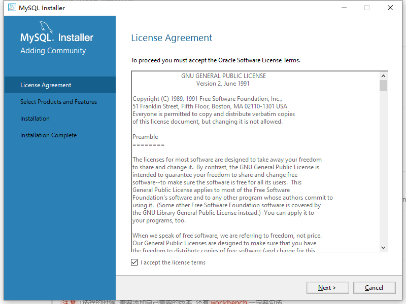
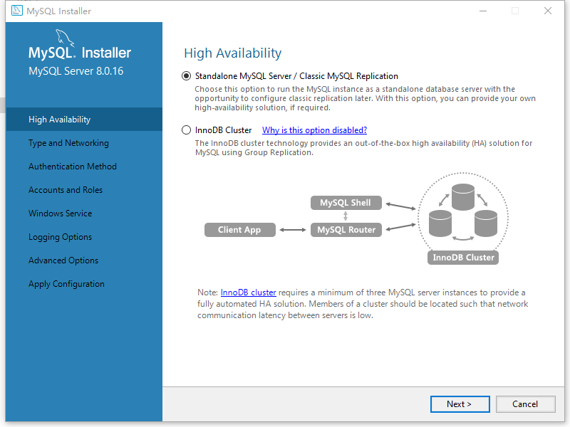
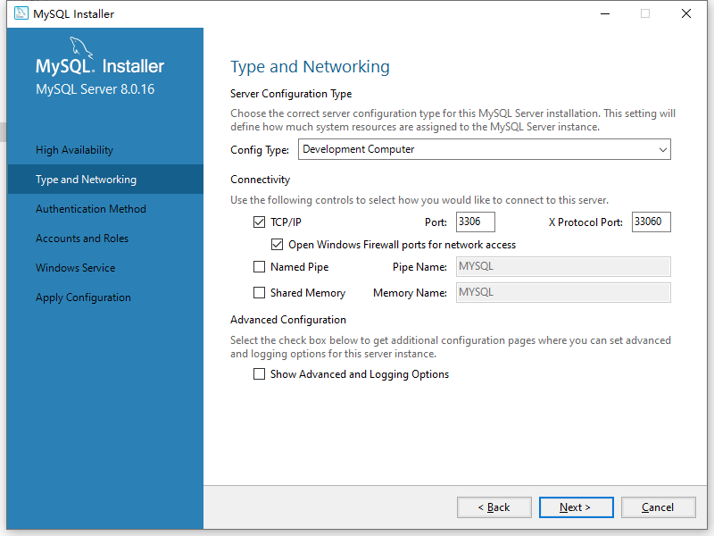

>本人笔记分享:[`全部笔记`](https://gitee.com/hongjilin/hongs-study-notes) [`java笔记`](https://gitee.com/hongjilin/hongs-study-notes/tree/master/%E7%BC%96%E7%A8%8B_%E5%90%8E%E5%8F%B0%E6%9C%8D%E5%8A%A1%E7%AB%AF%E5%AD%A6%E4%B9%A0%E7%AC%94%E8%AE%B0/Java/)

# #目录

>[TOC]

# 一、安装失败卸载

## Ⅰ-方法/步骤1:

>**删除 MySQL 隐藏文件夹**
>
>在 C 盘的 ProgramData （注意此文件夹是默认隐藏的）下会有一个 MySQL 文件夹，这个文件夹要删除

## Ⅱ-方法/步骤2:

>**删除注册表里面所有和MySQL有关的文件**
>
>Windows 运行框（ Windows键 + R键）中输入 regedit , 打开注册表编辑窗口

## Ⅲ-方法/步骤3:

**搜索注册表信息**

鼠标指向计算机一栏，然后CTRL+F调出搜索框输入MySQL并搜索

## Ⅳ-方法/步骤4:

>**删除注册表信息**
>
>把搜索到的所有结果删除，之后搜索`卸载不掉的MySQL Connector Net xxx`（注意：此处xxx代表的是安装的connector的版本，搜索出来的connector如果是 单独的直接删除即可，如果搜索出来的文件下面还有一个文件和你卸载不掉的 connector 版本一样一定要删除，`版本不删除依然以后无法安装`，本人就是在此被坑,如果不放心可以直接搜索版本号xxx然后再删除）

# 二、安装

> [地址](https://dev.mysql.com/downloads/)
>
> 社区中的历史版本挑选自己的版本
>
> `注意`:选择的时候,需要添加自己需要的版本,还有`workbench`一定要勾选

>1. 下载后，进行安装，进入`license agreement`界面，勾选‘I accept the license terms’，然后点击‘next’
>
>2. `Select Products...`界面选择需要的`服务`与`workbench`,如果给了默认选项可以选择，然后点击‘next’
>
>3. `installion`界面，点击‘execute’，完成后，点击next
>
>4. 注意:如果点了Next之后发现会弹框报错，如:缺了`c++ 2003`的运行库。然后`executey`返回先安装运行库
>
>   
>
>6. 接下去直到输入密码前都是next
>
>7. accounts and roles界面，输入密码并再次确认
>
>8. 接下去一直往下next,然后结束
>
>9. 自动运行workbench  --`前面如果没选择就不会有这个`
>
>  
>
>10. 

