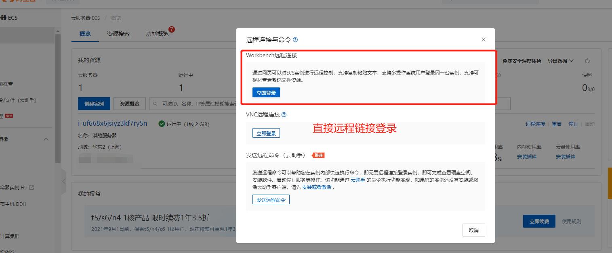
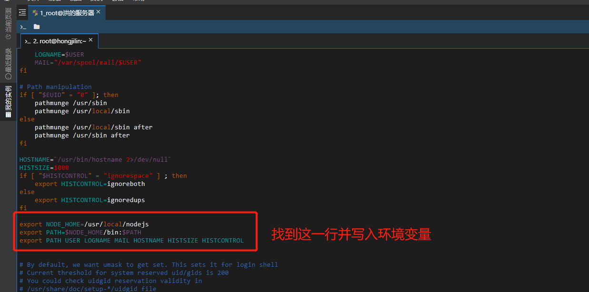
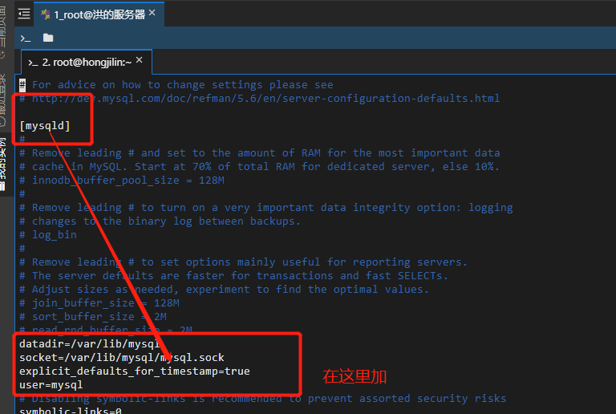
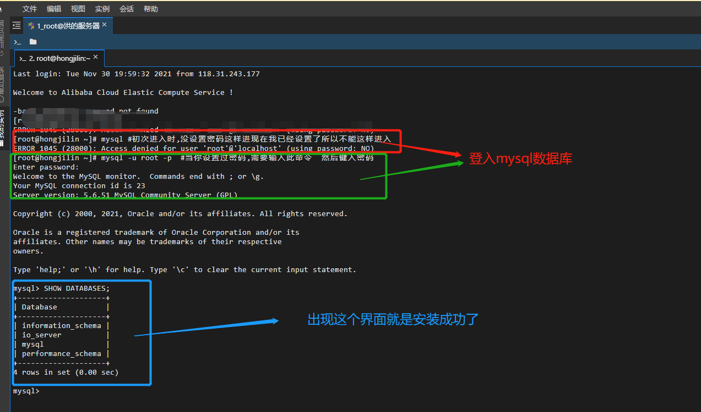

# #说明

>本笔记借鉴资料: [`参考文章链接`](https://www.cnblogs.com/tourey-fatty/p/12553144.html)

# #前言

>1. 请不要在选择阿里云应用镜像时，请不要选择nodejs的镜像，因为它版本太低了
>2. 在下载时请使用二进制文件，这样不用编译，不然可能还要安装gcc，Node版本过高的话，还要升级gcc，也是麻烦。
>3. 不要完全按照菜鸟教程里的CentOS安装node的方法，因为下载的文件需要编译。
>4. 不要完全按照菜鸟教程里的`linux`安装node的方法，里面软链接设置有些问题，和阿里云node解压后的路径不同。

# 一、安装Node环境

## Ⅰ - 远程链接

>我用的是阿里云官网的远程连接，就没去下载什么远程连接的工具了，远程连接后会出现个黑框，可以输入命令行的。
>
>

## Ⅱ - 命令行输入

>1. 切换用户
>
>   >```sh
>   >sudo su root
>   >```
>
>2. 下载二进制文件，以12.16.1版本为例\
>
>   >如果想要下载别的版本的话，自行到http://nodejs.org/dist/查找，注意后缀，要的是`linux-x64.tar.xz`
>   >
>   >```shell
>   >wget http://nodejs.org/dist/v12.16.1/node-v12.16.1-linux-x64.tar.xz 
>   >```
>
>3. 解压
>
>   >```sh
>   >tar xf  node-v12.16.1-linux-x64.tar.xz     
>   >```
>
>4. 移动文件夹
>
>   >```sh
>   >#mv 源文件 目标路径
>   >#目标路径，如果没有的文件夹系统会自己去创建
>   >mv node-v12.16.1-linux-x64 /usr/local/nodejs
>   >```
>
>5. 用vim打开相关文件配置环境变量
>
>   >```sh
>   >vim /etc/profile
>   >```
>
>6. 找到指定位置,并插入环境变量
>
>   >在文件中找到这行代码`export PATH USER LOGNAME MAIL HOSTNAME HISTSIZE HISTCONTROL`
>   >
>   >在之前找到的那串代码的**上面**，添加如下内容
>   >
>   >```sh
>   >export NODE_HOME=/usr/local/nodejs
>   >export PATH=$NODE_HOME/bin:$PATH
>   >```
>   >
>   >###### 这里是示例
>   >
>   > 
>
>7. 退出并保存
>
>   >按`esc`键，进入命令行模式，再依次按`:wq`，回车，如此就退出了vim
>
>8. 编译/etc/profile 使配置生效
>
>   >```sh
>   >source /etc/profile
>   >```
>
>9. 测试是否生效
>
>   >```sh
>   >node -v
>   >npm -v
>   >```
>   >
>   >如果输出版本，则证明安装node环境成功了。
>   >
>   >**如果再次连接服务器，发现node命令不管用了，别着急，再执行一次`source /etc/profile`即可*

# 二、Mysql安装

>**如果是想用node连接mysql的，最好不要安装8.0以上的版本**

## Ⅰ - 依次输入下面四条命令

>按照菜鸟教程提供的步骤，这四条目前还没啥子问题的,依次输入下面四条命令(`要分开输入`)
>
>```sh
>wget http://repo.mysql.com/mysql-community-release-el7-5.noarch.rpm
>rpm -ivh mysql-community-release-el7-5.noarch.rpm
>yum update
>yum install mysql-server
>```
>
>在执行`yum update`之后，会有让你确定是否要下载，都选择y

## Ⅱ - 权限设置与初始化

>* 权限设置
>
>  ```sh
>  chown mysql:mysql -R /var/lib/mysql
>  ```
>
>* 初始化
>
>  ```sh
>  ysqld --initialize
>  ```

### ① 可能的报错与解决

>当你运行初始化命令后,出现这个报错:
>
>```sh
>[Warning] TIMESTAMP with implicit DEFAULT value is deprecated. Please use --explicit_defaults_for_timestamp server option (see documentation for more details).
>2021-11-28 18:07:59 0 [Note] mysqld (mysqld 5.6.43) starting as process 16404 ...
>2021-11-28 18:07:59 16404 [ERROR] Fatal error: Please read "Security" section of the manual to find out how to run mysqld as root!
>
>2021-11-28 18:07:59 16404 [ERROR] Aborting
>
>2021-11-28 18:07:59 16404 [Note] Binlog end
>2021-11-28 18:07:59 16404 [Note] mysqld: Shutdown complete
>```

### ② 初始化错误的解决

>用vim打开相关文件，`vim /etc/my.cnf`，在[mysqlId]下添加如下内容
>
>```sh
>explicit_defaults_for_timestamp=true
>user=mysql
>```
>
>添加完成后，按`esc`，再按`:wq`，退出并保存,随后运行下面的命令
>
>```sh
>mysqld --initialize
>```
>
> 

## Ⅲ - 启动Mysql

>依次输入下面的命令
>
>```sh
>systemctl start mysqld #启动Mysql
>systemctl status mysqld #查看mysql运行状态
>mysqladmin --version #检查mysql是否安装成功
>```
>
>如果输出任何信息，证明安装失败,但只要操作正确,就不会错的

## Ⅳ - 进入Mysql

>* 进入mysql(注意,只有当你没设置密码的时候才能不输入密码)
>
>  ```sh
>  mysql #初次进入时,没设置密码这样进入
>  mysql -u root -p  #当你设置过密码,需要输入此命令  然后键入密码
>  ```
>
>* 查看当前数据库
>
>  ```sh
>  SHOW DATABASES;
>  ```
>
>* 成功示例
>
>   

### 可能出现的报错

>如果出现这个报错
>
>```sh
>ERROR 2002 (HY000): Can't connect to local MySQL server through socket '/var/lib/mysql/mysql.sock' (2)
>```
>
>###### 解决方案
>
>```sh
> ps -A|grep -i  mysql
>```
>
>如果输出类似下面的信息，那么 kill 杀死就好
>
>```sh
> 13285 ?        00:00:00 mysqld_safe
> 13622 ?        00:01:33 mysqld
>kill 13285
>kill 13622
>```
>
>杀完之后再次输入mysql，如果还是报同样的错误，那么再次输入`ps -A|grep -i mysql`，如此反复直到杀干净为止，这样就能顺利的进入mysql了

## Ⅴ - 设置(重置)密码

>在进行了 **步骤Ⅳ** 后,如果没有设置密码的要进行一次密码设置
>
>```sh
>mysqladmin -u root password "新的密码";
>```
>
>接下来会有个警告，不过不用理会
>
>随后重新进入Mysql,看看是否成功
>
>```sh
>mysql -u root -p
>```
>
>

