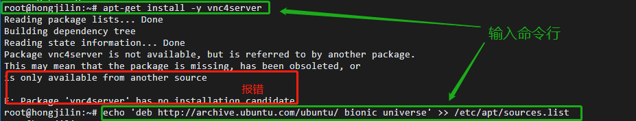
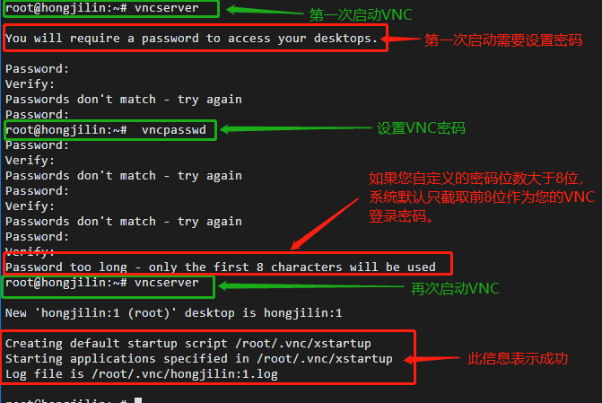
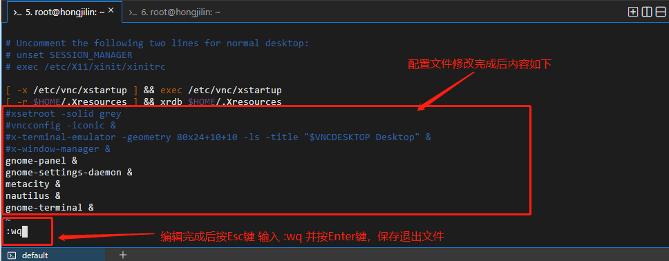
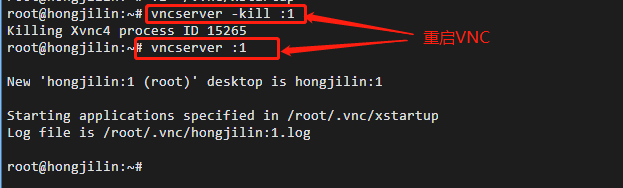
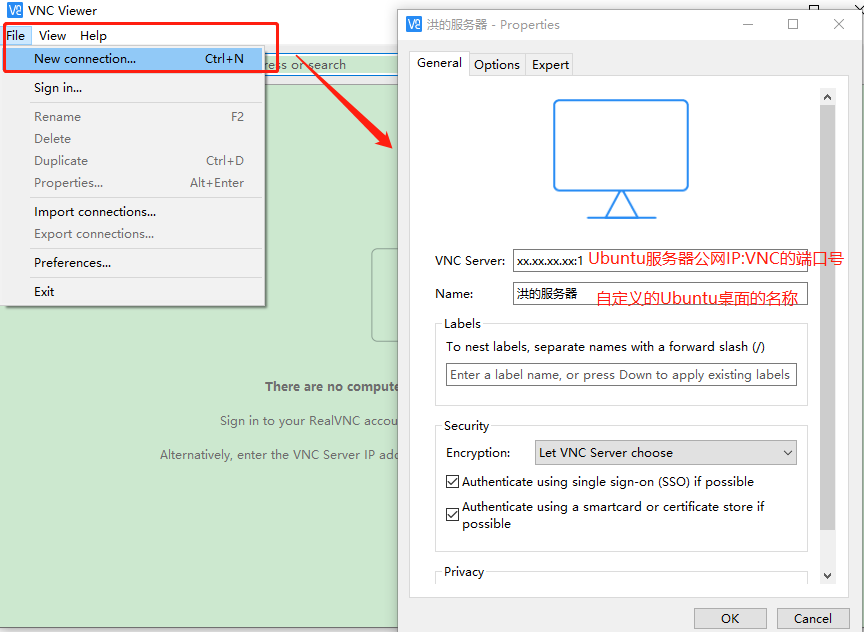
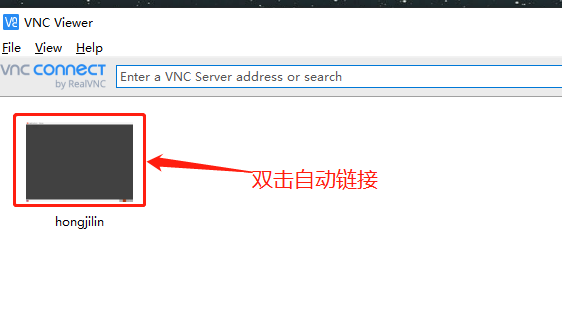
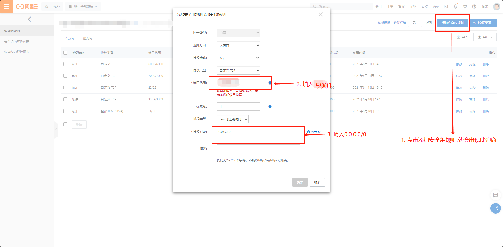
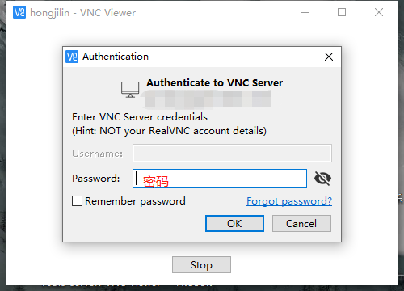
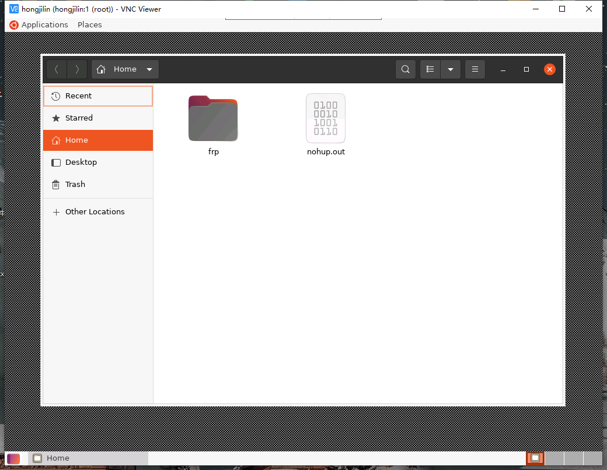

# #说明

>本笔记是本人参照阿里云官方文档的 [`通过VNC搭建Ubuntu图形界面`](https://help.aliyun.com/document_detail/59330.html?spm=5176.22414175.sslink.1.5f0560352cNlYO)、查阅csdn的[`NinoSun的阿里云服务器VNC连接Timed out waiting for a response from the computer报错解决方案`](https://blog.csdn.net/Nino_sama)、[`yanlaifan的ubuntu命令行模式与图形桌面切换方法`](https://blog.csdn.net/yanlaifan/article/details/53907104) 、[`sinat_40482939的Ubuntu中yum命令相关问题详解`](https://blog.csdn.net/sinat_40482939/article/details/107725446)进行操作,但期间出现了文档中没有的些许错误(也许是本人目前对linux还未系统学习原因),所以`将文档操作部分摘录下来`及自己操作实践出现的问题解决记录下来

# #目录

>[TOC]

# 通过VNC搭建Ubuntu图形界面

>轻量应用服务器提供的Linux系统均为命令行界面。如果您希望通过图形界面管理操作系统，可以使用VNC（Virtual Network Console）实现。本文介绍如何在Ubuntu系统中搭建图形界面。

## 一、前提条件及示例背景

>- 已创建Ubuntu系统的轻量应用服务器。具体操作，请参见[创建服务器（WordPress应用镜像）](https://help.aliyun.com/document_detail/59072.htm#task218)。
>- 已在Ubuntu服务器的防火墙中放行了VNC服务所需的5900和5901端口。具体操作，请参见[添加防火墙规则](https://help.aliyun.com/document_detail/59086.htm#section-zy8-x7r-9pl)。
>- 当然 本人找了好久没找到防火墙设置,最后解决方案是设置`安全组`,具体步骤(在下方VNC Viewer工具部分) --> [点我传送](#Ⅰ-可能的问题:) 
>
>本人是按照`Ubuntu 20.04.2`操作系统为例，通过VNC搭建图形界面，并在本地的Windows系统中，使用VNC Viewer工具测试访问
>
>查看自己ubuntu版本方法(适用linux):` 运行命令: cat /etc/issue`
>
> 


## 二、搭建图形界面

### 1、远程连接Ubuntu服务器

>具体操作，请参见[通过管理控制台远程连接Linux服务器](https://help.aliyun.com/document_detail/59083.htm#section-x54-mw9-9hc)。  -->本人此处直接用网页阿里云直接远程连接

### 2、运行以下命令，切换为`root`用户

>```sh
>sudo su root
>```

### 3、安装并配置VNC

#### Ⅰ- 运行以下命令，更新软件源

>```sh
>apt-get update
>```

#### Ⅱ- 运行以下命令，安装VNC

>```sh
>apt-get install -y vnc4server
>```
>
>1. 可能的问题说明1:
>
>   >
>   >
>   >`说明`:如果安装vnc4server失败，可能是因为当前系统版本（例如Ubuntu 20.04）下默认没有vnc4server软件包。您可以运行
>   >
>   >```sh
>   >echo 'deb http://archive.ubuntu.com/ubuntu/ bionic universe' >> /etc/apt/sources.list
>   >```
>   >
>   >将vnc4server所在的软件仓库添加至Ubuntu的软件包配置文件/etc/apt/sources.list中，然后再次运行
>   >
>   >`apt-get install -y vnc4server`命令进行安装。
>
>2. 可能的问题2:
>
>   >如果上面按照`问题1`解决方式无效后,仍报错`E: Package 'vnc4server' has no installation candidate`
>   >那么在上面命令后面，执行以下命令更新一下再重新安装 就可以继续执行安装命令`apt-get install -y vnc4server`了
>   >
>   >```sh
>   >sudo apt update
>   >```

#### Ⅲ- 运行以下命令，启动VNC

>1. 运行此命令，启动VNC
>
>   ```sh
>   vncserver
>   ```
>
>2. 可能出现的问题:
>
>   - 第一次启动需要设置VNC的登录密码。
>   - 如果您自定义的密码位数大于8位，系统默认只截取前8位作为您的VNC登录密码。 
>   - 设置密码中的`Password`和`Verify`是第一次输入密码以及确认密码,可以直接设置也可以运行`vncpasswd`命令进入设置密码
>
>3. 运行截图示例
>
>    
>
>   `主机名:1`表示已启动的VNC的端口号，在后续步骤中，需要在VNC远程连接工具中使用`Ubuntu服务器公网IP:1`远程连接Ubuntu图形界面。 


### 4、安装桌面环境

#### Ⅰ- 运行以下命令，安装x-windows应用程序

>```sh
>apt-get install -y x-window-system-core
>```

#### Ⅱ- 运行以下命令，安装GNOME的显示管理器gdm3

>```sh
>apt-get install -y gdm3
>```

#### Ⅲ- 运行以下命令，安装Ubunut的桌面

>```sh
>apt-get install -y ubuntu-desktop
>```

#### Ⅳ- 运行以下命令，安装GNOME依赖包

>```sh
>apt-get install -y gnome-panel gnome-settings-daemon metacity nautilus gnome-terminal
>```

#### Ⅴ-运行以下命令，备份VNC的xstartup配置文件

>```sh
>cp ~/.vnc/xstartup ~/.vnc/xstartup.bak
>```

#### Ⅵ- 运行以下命令，修改VNC的xstartup配置文件

>```sh
>vi ~/.vnc/xstartup
>```

#### Ⅶ- 按`i`键进入编辑模式。

>此处是接上一行`Ⅵ`命令`修改VNC的xstartup配置文件`
>
>您需要对配置文件做以下修改：
>
>- 在每一行开头使用`#`将以下配置信息注释掉：
>
>  ```sh
>  xsetroot -solid grey
>  vncconfig -iconic &
>  x-terminal-emulator -geometry 80x24+10+10 -ls -title "$VNCDESKTOP Desktop" &
>  x-window-manager &
>  ```
>
>- 在配置文件的末尾，添加以下配置信息：
>
>  ```sh
>  gnome-panel &
>  gnome-settings-daemon &
>  metacity &
>  nautilus &
>  gnome-terminal &
>  ```
>
>- 修改完成后 按`Esc`键，然后输入`:wq`并按`Enter`键，保存退出文件。
>
>配置修改完成后如下图所示
>
> 


### 5、重新启动VNC

#### Ⅰ- 运行以下命令，关闭已启动的VNC

>```sh
>vncserver -kill :1
>```

#### Ⅱ- 运行以下命令，启动一个新的VNC

>VNC的端口号仍为1。
>
>```sh
>vncserver :1
>```

#### Ⅲ- 截图示例

> 

## 三、使用VNC Viewer工具测试访问

### 1、在本地的Windows系统中，下载并安装VNC Viewer

>在本地的Windows系统中，下载并安装VNC Viewer。您可以访问[VNC Viewer官网](https://www.realvnc.com/en/connect/download/viewer/?spm=a2c4g.11186623.2.11.42dcdceb1U3eA3)获取下载链接以及安装方式。

### 2、打开VNC Viewer,然后新增链接

>1. 打开VNC Viewer，在顶部菜单栏，选择`File> New connection...`。
>
>2. 在**Properties**对话框，配置Ubuntu桌面的登录信息，然后单击**OK**。
>
>   必须的配置项说明：
>
>   - **VNC Server**：`Ubuntu服务器公网IP:VNC的端口号`。例如：`114.55.XX.XX:1`。
>   - **Name**：自定义的Ubuntu桌面的名称。例如：`test`。
>
> 

### 3、双击Ubuntu桌面的卡片

> 

#### Ⅰ-可能的问题:

> 如果你未添加防火墙,此时可能会出现链接失败 :`Timed out waiting for a response from the computer`
>
> 这时你可以去
>
> 1. 选择安全组配置  (也可以直接左侧导航栏菜单选择`安全组`)
>
>    
>
> 2. 点击出现的配置规则
>
>     
>
> 3. 添加安全组规则:可以分别添加5900以及5901,或者直接选定范围5900/5901
>
>    
>
> 4. 这样就可以正常连接了

### 4、在**Authentication**对话框的**Password**文本框中，输入Ubuntu桌面的密码，然后单击**OK**

> 
>
>

### 5、访问成功

> 


