# #说明

>该笔记是本人购买`服务器`后,根据博客园[萧凡客](https://www.cnblogs.com/xiaofanke/p/10428409.html)关于`利用阿里云搭建frp实现外网远程桌面内网电脑相关操作`、CSDN的[曹灰灰](https://blog.csdn.net/cao0507)的`阿里云服务器实现 frp 内网穿透`实践后记录的笔记
>
>主要应用场景：针对 ① 学生放假回家使用外网无法远程操作学校的服务器或者电脑 ② 工作后回家发现公司工作有部分未完成但需要内网才能有数据等
>
>这里通过阿里云的云服务器(其他云服务器操作一致)搭建一个frp服务，实现内网穿透，从而可以直接通过远程桌面或者其他工具实现对校园网内的服务器或者电脑进行操作。

# #目录

>[TOC]


# 一、预先准备

## 1、 购买云服务器及初步搭建

>1. 购买服务器:推荐去买阿里或者腾讯云,如果是学生还特别便宜,不是学生就等节日活动买 -->[`点我传送`](https://www.aliyun.com/1111/new?userCode=ntx4gz4v)
>2. 搭建云服务器(其实就是购买时选择的那些)，设置系统和登录密码。这里我选择的是ubuntu系统
>
>其实不同操作系统的云服务器在使用 frp 时操作都是一样的，就是**下载**，**配置**，**运行**。可能有区别的地方就是防火墙相关的配置，不同云服务厂商的镜像不同可能也有一些差别


## 2、frp相关知识

### Ⅰ- frp作用

>1. 利用处于内网或防火墙后的机器，对外网环境提供 http 或 https 服务。
>2. 对于 http, https 服务支持基于域名的虚拟主机，支持自定义域名绑定，使多个域名可以共用一个80端口。
>3. 利用处于内网或防火墙后的机器，对外网环境提供 tcp 和 udp 服务，例如在家里通过 ssh 访问处于公司内网环境内的主机。

### Ⅱ- frp实现功能

>1. 外网通过ssh访问内网机器
>2. 自定义绑定域名访问内网web服务 (必须需要公网服务器绑定域名)

### Ⅲ- frp下载说明

>公网服务器与内网服务器都需要下载frp进行安装 -->具体安装与使用步骤在下方
>
>这是下载地址的`github页面`,可以自行前往查看    --> [`点我传送`](https://github.com/fatedier/frp/releases)
>
>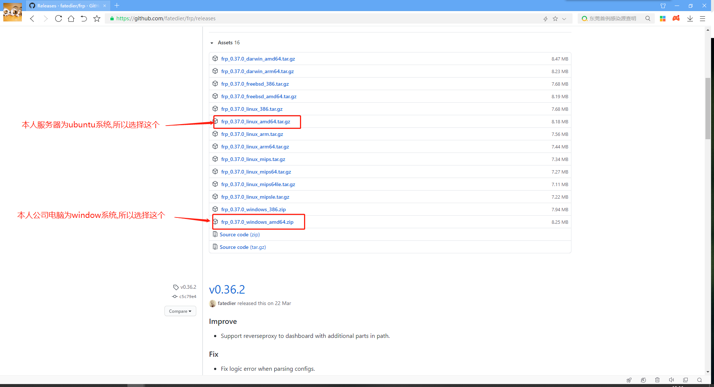
>
>具体下载什么版本根据个人情况不同自行选择


# 二、**服务器操作**:

## 1、远程登录系统

>首先登录系统(可以从阿里云网页上直接链接,也可以用其他软件) 

## 2、服务器终端操作(`Linux系统为例`):

>如果其他系统自行打开终端,但如window可以直接操作不用命令行(类似操作在下方客户端部分) -->[点我查看所有frp版本](https://github.com/fatedier/frp/releases)

### Ⅰ- 下载frp压缩包

>由于本人是`ubuntu`系统,所以进去就是终端,输入命令:  -->[点我查看所有版本](https://github.com/fatedier/frp/releases)
>
>  ```shell
>#此命令是下载linux版本的软件,如果其他系统请自行选择
>wget https://github.com/fatedier/frp/releases/download/v0.24.1/frp_0.24.1_linux_amd64.tar.gz
>  ```
>
>运行示例:
>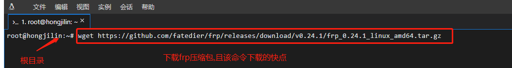

### Ⅱ- 解压

>解压文件命令行(后面跟的使下载的版本)：
>
>  ```shell
>tar -zxvf frp_0.24.1_linux_amd64.tar.gz
>  ```
>
> 截图示例 

### Ⅲ- 重命名(方便后续命令行操作将其`简化为frp`)

>命令行
>
>  ```shell
>mv frp_0.24.1_linux_amd64 frp
>  ```
>
>截图示例
>
>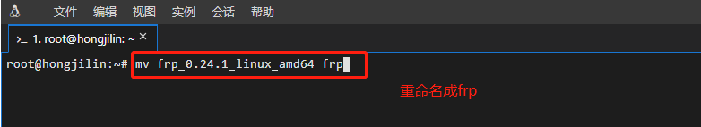 

### Ⅳ- 查看上述操作是否正确(可以跳过)

>先查看上述操作是否成功-->输入`ls`
>
>截图示例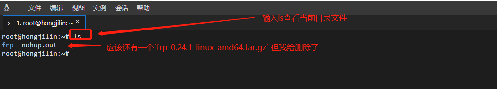

### Ⅴ- 修改配置文件 **`frps.ini`**

>  1. `注意`:此处需要先`cd frp`,再`vim frps.ini`
>
>     ```shell
>     cd frp  #先进入到frp文件目录中
>     vim frps.ini  #在frp文件目录中找到frps.ini配置文件且进行修改
>     ```
>
>     截图示例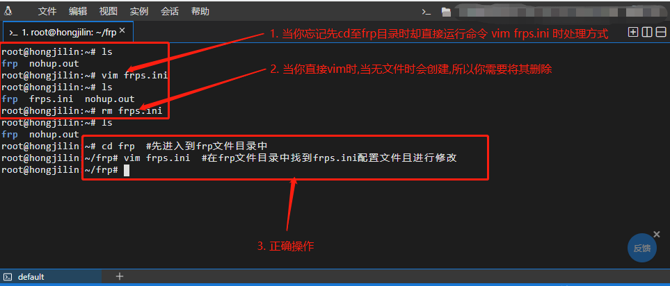
>
>  2. 写入配置
>
>     ```shell
>     [common]
>     #服务器开放的端口
>     bind_port = 7000
>     ```
>
>     截图示例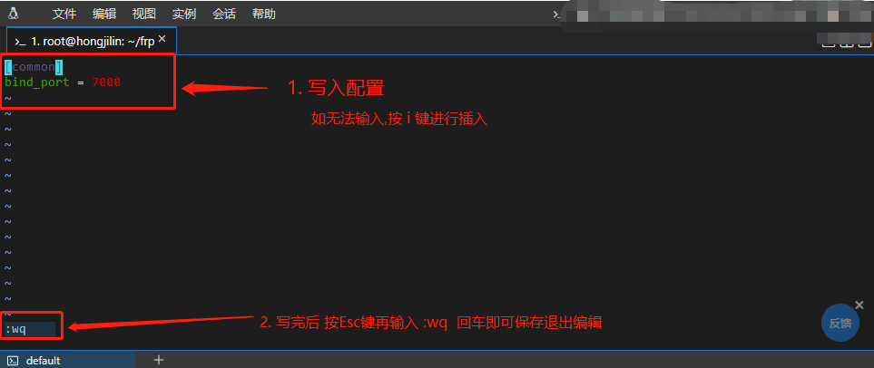


## 3、云服务器管理平台操作(`以阿里云为例`)

>1. 此处以`阿里云旧版为例`(右上角可以切换新旧版本)
>
>2. 选择安全组配置  (也可以直接左侧导航栏菜单选择`安全组`)
>
>   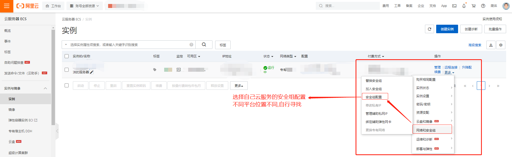
>
>3. 点击出现的配置规则
>
>   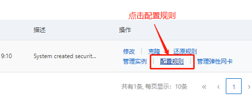 
>
>4. 添加安全组规则
>
>   
>
>5. 至此云平台设置完成:`其实只是设置了安全组规则`

## 4、在内网目标主机上运行客户端程序

>此步通常是都配置完成后连接使用
>
>**nohup** :英文全称 no hang up（不挂起），用于在系统后台不挂断地运行命令，退出终端不会影响程序的运行。
>
>**nohup** 命令，在默认情况下（非重定向时），会输出一个名叫 nohup.out 的文件到当前目录下，如果当前目录的 nohup.out 文件不可写，输出重定向到 **$HOME/nohup.out** 文件

>`终端命令`:
>
>```shell
>cd frp  #进入到frp目录
>nohup ./frpc -c frpc.ini 
>```
>
>`success`:查看 nohup.out 的信息
>
>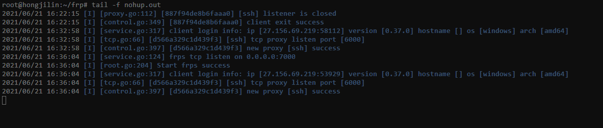
>
>本质:其实就是服务器远程连接本地


# 三、客户端配置(个人 or 公司电脑 or 学校电脑)

> 此处默认是`window`系统,如果是linux,那就参考上面,如果服务端也是window,那么就按照这个来

## 1、下载安装包、解压

>上面预先准备部分已经给出frp下载说明,不再赘述 -->[点我传送](#Ⅲ - frp下载说明)

## 2、然后配置**frpc.ini**文件

>```shell
>[common]
>server_addr = 你自己服务器端ip（公网ip）
>server_port = 7000 #对应服务器配置中的端口
> 
>[ssh]
>type = tcp
>local_ip = 自己电脑的ip
>local_port = 3389
>remote_port = 6000
>```

## 3、客服端添加端口出站规则：将端口**3389**添加到出站规则中

>控制面板-->系统和安全-->防火墙-->高级设置-->出站规则-->新建规则-->...
>
>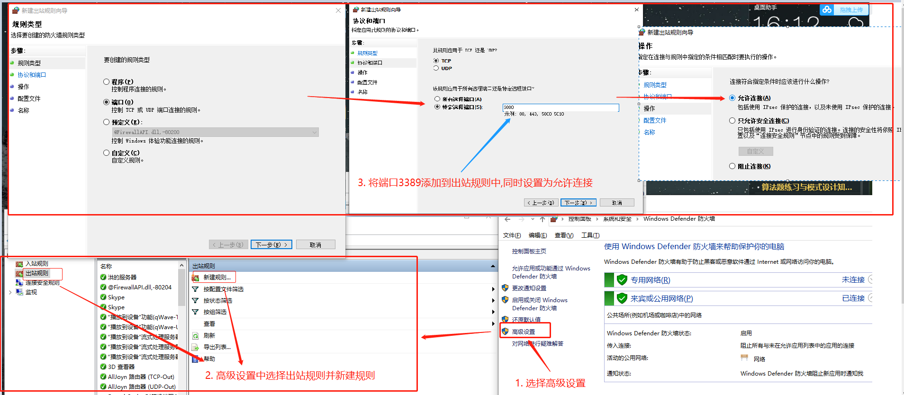

## 4、在公网服务器上运行服务端程序

>在Dos中启动服务：win+R 输入cmd
>
>1. 需要`先进入frp目录`后执行如下操作：-->`换话说就是将自己暴露出去,使外界能远程`
>
>   ```shell
>   nohup ./frps -c frps.ini # 在公网服务器上运行服务端程序 
>   ```
>
>   运行示例:
>
>    
>
>2. `success`:查看 nohup.out 的信息， -->如果安装`winsw`后日志存在`winse.out.log`中
>
>   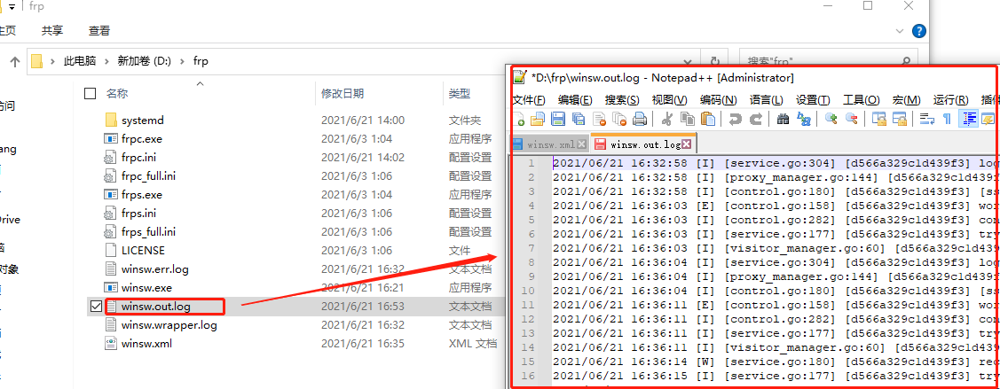
>
>   
>
>`ps`:远程访问地址--(阿里云服务公网IP):6000(端口号，remote_port)


# 四、设置开启自启动客户端frpc：

>服务器一般不会经常重启，但是自己的电脑涉及到经常重启问题，所以需要设置`开启自启动客户端frpc`：
>
>1. 下载 `winsw` :  --> [`点我传送`](https://github.com/kohsuke/winsw/releases)
>
>   改名为winsw.exe，放到frp相同的目录里，并在同一个目录里创建一个utf8编码的文本文件，文件名是 winsw.xml，内容是
>
>   
>
>2. **启动：**以管理员权限打开一个命令窗口，cd到frp所在目录，执行：
>
>   ```shell
>   winsw install
>   winsw start
>   ```
>
>3. 卸载服务
>
>   ```shell
>   winsw stop
>   winsw uninstall
>   ```
>
>4. 截图示例
>
>    