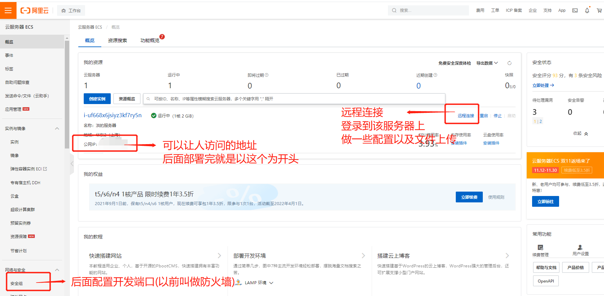
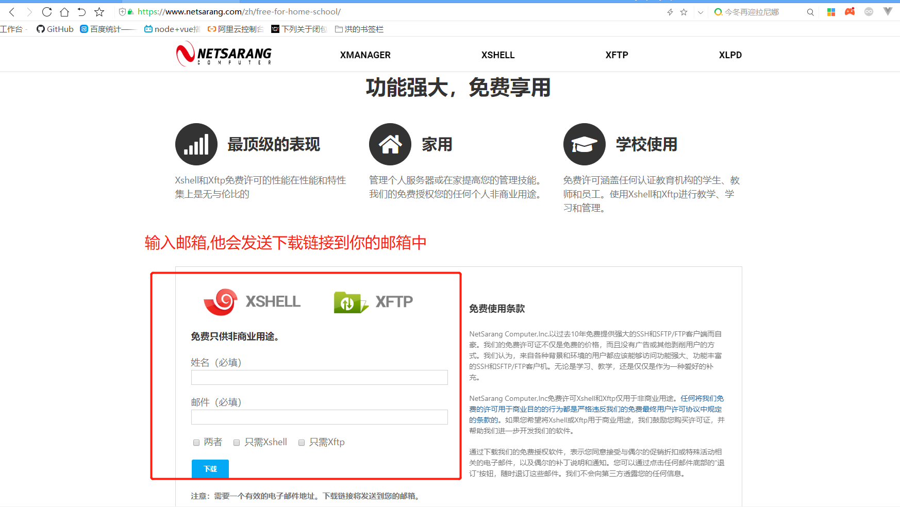
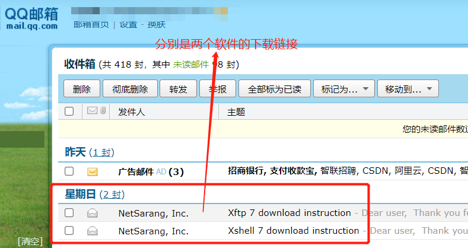
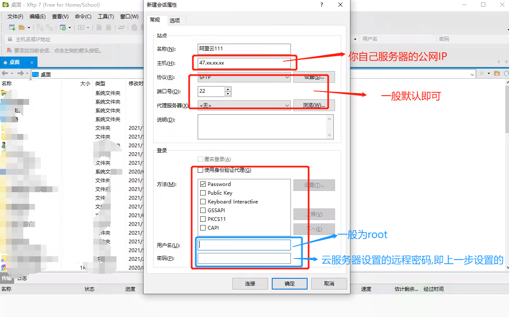
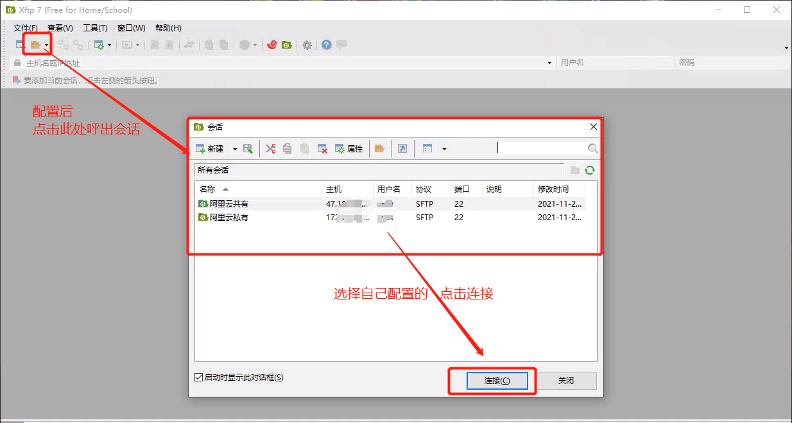
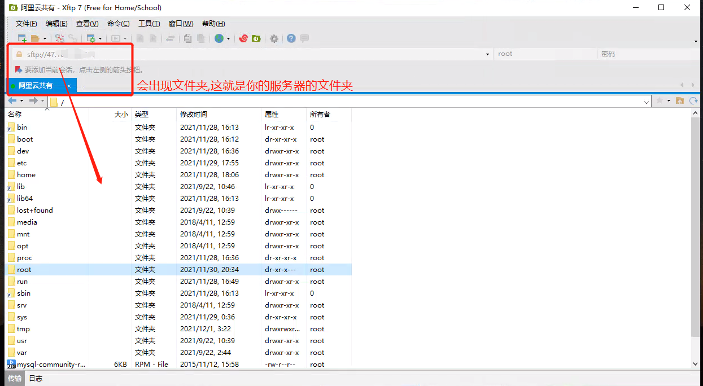
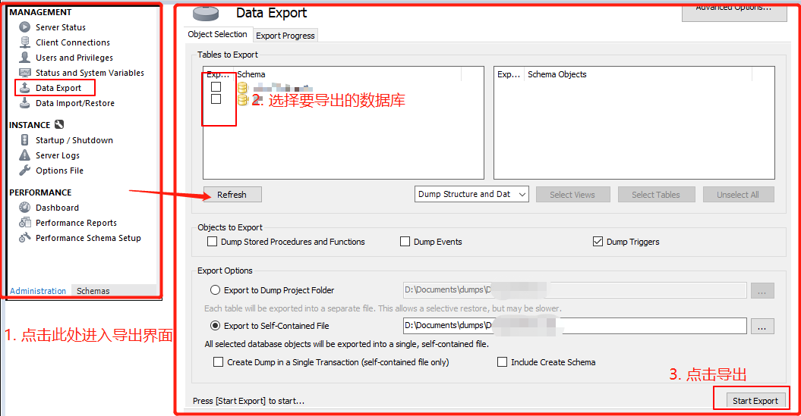
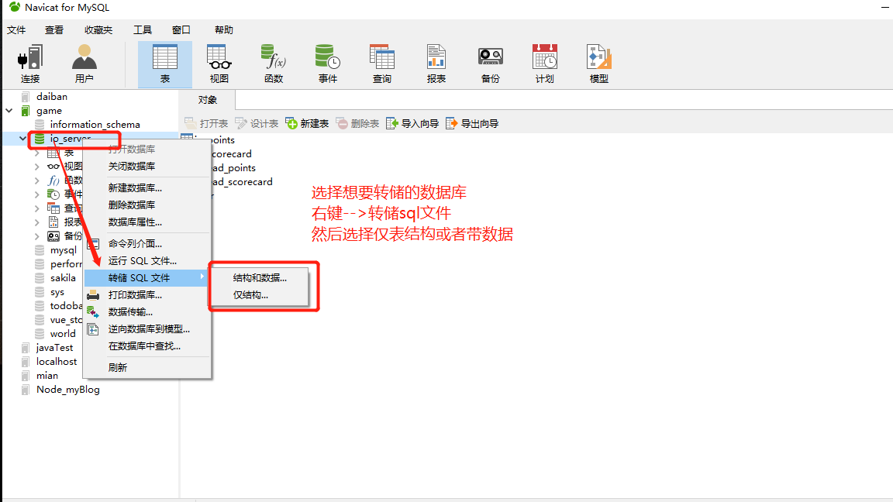

# #说明

>此笔记为记录本人在**`阿里云centos部署vue+node(express)+mysql项目`**的踩坑填坑过程,希望能对小伙伴们有帮助
>
>当然,实际上云服务器操作都是大同小异,此处拿阿里云做例子

# 一、购买云服务器

>* 如果是学生,可以很优惠地买到云服务器,本人就是用的学生认证买的
>* 建议 **服务器的系统镜像选择centos 7** 当然,这个可以重置,也不麻烦,具体操作可以百度
>* 下面是几个按钮简单介绍,防止找不到
>
>

# 二、安装开发环境

>此处看本人其他笔记,有专门叙述,下面是链接
>
>**[云服务器安装Node与Mysql环境](https://gitee.com/hongjilin/hongs-study-notes/tree/master/编程_后台服务端学习笔记/云服务器相关笔记/云服务器安装Node与Mysql环境)** 

# 三、下载远程链接软件

## Ⅰ - 去官网找下载源

>###### 下载安装此软件是为了方便上传我们项目文件
>
>官网链接: https://www.netsarang.com/zh/xftp/ ,
>
>官网的个人家庭版(**免费的,也是本人下载的版本**): https://www.netsarang.com/zh/free-for-home-school/
>
> 在这里面找一下个人版本,是免费的.
>
> 

## Ⅱ  -  回到自己的邮箱点击链接下载

>这里选择 `Xftp` 下载,因为我们只要用来进行项目文件上传
>
> 
>
>傻瓜式安装,一直点下一步即可

## Ⅲ - 回到自己阿里云,设置远程链接密码

>* 默认是没有设置的,但如果你要用远程链接软件,那么就必须要设置密码
>* **将这个密码记住,后面很常用,等下也要用到**

# 四、用Xftp连接服务器

## Ⅰ - 打开安装好的xftp,新建会话

> 

## Ⅱ  -  打开配置好的会话,连接服务器

>

## Ⅲ - 连接成功

>连接成功会出现下面这个界面
>
> 
>
>上传文件时只要将文件夹拖入即可

# 五、准备项目文件

## Ⅰ - 导出数据库 sql 文件

>1. 这是用 workbench 文件导出的操作
>
>
>
>2. 这是用 Navcat 软件导出的界面
>
>

