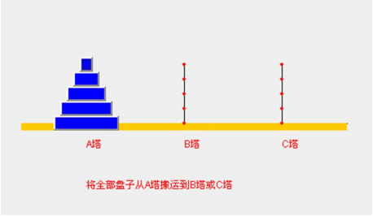

# #说明

>1.  **[数据结构与算法基础学习笔记](https://gitee.com/hongjilin/hongs-study-notes/tree/master/编程_算法及课程基础学习笔记/数据结构与算法/数据结构与算法基础学习笔记)** 
>
>  > 此处将整理数据结构与算法基础知识点学习笔记,学习的课程是 青岛大学-王卓老师的[数据结构与算法基础](https://www.bilibili.com/video/BV1nJ411V7bd?share_source=copy_web)
>
>2. **[数据结构与算法进阶学习笔记](https://gitee.com/hongjilin/hongs-study-notes/tree/master/编程_算法及课程基础学习笔记/数据结构与算法/数据结构与算法进阶学习笔记)** 
>
>  >基础掌握后就需要结合实例进行巩固理解,此笔记将学习记录数据解构与算法在实际代码中如何实现
>  >
>  >此处选择用Java语言作为笔记中例子实现语言,前端的同学不用慌,这边用到的就只是Java基础,只要你有学前端ES6的class知识点,栗子中的代码基本与JS一摸一样
>  >
>  >前端ES系列知识点笔记 --> **[ES6及后续版本学习笔记](https://gitee.com/hongjilin/hongs-study-notes/tree/master/编程_前端开发学习笔记/ES6及后续版本学习笔记)** 
>
>3.  **[LeetCode题目](https://gitee.com/hongjilin/hongs-study-notes/tree/master/编程_算法及课程基础学习笔记/数据结构与算法/LeetCode题目)** 
>
>  > 此笔记将持续收录算法题
>
>除此笔记外大家可以看我其他笔记 :**[全栈笔记](https://gitee.com/hongjilin/hongs-study-notes/tree/master)**、**[数据结构与算法](https://gitee.com/hongjilin/hongs-study-notes/tree/master/编程_算法及课程基础学习笔记/数据结构与算法)**、**[编程_前端开发学习笔记](https://gitee.com/hongjilin/hongs-study-notes/tree/master/编程_前端开发学习笔记)**、**[编程_后台服务端学习笔记](https://gitee.com/hongjilin/hongs-study-notes/tree/master/编程_后台服务端学习笔记)** 、**[Java](https://gitee.com/hongjilin/hongs-study-notes/tree/master/编程_后台服务端学习笔记/Java)** 、**[Nodejs](https://gitee.com/hongjilin/hongs-study-notes/tree/master/编程_后台服务端学习笔记/Nodejs)** 、**[JavaScript笔记](https://gitee.com/hongjilin/hongs-study-notes/tree/master/编程_前端开发学习笔记/HTML+CSS+JS基础笔记/JavaScript笔记)**、**[ES6及后续版本学习笔记](https://gitee.com/hongjilin/hongs-study-notes/tree/master/编程_前端开发学习笔记/ES6及后续版本学习笔记)** 、**[Vue笔记整合](https://gitee.com/hongjilin/hongs-study-notes/tree/master/编程_前端开发学习笔记/Vue笔记整合)** 、**[React笔记](https://gitee.com/hongjilin/hongs-study-notes/tree/master/编程_前端开发学习笔记/React笔记)**、**[微信小程序学习笔记](https://gitee.com/hongjilin/hongs-study-notes/tree/master/编程_前端开发学习笔记/微信小程序学习笔记)**、**[Chrome开发使用及学习笔记](https://gitee.com/hongjilin/hongs-study-notes/tree/master/编程_前端开发学习笔记/Chrome开发使用及学习笔记)** 以及许多其他笔记就不一一例举了

------

# #此文件为方便gitee网站观阅使用专门创建

> 此笔记文件于某一时间截取复制至此,容易存在更新不及时问题,建议观看同级目录下的笔记文件
>
> 为防止网站加载时间过长,只截取了上方`数据结构与算法进阶学习笔记`部分笔记的部分知识点至此,方便网站阅读
>
> `基础掌握后就需要结合实例进行巩固理解,此处选择用Java语言作为笔记中例子实现语言,前端的同学不用慌,这边用到的就是Java基础,只要你有学前端ES6的class知识点,栗子中的代码基本与JS一摸一样`

# 数据结构与算法进阶

>1) 算法是程序的灵魂，优秀的程序可以在海量数据计算时，依然保持高速计算 
>
>2) 一般来讲 程序会使用了内存计算框架(比如 Spark)和缓存技术(比如 Redis 等)来优化程序,再深入的思考一下，这 些计算框架和缓存技术， 它的核心功能是哪个部分呢？ 
>
>3) 拿实际工作经历来说, 在 Unix 下开发服务器程序，功能是要支持上千万人同时在线，在上线前做内测，一切OK,可上线后，服务器就支撑不住了, 公司的 CTO 对代码进行优化，再次上线，坚如磐石。你就能感受到程序 是有灵魂的，就是算法。 
>
>4) 目前程序员面试的门槛越来越高，很多一线 IT 公司(大厂)，都会有数据结构和算法面试题(负责的告诉你，肯定有的) 
>
>5) 如果你不想永远都是代码工人,那就花时间来研究下数据结构和算法

## 一、数据结构与算法概述以及经典题目举例

### 1、数据结构和算法的关系

>1) 数据 data 结构(structure)是一门研究组织数据方式的学科，有了编程语言也就有了数据结构.学好数据结构可以 编写出更加漂亮,更加有效率的代码。 
>
>2) 要学习好数据结构就要多多考虑如何将生活中遇到的问题,用程序去实现解决. 
>
>3) `程序 = 数据结构 + 算法`
>
>4) 数据结构是算法的基础, 换言之，想要学好算法，需要把数据结构学到位。

### 2、线性结构与非线性结构

>数据结构包括：线性结构和非线性结构。

#### Ⅰ-线性结构

>1) 线性结构作为最常用的数据结构，其特点是数据元素之间存在一对一的线性关系 
>
>2) 线性结构有两种不同的存储结构，即顺序存储结构(数组)和链式存储结构(链表)。顺序存储的线性表称为顺序 表，顺序表中的存储元素是连续的 
>
>3) 链式存储的线性表称为链表，链表中的存储元素不一定是连续的，元素节点中存放数据元素以及相邻元素的地 址信息 
>
>4) 线性结构常见的有：数组、队列、链表和栈

#### Ⅱ-非线性结构

>非线性结构包括：二维数组，多维数组，广义表，树结构，图结构


### 3、经典面试题

#### Ⅰ-字符串匹配问题：

>1) 有一个字符串 str1= ""硅硅谷 尚硅谷你尚硅 尚硅谷你尚硅谷你尚硅你好""，和一个子串 str2="尚硅谷你尚 硅你"
>
>2) 现在要判断 str1 是否含有 str2, 如果存在，就返回第一次出现的位置, 如果没有，则返回-1 
>
>3) 要求用最快的速度来完成匹配 4) 
>
>解: 1. 暴力匹配 [简单，但是效率低] 2.  `KMP 算法《部分匹配表》`

#### Ⅱ-汉诺塔游戏

>请完成汉诺塔游戏的代码: 要求：
>
>1) 将 A 塔的所有圆盘移动到 C 塔。并且规定，在 
>
>2) 小圆盘上不能放大圆盘， 
>
>3)在三根柱子之间一次只能移动一个圆盘
>
> 

#### Ⅲ-八皇后问题:

>八皇后问题，是一个古老而著名的问题，是回溯算法的典型案例。该问题是国际西洋棋棋手马克斯·贝瑟尔于 1848 年提出：在 8×8 格的国际象棋上摆放八个皇后，使其不能互相攻击，即：任意两个皇后都不能处于同一行、 同一列或同一斜线上，问有多少种摆法。【92】=> `分治算法`
>
> 

#### Ⅳ-马踏棋盘算法

>1) 马踏棋盘算法也被称为骑士周游问题 
>
>2) 将马随机放在国际象棋的 8×8 棋盘 Board[0～7][0～7]的某个方格中，马按走棋规则(马走日字)进行移动。要求 每个方格只进入一次，走遍棋盘上全部 64 个方格 
>
>3) [游戏演示:](http://www.4399.com/flash/146267_2.html)
>
>4) 会使用到图的`深度优化遍历算法(DFS) + 贪心算法优化`
>
> 

### 4、几个实际编程中遇到的问题

#### Ⅰ-字符串替换问题

>


#### Ⅱ-一个五子棋程序

>如何判断游戏的输赢，并可以完成存盘退出和继续上局的功能 
>
>1) 棋盘 二维数组=>(稀疏数组)-> 写入文件 【存档功能】 
>
>2) 读取文件-》稀疏数组-》二维数组 -》 棋盘 【接上局】
>
>


#### Ⅲ-约瑟夫(Josephu)问题(丢手帕问题)

>1) Josephu 问题为：设编号为 1，2，… n 的 n 个人围坐一圈，约定编号为 k（1<=k<=n）的人从 1 开始报数，数 到 m 的那个人出列，它的下一位又从 1 开始报数，数到 m 的那个人又出列，依次类推，直到所有人出列为止， 由此产生一个出队编号的序列。 
>
>2) 提示：用一个不带头结点的循环链表来处理 Josephu 问题：先构成一个有 n 个结点的单循环链表（单向环形链 表），然后由 k 结点起从 1 开始计数，计到 m 时，对应结点从链表中删除，然后再从被删除结点的下一个结点 又从 1 开始计数，直到最后一个结点从链表中删除算法结束。 
>
>3) 小结：`该问题解决自 ->第四章链表的6小节 --环形链表实现 `


#### Ⅳ-其它常见算法问题:

>1) 修路问题 => 最小生成树(加权值)【数据结构】+ `普利姆算法 `
>
>2) 最短路径问题 => `图+弗洛伊德算法` 
>
>3) 汉诺塔 => `分支算法` 
>
>4) 八皇后问题 => `回溯`
>
>


## 二、稀疏数组与队列

### 1、稀疏 sparsearray 数组

#### Ⅰ-需求分析

> 需求举例:编写的五子棋程序中，有存盘退出和续上盘的功能
>
> 
>
> 分析:因为该二维数组的很多值是默认值 0, 因此记录了`很多没有意义的数据.->稀疏数组`。

#### Ⅱ-基本介绍

>当一个数组中大部分元素为０，或者为同一个值的数组时，可以使用稀疏数组来保存该数组。 稀疏数组的处理方法是: 
>
>1) 记录数组一共有`几行几列，有多少个不同`的值 
>
>2) 把具有不同值的元素的行列及值记录在一个小规模的数组中，从而`缩小程序的规模`
>
> 

#### Ⅲ-应用实例

>1) 使用稀疏数组，来保留类似前面的二维数组(棋盘、地图等等) 
>
>2) 把稀疏数组存盘，并且可以从新恢复原来的二维数组数 
>
>3) 整体思路分析
>
>
>
>4) 代码实现
>
>```java
>package com;
>public class SparseArray {
>    public static void main(String[] args) {
>        //创建一个原始的二维数组11*11
>        /* 0:表示没有棋子,1表示黑子,2表示蓝子 */
>        int chessArr1[][] = new int[11][11];
>        chessArr1[1][2] = 1;
>        chessArr1[2][3] = 2;
>        chessArr1[5][5] = 2;
>        //输出原始的二维数组
>        System.out.println("原始的二维数组");
>        for (int[] row : chessArr1) {
>            for (int data : row) {
>                System.out.printf("%d\t", data);
>            }
>            System.out.println();
>        }
>        //将二维数组转稀疏数组
>        //1.先遍历二维数组,得到非0数据的个数
>        int sum = 0;
>        for (int i = 0; i < 11; i++) {
>            for (int j = 0; j < 11; j++) {
>                if (chessArr1[i][j] != 0) sum++;
>            }
>        }
>        //创建对应的稀疏数组
>        int sparseArr[][] = new int[sum + 1][3];
>        //给稀疏数组赋值  -->存行列长度,有效数据
>        sparseArr[0][0] = 11;
>        sparseArr[0][1] = 11;
>        sparseArr[0][2] = sum;
>        //遍历二维数组,
>        int count = 0;//给稀疏数组当计数器
>        for (int i = 0; i < 11; i++) {
>            for (int j = 0; j < 11; j++) {
>                //当数组中遇到不为0时,给稀疏数组插入(push同效果):行 列 有效数
>                if (chessArr1[i][j] != 0) {
>                    count++;
>                    sparseArr[count][0] = i;
>                    sparseArr[count][1] = j;
>                    sparseArr[count][2] = chessArr1[i][j];
>                }
>            }
>        }
>        System.out.println("有效数据" + sum);
>        //输出稀疏数组的形式
>        System.out.println("'得到稀疏数组为~~'");
>        for (int i = 0; i < sparseArr.length; i++) {
>            System.out.printf("%d\t%d\t%d\t\n", sparseArr[i][0], sparseArr[i][1], sparseArr[i][2]);
>        }
>        System.out.println("将稀疏数组回复成原始的二维数组");
>        //1. 先读取稀疏数组的第一行,根据第一行的数据,创建原始的二维数组
>        int chessArr2[][] = new int[sparseArr[0][0]][sparseArr[0][1]];
>        //2. 在读稀疏数组后几行的数据(从第二行开始,所以i=1),并赋值给原始的二维数组即可
>        for (int i = 1; i < sparseArr.length; i++) {
>            chessArr2[sparseArr[i][0]][sparseArr[i][1]] = sparseArr[i][2];
>        }
>        //输出恢复后的二维数组
>        System.out.println("输出恢复后的二维数组");
>        for (int[] row : chessArr2) {
>            for (int data : row) {
>                System.out.printf("%d\t", data);
>            }
>            System.out.println();
>        }
>    }
>}
>```
>
>5) 练习 要求： 1) 在前面的基础上，将稀疏数组保存到磁盘上，比如 map.data 2) 恢复原来的数组时，读取 map.data 进行恢复

### 2、队列

#### Ⅰ-队列介绍

>1) 队列是一个有序列表，可以用数组或是链表来实现。 
>
>2) 遵循先入先出的原则。即：先存入队列的数据，要先取出。后存入的要后取出
>
> 

#### Ⅱ-数组模拟队列

>1. 队列本身是有序列表，若使用数组的结构来存储队列的数据，则队列数组的声明如上图, 其中 maxSize 是该队列的最大容量。 
>
>2. 因为队列的输出、输入是分别从前后端来处理，因此需要两个变量 front 及 rear 分别记录队列前后端的下标， front 会随着数据输出而改变，而 rear 则是随着数据输入而改变，如队列介绍中图所示
>
>3. 当我们将数据存入队列时称为”addQueue”，addQueue 的处理需要有两个步骤：思路分析:
>
>   >  - 将尾指针往后移：rear+1 , 当 front == rear 【空】 
>   >
>   >  - 若尾指针 rear 小于队列的最大下标 maxSize-1，则将数据存入 rear 所指的数组元素中，否则无法存入数据
>
>4. `注意`:front并没有直接指向数据,而是数据前一位,所以当你要用front读取队列头时需要`front+1`
>
>5. 代码实现
>
>  ```java
>  package com.queue;
>  import java.util.Scanner;
>
>  public class ArrayQueueDemo {
>      public static void main(String[] args) {
>          //创建一个队列
>          ArrayQueue queue = new ArrayQueue(3);
>          char key = ' ';//接受用户输入
>          Scanner scanner = new Scanner(System.in);
>          boolean loop = true;
>          //输出一个菜单
>          while (loop) {
>              System.out.println("s(show):显示队列");
>              System.out.println("e(exit):退出程序");
>              System.out.println("a(add):添加数据到队列");
>              System.out.println("g(get):从队列取出数据");
>              System.out.println("h(head):查看队列头的数据");
>              key = scanner.next().charAt(0);//接受一个字符
>              switch (key) {
>                  case 's':
>                      queue.showQueue();
>                      break;
>                  case 'a':
>                      System.out.println("输入一个数字");
>                      int value = scanner.nextInt(); //不用再new一个新得scanner
>                      queue.addQueue(value);
>                      break;
>                  case 'g':
>                      try {
>                          int res = queue.getQueue();
>                          System.out.printf("取出的数据是%d\n", res);
>                      } catch (Exception e) {
>                          System.out.println(e.getMessage());
>                      }
>
>                      break;
>                  case 'h':
>                      try {
>                          int head = queue.headQueue();
>                          System.out.printf("表头是%d\n", head);
>                      } catch (Exception e) {
>                          System.out.println(e.getMessage());
>                      }
>                      break;
>                  default:
>                      scanner.close();//关闭不释放会有异常
>                      loop = false;
>                      break;
>              }
>          }
>          System.out.println("程序退出");
>      }
>  }
>
>  //使用数组模拟队列-编写一个ArrayQueue类
>  class ArrayQueue {
>      private int maxSize;//表示数组的最大容量
>      private int front; //队列头
>      private int rear;//队列尾
>      private int[] arr; //该数据用于存放数据,模拟队列
>
>      //创建队列的构造器
>      public ArrayQueue(int arrMaxSize) {
>          maxSize = arrMaxSize;
>          arr = new int[maxSize];
>          front = -1;//指向队列头部,分析出front是只想队列头的前一个位置
>          rear = -1;//指向队列尾部,只想队列尾部数据(即队列最后一个数据)
>      }
>
>      //1. 判断队列是否满
>      public boolean isFull() {
>          return rear == maxSize - 1; //当队列为指向数组最后一位时就是队列满
>      }
>
>      //2. 判断队列是否为空
>      public boolean isEmpty() {
>          return rear == front; //当队列头与尾部相等时,说明该队列没有值了
>      }
>
>      //3. 添加数据到队列
>      public void addQueue(int n) {
>          //判断队列是否满
>          if (isFull()) {
>              System.out.println("队列满,不能加入数据~~~~~~");
>              return;
>          }
>          rear++; //让rear 往后移动一位
>          arr[rear] = n; //以后移后的rear作为数组下标进行赋值
>      }
>
>      //4. 获取队列的数据,出队列
>      public int getQueue() {
>          //判断队列是否为空//抛出异常
>          if (isEmpty()) throw new RuntimeException("队列为空,不能取数据");
>          front++; //front后移 出队列
>          return arr[front];
>      }
>
>      //5. 显示队列的所有数据
>      public void showQueue() {
>          //遍历
>          if (isEmpty()) {
>              System.out.println("队列空的 没有数据");
>              return;
>          }
>          for (int i = 0; i < arr.length; i++) {
>              System.out.printf("arr[%d]=%d\n", i, arr[i]);
>          }
>      }
>
>      //显示队列的头数据,注意不是取出数据
>      public int headQueue() {
>          //判断
>          if (isEmpty())  throw new RuntimeException("队列空的,没有数据~~~~");
>          return arr[front + 1]; //front并没有直接指向数据,而是数据前一位,所以需要+1
>      }
>
>  }
>  ```
>
>6. 问题分析与优化方向:
>
>  1) 目前数组使用一次就不能用， 没有达到复用的效果.
>
>  ​	`原因`:取出数据时是将列表头(`front++`)向后移动,导致队列前面的空间并没有被释放,如上图第三个队列示例图 
>
>  2) 将这个数组使用算法，改进成一个环形的队列 取模：%

#### Ⅲ-数组模拟环形队列思路分析

>1. 对前面的数组模拟队列的优化，充分利用数组. 因此将数组看做是一个环形的。(通过取模的方式来实现即可)
>
>2. 分析说明:
>
>      1. 尾索引的下一个为头索引时表示队列满，即将队列容量空出一个作为约定,这个在做判断队列满的 时候需要注意 (rear + 1) % maxSize == front 满]
>
>      2. rear == front [空]
>
>   3. 思路分析示例图3-2-3-1
>
>      
>
>3. 环形队列示例图
>
>   

#### Ⅳ-个人对于环形队列的理解与总结

>个人对于思路分析示例图3-2-3-1理解与总结:
>
>1. `rear`初始化为0:因为当队列为空时,`rear`队列尾应是指向`-1`位置,因为整个队列是空的
>
>   > 所以符合调整:rear指向队列的最后一个元素的后一个位置,可以留出一个空间作为约定(用来`判断是队空还是队满`)
>
>2. `front`初始化为0:因为要指向队列第一个位置,所以为0
>
>3. 队列满条件:`(rear+1)%maxSize==front`-->原理如上方环形队列示例图
>
>   >当`(rear+1)%maxSize==front`时,队列情况如环形队列示例图右边部分 -->例: (4+1)%10==5
>
>4. 队列为空`rear==front`:假使你队列曾经加到8个数据,所以你`rear==8`,但当你将队列一个一个取出时front发生如下变化:`front==0-->front++*n-->front==8`,所以当front==rear==8时,就可以判断队列为空
>
>5. 队列的有效数据个数:`(rear+maxSize-font)%maxSize` -->
>
>> 提出疑惑:为什么要先加`maxSize`-->可能出现队尾rear小于队首front的情况
>
>   通过这个环形队列图(里面数字是`数组下标`不是数据)你应该可以很容易理解:假使队列长8、队尾在2的位置、队首在6的位置
>
>​	解决:如图所示
>
>  
>
>> 再次提出疑惑:老铁!!!我看图上`6~2`,甚至还用手指去数,明明就是五个数据啊!为什么还能算成`4`?
>
>​	解:注意`rear`的定义:rear指向队列的最后一个元素的后一个位置,所以这时候最后一个队列数据是在`1`的位置,所以`6~1`是4位

#### Ⅴ-环形队列代码实现

>```java
>package com.queue;
>import java.util.Scanner;
>
>public class CircleArrayQueueDemo {
>    public static void main(String[] args) {
>        //创建一个环形队列
>        System.out.println("创建一个环形队列");
>        CircleArrayQueue queue = new CircleArrayQueue(3);
>        char key = ' ';//接受用户输入
>        Scanner scanner = new Scanner(System.in);
>        boolean loop = true;
>        //输出一个菜单
>        while (loop) {
>         .....//同上面队列代码调用,省略
>        }
>    }
>}
>
>class CircleArrayQueue {
>    private int maxSize;//表示数组的最大容量
>    private int front; //队列头
>    private int rear; //队列尾部
>    private int[] arr;//该数据用于存放数据,模拟队列
>
>    //创建队列的构造器
>    public CircleArrayQueue(int arrMaxSize) {
>        //注意:如果要能存3个有效数据,arrMaxSize就要为`4`,因为预留了一个位置,所以需要传入的数字要+1
>        maxSize = arrMaxSize + 1;
>        arr = new int[maxSize];
>        /**
>         * 1. 此处front含义做出调整:front指向队列的第一个元素,也就是说arr[front]就是队列的第一个元素,front的初始值为0*
>         * 2.此处rear含义做出调整:rear指向队列的最后一个元素的后一个位置,因为希望空出一个空间作为约定(判断栈满栈空),rear的初始值为0
>         */
>        front = rear = 0;
>    }
>
>    //1. 判断队列是否满
>    public boolean isFull() {
>        //此时队满条件发生变化,因为rear预留了一个位置
>        return (rear + 1) % maxSize == front;
>    }
>
>    //2. 判断队列是否为空
>    public boolean isEmpty() {
>        return front == rear;
>    }
>
>    /**
>     * 3.获取队列的有效数量
>     * @return int  此函数结果用来在 遍历队列数组时防止下标越界
>     */
>    public int getSize() {
>        return (rear + maxSize - front) % maxSize;
>    }
>
>    //4. 添加数据到队列
>    public void addQueue(int n) {
>        //判断是否队满
>        if (isFull()) {
>            System.out.println("队列满,不能加入数据~~~~~");
>            return;
>        }
>        arr[rear] = n;//这里需要先赋值再将rear+1,因为rear指向最后一个有效数据
>        //让rear后移一位,但是需要注意`%`,因为栈尾可以回到下标为`0`处,原因看我画的图
>        rear = (rear + 1) % maxSize;
>
>    }
>
>    //5. 获取队列数据 出队列(类似删除数组第一位)
>    public int getQueue() {
>        //判断队列是否为空,抛出异常
>        if (isEmpty()) {
>            throw new RuntimeException("队列为空,不能取数据");
>        }
>        //这里需要先将`front`的值保存下来(或者直接保存arr[front],再去return),因为front此时对应的是第一个有效数据,如果＋1后再返回,将指向错误的有效数据
>        int thisFront = front;
>        //front后移,原因与注意点同rear
>        front = (front + 1) % maxSize;
>        return arr[thisFront];
>    }
>
>    //6. 显示所有队列的数据
>    public void showQueue() {
>        //先判断是否为空
>        if (isEmpty()) {
>            System.out.println("队列为空,没有数据");
>            return;
>        }
>        /**
>         * 1.首先front指向队列第一位,所以要从front开始遍历
>         * 2.结束
>         *
>         */
>        for (int i = front; i < front + getSize(); i++) {
>            System.out.printf("arr[%d]=%d\n", i % maxSize, arr[i % maxSize]);
>        }
>    }
>
>    //7. 显示队列的头数据,注意不是取出数据
>    public int headQueue() {
>        //判断是否为空
>        if (isEmpty()) {
>            throw new RuntimeException("队列空的,没有数据~~~~");
>        }
>        //front是直接指向队列第一位的,所以这里可以直接返回
>        return arr[front];
>    }
>}
>```

------

# `更多知识点请看上方具体详情笔记`
