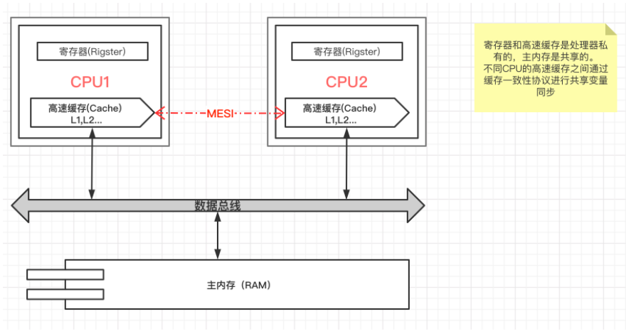
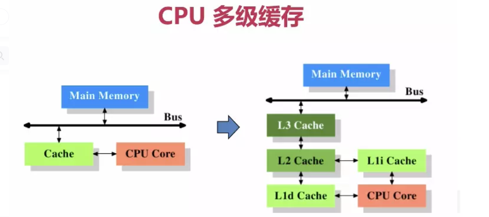
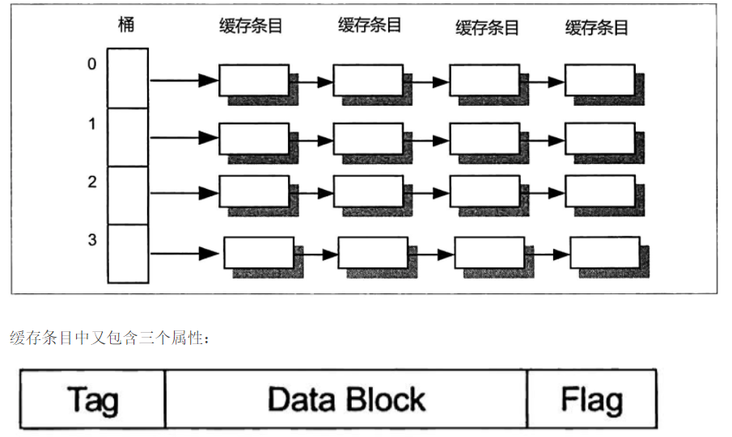

# #说明

> 查阅借鉴的资料:博客园的[缓存和内存的区别?](https://www.cnblogs.com/newcapecjmc/p/10280794.html)、简书的[缓存和内存的区别? (ROM？RAM?)](https://www.jianshu.com/p/fe38be062e16)、CSDN的[CPU，缓存，内存，外存全解析](https://blog.csdn.net/qq_40121580/article/details/107144304) 、百度知道的[外存和内存分别是什么 ](https://zhidao.baidu.com/question/37178116.html); HTML中文网的[静态ram和动态ram的区别是什么](https://www.html.cn/qa/other/21942.html)等
>
> 除此笔记外大家可以看我其他笔记 :**[全栈笔记](https://gitee.com/hongjilin/hongs-study-notes/tree/master)**、**[数据结构与算法](https://gitee.com/hongjilin/hongs-study-notes/tree/master/编程_算法及课程基础学习笔记/数据结构与算法)**、**[编程_前端开发学习笔记](https://gitee.com/hongjilin/hongs-study-notes/tree/master/编程_前端开发学习笔记)**、**[编程_后台服务端学习笔记](https://gitee.com/hongjilin/hongs-study-notes/tree/master/编程_后台服务端学习笔记)** 、**[Java](https://gitee.com/hongjilin/hongs-study-notes/tree/master/编程_后台服务端学习笔记/Java)** 、**[Nodejs](https://gitee.com/hongjilin/hongs-study-notes/tree/master/编程_后台服务端学习笔记/Nodejs)** 、**[JavaScript笔记](https://gitee.com/hongjilin/hongs-study-notes/tree/master/编程_前端开发学习笔记/HTML+CSS+JS基础笔记/JavaScript笔记)**、**[编程工具使用笔记](https://gitee.com/hongjilin/hongs-study-notes/tree/master/编程_前端开发学习笔记/A_前端工具使用笔记)** 、**[前端代码规范](https://gitee.com/hongjilin/hongs-study-notes/tree/master/编程_前端开发学习笔记/A_前端代码规范)** 、**[Git学习笔记](https://gitee.com/hongjilin/hongs-study-notes/tree/master/编程_前端开发学习笔记/Git学习笔记)** 、**[ES6及后续版本学习笔记](https://gitee.com/hongjilin/hongs-study-notes/tree/master/编程_前端开发学习笔记/ES6及后续版本学习笔记)** 、**[Vue笔记整合](https://gitee.com/hongjilin/hongs-study-notes/tree/master/编程_前端开发学习笔记/Vue笔记整合)** 、**[React笔记](https://gitee.com/hongjilin/hongs-study-notes/tree/master/编程_前端开发学习笔记/React笔记)**、**[微信小程序学习笔记](https://gitee.com/hongjilin/hongs-study-notes/tree/master/编程_前端开发学习笔记/微信小程序学习笔记)**、**[Chrome开发使用及学习笔记](https://gitee.com/hongjilin/hongs-study-notes/tree/master/编程_前端开发学习笔记/Chrome开发使用及学习笔记)** 以及许多其他笔记就不一一例举了

# 一、缓存

## 1、定义

>>###### **凡是为于速度相差较大的两种硬件之间,用于协调两者数据传输速度差异的结构,均可称之为`Cache`** (电脑高速缓冲存储器)
>
>* 缓存的存在是为了解决 CPU 和内存之间存取速度的差异的
>* 内存中被 CPU 访问最频繁的数据和指令会被复制到 CPU 的缓存中（这其中的“频繁”是由专门的算法来定义的
>* 这样 CPU 就不用去很慢的内存中读取需要的数据和指令了

## 2、被扩充概念

>###### 如今缓存的概念已被扩充
>
>* **CPU** 与 **主内存** 之间 (就我们常说的缓存)
>* **内存** 与 **硬盘** 之间 (磁盘缓存)
>* **硬盘** 与 **网络**之间 (称为**Internet** 临时文件夹或网络内容缓存等)

## 3、缓存的作用

>###### 用于协调两者数据传输速度差异的结构
>
>实例:
>
>* 缓存 是 CPU 的一部分
>* 缓存 是硬盘控制器上的一块内存芯片
>* 硬盘上的缓存: 当硬盘存取零碎数据时需要不断地在硬盘与内存之间交换数据

# 二、内存

## 1、什么是内存?

>**在计算机的组成结构中,有一个很重要的部分,就是存储器,那么他的具体概念是什么呢?** 
>
>1. 存储器是用来存储程序和数据的部件,对于计算机来说,有了存储器才有记忆功能,才能保证正常工作
>2. 存储器的种类很多,按照其用途可以分为 `主存储器` 和 `辅助存储器` 
>   - 主存储器又称为 **`内存储器`**(**就是我们常说的内存**) 
>   - 辅助存储器又成为 **`外存储器`** (**简称外存**)
>   - 所以实际上有很多人容易弄混淆这个概念,以为存储器就是内存

## 2、内存与外存

### Ⅰ - 外存 (ROM)

>>**外存通常是磁性介质或光盘: 如硬盘、软盘、磁带、CD等**
>
>* 能长期保存信息,且**不依赖于电**来保存信息,即断电不会失去保存的信息
>* 由于是机械部件带动,速度与CPU相比就显得慢得多
>* **`ROM`**（Read Only Memory） 只读内存，应用于硬盘存储

### Ⅱ - 内存 (RAM)

>> **物理实质就是一组或多组具备数据输入输出和数据存储功能的集成电路**
>
>* 指的是主板上的存储不见,是CPU直接与之沟通并用其存储数据的不见
>* 存放当前 正在使用的(**即执行中**) 的数据和程序
>* **它的物理实质就是一组或多组具备数据输入输出和数据存储功能的集成电路**
>* 内存只用于暂时存放程序和数据,一旦关闭电源或者发生断电,其中的程序和数据就会丢失
>* 随机存储器  **`RAM`**（Random Access Memory）俗称内存 

## 3、内存分类

>内存分为 **静态RAM** 和 **动态RAM**
>
> 
>
>**静态RAM** 速度比 **动态RAM** 快很多
>
>1. 速度比较：静态RAM > 动态RAM > ROM；缓存 > 内存 > 外存。

### Ⅰ - 静态RAM

>> **静态RAM，指SRAM：只要有供电，它保存的数据就不会丢失，且为高速存储器，如CPU中的高速缓存（cache）**
>
>缓存通常使用的是静态RAM, 不过由于静态RAM集成度低,因此便延申出一级缓存和二级缓存
>
>- 一级缓存为 静态RAM
>-  二级缓存为告诉动态RAM（比静态RAM慢，但比常规动态RAM要快）

### Ⅱ - 动态RAM

>>**动态RAM，指DRAM：有供电，还要根据它要求的刷新时间参数，才能保持存储的数据不丢失，如电脑中的内存条**
>
>现在使用的内存一般都是**动态RAM** 
>
>- 因为静态RAM集成度相对较低:存储相同数据量,静态RAM的提及是动态RAM的6倍之多,且价格高

### Ⅲ  -  动态RAM 与 静态RAM 的区别

> * 动态RAM 会周期地刷新,而 静态RAM 不会进行刷新
> * 动态RAM 是靠MOSS电路中的栅极电容来记忆信息的; 静态RAM 是靠双稳态触发器来记忆信息的
> * 由于电容上的电荷会泄露,需要定时给予补充. 所以 动态RAM 需要设置刷新电路,而静态不用
>
> ###### 应用上的区别
>
> * 动态RAM 比 静态RAM 集成度高、功耗低,从而成本也低,适用于做大容量储存器,所以**主内存通常采用动态RAM**
> * 另外:内存还应用于显卡、声卡及CMOS等设备中,用于充当设备缓存或保存固定的程序及数据
> * **高速缓冲存储器(Cache)则使用静态RAM** 

## 4、内存是如何工作的?

>> **既然内存是用来存放当前 正在使用的(即执行中) 的数据和程序,那么你可能会问:它是怎么工作的呢?**
>
>我们平常所提到的计算机内存指的是 **动态内存(即DRAM)** ,动态内存中所谓的 '**动态**' 指的是当我们将数据写入DRAM后,经过一段时间数据就会丢失,因此我们需要一个额外的电路进行内存刷新操作
>
>###### 具体工作过程是这样的:
>
>* 一个DRAM的存储单元存储的是0还是1取决于电容是否电荷. `有电荷代表1、无电荷代表0`
>* 但时间一长,代表 1 的电容会放电,代表 0 的电荷会吸收电荷 (**这就是数据丢失的原因**)
>* 刷新操作定期对电容进行检查,若电量大于满点亮的 **1/2** 则认为其代表 **1**, 并把电容充满
>* 定期刷新操作时,若电量小于 **1/2** 则认为其代表 **0**, 并把电容放电,籍此来保持数据的连续性

------

# 三、CPU

## 1、CPU的简单工作原理图

>
>
>**CPU 一般由控制单元、逻辑运算单元和存储单元(寄存器)组成（注意忽略了中断系统）** 
>
>CPU负责执行指令，是所有计算机硬件中速度最快的。一般用**时钟周期**（时钟频率）来衡量CPU的性能。

### Ⅰ - 控制单元

>* 在 [节拍脉冲](https://www.zhihu.com/question/20392042) 的作用下,将 [程序计数器](https://baike.baidu.com/item/%E7%A8%8B%E5%BA%8F%E8%AE%A1%E6%95%B0%E5%99%A8/3219536) (Program Counter -- PC)指向的 **主存或多级高速缓存** 中的 `指令地址` 送到地址总线
>* 接着获取 **指令地址** 所对应的指令并放入[指令寄存器](https://baike.baidu.com/item/%E6%8C%87%E4%BB%A4%E5%AF%84%E5%AD%98%E5%99%A8/3219483) (Instruction Register -- IR) 中
>* 然后通过[指令译码器](https://baike.baidu.com/item/%E6%8C%87%E4%BB%A4%E8%AF%91%E7%A0%81%E5%99%A8/3295261) (Instruction Decoder -- ID)分析指令需要进行的操作
>* 最后通过[操作控制器](https://baike.baidu.com/item/%E6%93%8D%E4%BD%9C%E6%8E%A7%E5%88%B6%E5%99%A8/1921725)(Operation Controller -- OC)向其他设备发出 微操作控制信号
>
>也许你对上述过程中提到的名词感到陌生,下面将会列举出来

#### ① 节拍脉冲是什么?

>时钟周期是由CPU时钟定义的定长时刻距离，是CPU作业的最小时刻单位，也称`节拍脉冲`或T周期。通常为节拍脉冲或T周期，既主频的倒数，它是处理操作的最基本的单位
>
>[原文地址](https://www.zhihu.com/question/20392042)

#### ②  程序计数器

>> ###### 程序计数器是用于存放下一条指令所在单元的地址的地方。 
>
>当执行一条指令时，首先需要根据PC中存放的指令地址，将指令由内存取到[指令寄存器](https://baike.baidu.com/item/指令寄存器/3219483)中，此过程称为“取指令”。与此同时，PC中的地址或自动加1或由转移指针给出下一条指令的地址。此后经过分析指令，执行指令。完成第一条指令的执行，而后根据PC取出第二条指令的地址，如此循环，执行每一条指令。
>
>[原文地址](https://baike.baidu.com/item/%E7%A8%8B%E5%BA%8F%E8%AE%A1%E6%95%B0%E5%99%A8/3219536)

#### ③  指令寄存器

>根据指令在存贮器中的地址（由指令地址计数器给出），把指令从存贮器中取出来之后，需要有一个专门用于存放指令的地方，以便对指令进行分析和执行。这个专门存放现行指令的部件就叫做指令寄存器。指令寄存器的位数应满足指令长度的要求 [2] 。
>
>指令寄存器与CPU的8根数据总线相连接。当[程序计数器](https://baike.baidu.com/item/程序计数器/3219536)访问存储器地址时，存储在该地址单元内的信息经8位数据总线送出，并储存在指令存器中

##### a) 属性描述

>BSDL语言中有一个重要的描述，即指令寄存器（Instruclion Register），它是由一些强制的、可选的和用户自定义的指令集合而成。
>
>关于这个指令寄存器的属性描述，必须包含5个要素：
>
>>* 指令寄存器的长度、
>>* 各种指令的名称、
>>* 对应的操作码、
>>* 指令寄存器的捕获操作码
>>* 哪些指令是内部的

##### b) 取指过程

>取指令阶段完成的任务是将现行指令从主存中取出来并送至指令寄存器中,具体操作如下
>
>1. 将 **程序计数器**(PC) 中的内容送至存储器[地址寄存器](https://baike.baidu.com/item/地址寄存器/3219619)（MAR),并送地址总线
>2. 由控制单元(CU) 经控制总线(CB)向存储器发 **读命令**
>3. 从主存中取出的指令通过数据总线(DB), 送到存储器[数据寄存器](https://baike.baidu.com/item/数据寄存器/1944231)（MDR）
>4. 将MDR的内容送至指令寄存器（R）中
>5. 将PC的内容递增，为取下一条指令做好准备
>
>以上这些操作对任何一条指令来说都是必须要执行的操作，所以称为公共操作

#### ④ 指令译码器

> 指令译码器(Instruction Decoder,ID)是[控制器](https://baike.baidu.com/item/控制器/2206126)中的主要部件之一。
>
> * 计算机能且只能执行“指令”。指令由[操作码](https://baike.baidu.com/item/操作码/3220418)和[地址码](https://baike.baidu.com/item/地址码/3220454)组成。
> * 操作码表示要执行的操作性质，即执行什么操作，或做什么；地址码是操作码执行时的操作对象的[地址](https://baike.baidu.com/item/地址/80420)。
> * 计算机执行一条指定的指令时，必须首先分析这条指令的操作码是什么，以决定操作的性质和方法，然后才能控制计算机其他各部件协同完成指令表达的功能。
> * 这个分析工作由 **指令译码器** 来完成。
> * 指令执行通过 控制部件 进行 指令译码，标量指令由标量[处理机](https://baike.baidu.com/item/处理机)执行向量指令各Cache控制器监听总线所有操作，并对操作做相应处理（修改或作废），如[MESI协议](https://baike.baidu.com/item/MESI协议/22742331)。
>
> [原文地址](https://baike.baidu.com/item/%E6%8C%87%E4%BB%A4%E8%AF%91%E7%A0%81%E5%99%A8/3295261)

#### ⑤ 操作控制器

>操作控制器的功能就是根据指令[操作码](https://baike.baidu.com/item/操作码)和[时序信号](https://baike.baidu.com/item/时序信号)，产生各种操作[控制信号](https://baike.baidu.com/item/控制信号)，以
>
>便正确地建立[数据通路](https://baike.baidu.com/item/数据通路)，从而完成取指令和执行指令的控制。
>
>[原文地址](https://baike.baidu.com/item/%E6%93%8D%E4%BD%9C%E6%8E%A7%E5%88%B6%E5%99%A8/1921725)

##### a) 指令执行过程

>1、取指令：根据指令地址（由PC提供），从[存储器](https://baike.baidu.com/item/存储器)中取出所要执行的指令。
>
>2、分析指令：
>
>（1）[译码](https://baike.baidu.com/item/译码)分析。确定指令应完成的操作，产生相应操作的控制电位。去参与形成该指令功能所需要的全部控制命令（[微操作](https://baike.baidu.com/item/微操作/8190269)控制信号）。
>
>（2）根据[寻址方式](https://baike.baidu.com/item/寻址方式)的分析和指令功能要求，形成[操作数](https://baike.baidu.com/item/操作数)的[有效地址](https://baike.baidu.com/item/有效地址)，并按此地址取出操作数（运算型指令）或形成转移地址（转移类指令），以实现程序转移。
>
>3、执行指令：根据指令分析所产生的操作[控制信号](https://baike.baidu.com/item/控制信号)和形成的有效地址，按一定算法形成指令控制序列，控制有关部件完成指令规定的功能。

##### b) 控制方式

>操作控制器常用的控制方式有[同步控制](https://baike.baidu.com/item/同步控制/9649897)、异步控制、联合控制。
>
>[同步控制方式](https://baike.baidu.com/item/同步控制方式)：任何指令的运行或指令中各个[微操作](https://baike.baidu.com/item/微操作/8190269)的执行，均由确定的，具有统一基准时标的[时序信号](https://baike.baidu.com/item/时序信号)所控制。即所有的操作均由统一的时钟控制，在标准时间内完成。（在同步控制下，每个时序信号的结束就意味着安排完成的工作已经完成，随即开始执行后续的微操作或自动转向下条指令的运行。）
>
>[异步控制方式](https://baike.baidu.com/item/异步控制方式)：没有统一的[同步信号](https://baike.baidu.com/item/同步信号/8555402)，采用问答方式进行时序协调，将前一操作的回答作为下一操作的启动信号。
>
>联合控制方式：将同步控制和异步控制相结合。其通常设计思想为：在功能部件内部采用同步方式或以同步方式为主的控制方式；在功能部件间采用异步方式。

### Ⅱ - 运算单元

>如果 **控制单元** 发出的控制信号存在**算数运算**(加减乘除、增1、减1、取反等) 或者 **逻辑运算**(与、或、非、异或),那么**需要通过运算单元获取存储单元的计算数据**进行处理

### Ⅲ - 储存单元

>包括片内 **缓存** 和 **寄存器组** ,是CPU中临时存放数据的地方
>
>* CPU直接访问主存数据大概需要花费数百个机器周期
>* 而访问 **缓存** 和 **寄存器组** 只需要若干个或者几十个机器周期
>* 因此会使用 **缓存** 和 **寄存器组** 来存储和获取临时数据(即将被运算或者运算之后的数据),从而提升运行效率
>
>

### Ⅳ - 指令周期

>计算机系统执行程序指令时需要花费时间,其中取出一条指令并执行这条指令的时间叫做 **指令周期**
>
>
>
>

------

## 2、为什么需要缓存

>>**`CPU`** 负责运算，`内存` 负责暂时存储运算所涉及的东西，`高速缓存是CPU内部集成的小容量高速内存`
>>
>>**高速缓存**和内存的区别是，缓存容量极小，但是与**CPU**关系密切，所以传输速度比内存快得多
>
>* 缓存只是内存中少部分数据的复制品,所以CPU到缓存中寻找数据时也会出现找不到的情况(因为这些数据没用从内存复制到缓存中去)
>* 在这种缓存中找不到的情况下, CPU 还是会到内存中去找数据,这样系统的速度就会慢下来,不过**CPU会把这些数据复制到缓存中去**,以便下一次不用再到内存中去取,以此提高系统运行效率
>* 不过随着时间的变化,被访问得最频繁得数据不是一成不变的,也许昨天访问的不频繁的数据今天就非常频繁地进行了访问;
>* 所以说缓存中的数据经常要按照一定的算法来更换,这样才能保证缓存中的数据是被访问的最频繁的

------

## 3、CPU的作用

### Ⅰ - 缩短延迟

>访问缓存的时间应该尽可能缩短,可以通过多种的方式缩短这个时间:
>
>* 比如能够通过减少缓存的大小、关联性来降低缓存的延迟; 
>* 或者方法预测、增加宽带等

### Ⅱ - 提高命中率

>所谓命中率是在高速缓存中找到内存引用的速率,我们希望能够首先通过缓存中获得信息以得到速度的优势;
>
>所以缓存需要最大限度地实现这一目标
>
>对于单个高速缓存来说:大小、关联性和块大小决定命中率

### Ⅲ - 降低更低级别内存下的开销

>高速缓存是内存层次结构的一部分,其性能会影响其他性能,处理其他内存花费的时间越长意味着系统性能越低
>
>也就是说尽可能地让处理在缓存中完成

### Ⅳ - 减少错失惩罚

>缓存中不能命中是无法避免的事情,但是我们可以减少处理未命中所需地时间以获得更好的处理器性能,通过提升命中率与不同的优化能有效降低错失惩罚
>
> 高速缓存是CPU中十分重要的部分,占据了大量的资源开销和成本,如果咱看过CPU架构图的话就会发现缓存占据了至少50%的面积,绝对至关重要

------

## 4、时钟周期与指令周期

>**`CPU时钟周期`** 是操作的最小时间单位,值是主频的倒数,现代计算机的主频可以达到几GHZ.
>
>**`指令周期`**是取出并执行一个指令的时间单位,一个指令需要多个 CPU 操作来执行,一般来说一个指令周期至少包含2个CPU时钟周期(取指 + 执行)
>
>同一个硬件架构下不同CPU的时钟周期越高,相同时间内能够执行的指令越多,性能就越好; 但在不同硬件架构下只比较CPU主频大小意义不大，处理器结构不同，指令集就不同，相同意义的指令所需的CPU时钟周期也就不同
>
>除了计算机架构不同外，在比较计算机整体性能的时候还需要考虑很多因素，例如[前端总线](https://zh.wikipedia.org/wiki/前端总线)（"front side bus"，FSB），**内存的时钟周期**，CPU[通用寄存器](https://zh.wikipedia.org/w/index.php?title=通用寄存器&action=edit&redlink=1)的数据宽度和机器的一级、二级[缓存](https://zh.wikipedia.org/wiki/缓存)等。

------

## 5、存储单元(寄存器)

>寄存器是CPU的内部组成单元,是CPU运算时取 **指令** 和 **数据** 的地方,速度很快.
>
>> * 可以理解成对于 CPU 来说, **对寄存器进行 读/写 是不需要时间的**
>> * 或者说如果只是操作寄存器 (比如类似mov BX,AX之类的操作),那么一秒钟执行的指令个数理论上等于主频,因为寄存器是CPU的一部分
>
>###### 寄存器可以用来暂存指令、数据和地址. 在CPU中分为
>
>* **通用寄存器**: 如指令寄存器`IR`; 
>* **特殊功能寄存器** : 如程序计数器`PC 、sp`等
>
> 

------

# 四、CPU的多级缓存(高速缓存)

>> ###### 高速缓存（cache）通常分为L1,L2,L3三级，速度递减，容量递增，是为了弥补CPU与内存之间运算速度的差异而设置的硬件
>
>
>
>上图为最简单的高速缓存的配置, 数据的读取和储存都将经过高速缓存, CPU 核心与高速缓存有一条特殊的快速通道: 主存和高速缓存都连在系统总线上,这条总线还用于其他组件的通信
>
>高速缓存出现不久,系统变得越来越复杂,高速缓存与主存之间的速度差异越来越大,直到加入了另一级缓存: 新加入的这级缓存比第一缓存更大而且更慢,同时经济上不合适,所以有了二级缓存、三级缓存

## 1、多级缓存出现的意义

### Ⅰ - 为什么需要CPU Cache

>>**CPU的频率太快了，快到主存跟不上，这样在处理器时钟周期内，CPU常常需要等待主存，浪费资源，所以Cache的出现，是为了缓解CPU和内存之间速度的不匹配问题（结构：cpu -> cache -> memort）**
>
>当 **CPU** 处理数据时, 它会先到 **Cache** 中去寻找,如果数据因之前的操作已经读取而被暂存其中的话就不必再从主内存中读取数据
>
>* 由于 CPU 的运行速度一般比主内存的读取速度快.主存 **时钟周期**(访问主存储器所需要时间) 为数个 CPU 时钟周期
>* 因此如果要访问主内存的话,就必须等待数个CPU周期从而造成浪费
>* **L1缓存** 的速度可以在 2-4 个CPU时钟频率内完成,速度很快
>
>Linux下可以通过 `lscpu` 命令来查看 CPU 的信息,其中就包括 Cache 层次

### Ⅱ - CPU Cache 有什么意义

>* 时间局限性: 如果某个数据被访问,那么在不久的将来他很可能被再次访问
>* 空间局限性: 如果某个数据被访问,那么与他相邻的数据很快也可能被访问

## 2、原理

>> 提供 '**缓存**' 的目的是为了让数据访问的速度适应 CPU 的处理速度,多级Cache技术，利用使用一个大的二级Cache来处理一级Cache的缺失，从而降低缺失代价
>
>通常它不像系统主存那样使用 **`DRAM(动态)`** 技术,而是使用 **昂贵但比较快速** 的 **`SRAM(静态)`** 技术,其原理是:
>
>* 内存中 '**程序执行与数据访问的局域性行为**', 即一定程序执行时间和空间内,被访问的代码集中于一部分
>* 为了充分发挥缓存的作用,不仅依靠 '**暂存刚刚访问过的数据**', 还要使用硬件实现的指令 **预测 与 数据预取技术** --> 尽可能把将要使用的数据预先从内存中取到缓存里
>

## 3、数据结构

>高速缓存的数据结构类似于 **`拉链式的散列表`** ,**Key**是内存地址,**值**是内存数据的副本或是即将写入内存的数据
>
> 
>
>其中 **Tag** 可以理解为数据的内存地址, **Data Block** 是内存数据, **Flag** 用于标识数据状态

## 4、CPU的多级缓存

> CPU的核心数量、高频高低都会影响性能，但如果让CPU更聪明、更有效率的执行计算任务，那么缓存的作用就至关重要了

### Ⅱ - 一级缓存 (L1 Cache)

>> ###### **CPU一级缓存**,就是指 CPU 的第一层级的高速缓存, 主要担当的工作是 **缓存指令** 和 **缓存数据** .
>
>* 一级缓存的容量与结构对于CPU性能的影响十分巨大,但是由于它的结构相对复杂且还有成本问题
>* 一般来说, **`CPU 的一级缓存比较小`**, 通常 CPU 的一级缓存也就能做到 **256KB** 左右的水平

### Ⅱ - 二级缓存 (L2 Cache)

>> ###### CPU 二级缓存, 就是指 CPU 的第二层级的高速缓存
>
>* 二级缓存的容量会直接影响到 CPU 的性能,所以二级缓存的容量越大越好
>* 例如intel的第八代i7-8700处理器，共有六个核心数量，而每个核心都拥有256KB的二级缓存，属于各核心独享，这样二级缓存总数就达到了1.5MB。

### Ⅲ - 三级缓存 (L3 Cache)

>CPU 三级缓存, 就是指 CPU 的第三层级的高速缓存, 起作用就是进一步降低内存的延迟, 同时提升海量数据计算时的性能
>
>> ###### 和一级、二级缓存不同的是,三级缓存时核心共享的,能够将容量做很大

### Ⅳ - 缓存一致性(MESI)

> CPU种每个 `缓存行` 使用 **四种** 状态进行标记

#### ① M: Modified 修改

>指的时该 **缓存行** 只被缓存在该 CPU 种,并且是`被修改过`的, **因此他与主存的数据是不一致的**,
>
>该缓存行中的数据需要在未来某个时间点(**允许其他CPU读取主存相应的内容之前**) 写回主存,然后`状态变成E (独享)`

#### ② Exclusive 独享

>缓存行 只被缓存在该 CPU 的缓存中,是`未被修改过`的,**与主存的数据是一致的**. 
>
>可以在任何时刻当有其他CPU读取该内存时,状态变成 `S(共享)`
>
>当CPU修改缓存行的内容时, 状态变成 `M(修改)`

#### ③ Share 共享

>意味着该 缓存行 `可能被多个 CPU 进行缓存`,并且**该缓存中的数据与主存数据是一致的**
>
>当有一个 CPU 修改 **该缓存行** 时,其他 CPU 是可以被作废的,变成 `I(无效的)`

#### ④ Invalid 无效的

>代表这个缓存是无效的，可能是有其他CPU修改了该缓存行

#### ⑤对应的四个操作

>local read：读本地缓存
>local write：写本地缓存
>remote read：将内存中的数据读取过来
>remote write：将数据写回主存

##### a) 详细说明

>> **在一个典型的多核系统中，每一个核都会有自己的缓存来共享总线，每一个CPU会发出读写（I/O）请求，而缓存的目的是为了减少CPU读写共享主存的次数；**
>
>1. 一个缓存除了在无效（Invalid）状态，都可以满足CPU的读请求，一个无效（Invalid）的缓存行必须从主存中读取（变成Share或者Exclusive状态）来满足该CPU的读请求
>2. 一个 `写请求` 只有在该缓存行是 **`修改`** 或者 **`独享`** 状态时才能被执行
>   - 如果缓存行处于 **`共享`** 状态，必须**先将其他缓存中的 该缓存行** 变成 `无效` 状态
>   - **也即是不允许不同CPU同时修改同一缓存行，即使修改该缓存行中的不同数据也不允许**
>   - 该操作经常作用广播的方式来完成，例如：Request For Ownership（RFO）
>3. 缓存可以随时将一个 **非修改** 状态的缓存行作废，或者变成 **`无效`** 状态，而一个**`修改`** 状态的缓存行必须先被写回主存
>4. 一个处于 **共享** 状态的 缓存行  也`必须监听` 其他缓存中**使该 缓存行 `无效` 或者 `独享` 该缓存行的请求**，并将该 缓存行 变成 **`无效`**
>5. 一个处于 **独享** 状态的 缓存行 也`必须监听`其他缓存中 **读主存中该缓存行的操作**，一旦有这种操作，该缓存行需要变成`共享`状态
>6. 对于 `修改` 和 `独享` 状态而言总是精确的，他们在该缓存行的真正状态是一致的。
>   - 而 `共享` 状态可能是非一致的
>   - 如果一个缓存将处于 `共享` 状态的缓存行作废了，而另一个缓存实际上可能已经独享了 该缓存行，但是该缓存却不会将该 缓存行 升迁为 `独享` 状态
>   - 这是因为**其他缓存不会广播他们作废掉该缓存行的通知**，同样由于缓存并没有保存该缓存行的 copy 的数量，因此也没有办法确定自己是否已经独享（Share了该缓存行）
>
>从上面的意义看来独享（Exclusive）状态时一种投机性的优化：如果一个CPU想修改一个处于共享（Share）状态的缓存航，总线事务需要将所有缓存行的copy变成Invalid状态，而修改独享（Exclusive）状态的缓存不需要使用总线事务
