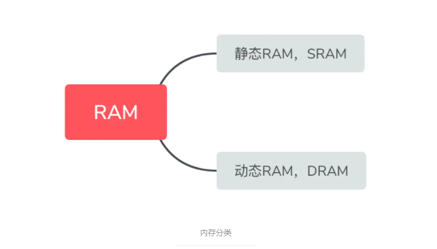

# #说明

> 查阅借鉴的资料:博客园的[缓存和内存的区别?](https://www.cnblogs.com/newcapecjmc/p/10280794.html)、简书的[缓存和内存的区别? (ROM？RAM?)](https://www.jianshu.com/p/fe38be062e16)、CSDN的[CPU，缓存，内存，外存全解析](https://blog.csdn.net/qq_40121580/article/details/107144304) 、百度知道的[外存和内存分别是什么](https://zhidao.baidu.com/question/37178116.html)等

# 一、缓存

## 1、定义

>>###### **凡是为于速度相差较大的两种硬件之间,用于协调两者数据传输速度差异的结构,均可称之为`Cache`** (电脑高速缓冲存储器)
>
>* 缓存的存在是为了解决 CPU 和内存之间存取速度的差异的
>* 内存中被 CPU 访问最频繁的数据和指令会被复制到 CPU 的缓存中（这其中的“频繁”是由专门的算法来定义的
>* 这样 CPU 就不用去很慢的内存中读取需要的数据和指令了

## 2、被扩充概念

>###### 如今缓存的概念已被扩充
>
>* **CPU** 与 **主内存** 之间 (就我们常说的缓存)
>* **内存** 与 **硬盘** 之间 (磁盘缓存)
>* **硬盘** 与 **网络**之间 (称为**Internet** 临时文件夹或网络内容缓存等)

## 3、作用

>###### 用于协调两者数据传输速度差异的结构
>
>实例:
>
>* 缓存 是 CPU 的一部分
>* 缓存 是硬盘控制器上的一块内存芯片
>* 硬盘上的缓存: 当硬盘存取零碎数据时需要不断地在硬盘与内存之间交换数据

# 二、内存

## 1、什么是内存?

>**在计算机的组成结构中,有一个很重要的部分,就是存储器,那么他的具体概念是什么呢?** 
>
>1. 存储器是用来存储程序和数据的部件,对于计算机来说,有了存储器才有记忆功能,才能保证正常工作
>2. 存储器的种类很多,按照其用途可以分为 `主存储器` 和 `辅助存储器` 
>   - 主存储器又称为 **`内存储器`**(**就是我们常说的内存**) 
>   - 辅助存储器又成为 **`外存储器`** (**简称外存**)
>   - 所以实际上有很多人容易弄混淆这个概念,以为存储器就是内存

## 2、内存与外存

### Ⅰ - 外存 (ROM)

>>**外存通常是磁性介质或光盘: 如硬盘、软盘、磁带、CD等**
>
>* 能长期保存信息,且**不依赖于电**来保存信息,即断电不会失去保存的信息
>* 由于是机械部件带动,速度与CPU相比就显得慢得多
>* **`ROM`**（Read Only Memory） 只读内存，应用于硬盘存储

### Ⅱ - 内存 (RAM)

>> **物理实质就是一组或多组具备数据输入输出和数据存储功能的集成电路**
>
>* 指的是主板上的存储不见,是CPU直接与之沟通并用其存储数据的不见
>* 存放当前 正在使用的(**即执行中**) 的数据和程序
>* **它的物理实质就是一组或多组具备数据输入输出和数据存储功能的集成电路**
>* 内存只用于暂时存放程序和数据,一旦关闭电源或者发生断电,其中的程序和数据就会丢失
>* 随机存储器  **`RAM`**（Random Access Memory）俗称内存 

## 3、内存分类

>内存分为 **静态RAM** 和 **动态RAM**
>
> 
>
>**静态RAM** 速度比 **动态RAM** 快很多
>
>1. 现在使用的内存一般都是**动态RAM** 
>   - 因为静态RAM集成度相对较低:存储相同数据量,静态RAM的提及是动态RAM的6倍之多,且价格高
>2. 缓存通常使用的是静态RAM, 不过由于静态RAM集成度低,因此便延申出一级缓存和二级缓存
>   - 
>
>

## 4、内存是如何工作的?

>> **既然内存是用来存放当前 正在使用的(即执行中) 的数据和程序,那么你可能会问:它是怎么工作的呢?**
>
>我们平常所提到的计算机内存指的是 **动态内存**
>
>