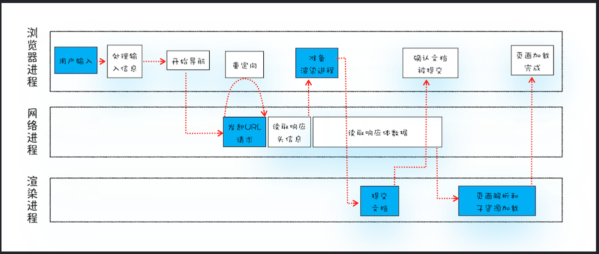
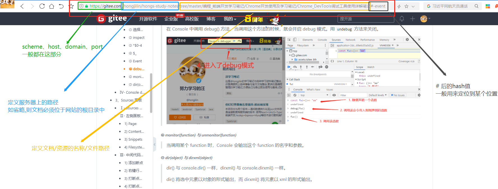
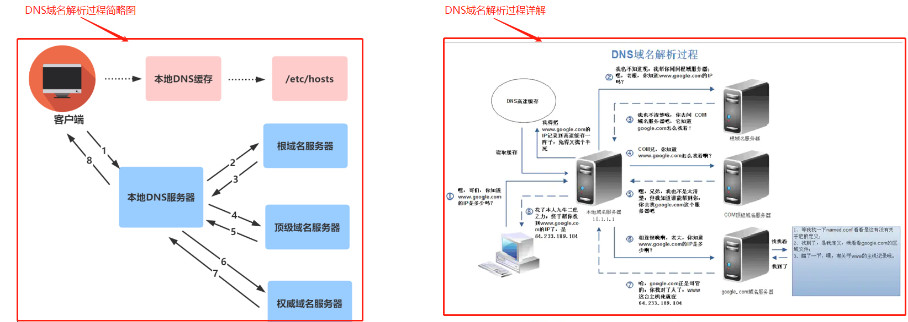
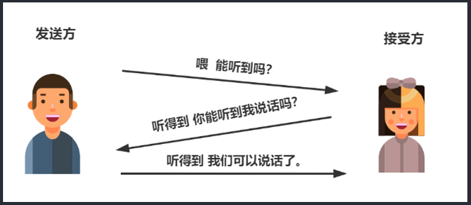
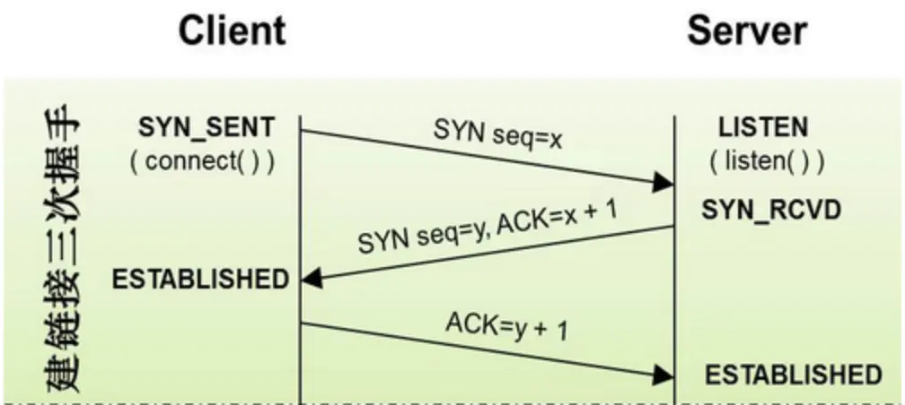

# #说明

> 此笔记为学习码上前端的[`2021年前端程序员必须要掌握的浏览器的工作原理、HTTP协议底层原理、TCP网络协议、浏览器的渲染流程`](https://www.bilibili.com/video/BV1h44y167zh?p=2&share_source=copy_web)视频;GitHub上[`SummerWang的从输入页面地址到展示页面信息都发生了些什么`](https://github.com/kaola-fed/blog/issues/271);segmentfault的[`浪里行舟的从URL输入到页面展现到底发生什么？`](https://segmentfault.com/a/1190000017184701);掘金的[`williamife的从URL输入到页面展现到底发生什么？`](https://juejin.cn/user/3386151545869783)等等包括但不仅限的资料学习整理而成

# #目录

>[TOC]

# 从URL输入到页面展现,这中间发生了什么？

>完整流程图
>
>总体来说分为以下几个过程：
>
>- DNS 解析:将域名解析成 IP 地址
>- TCP 连接：TCP 三次握手
>- 发送 HTTP 请求
>- 服务器处理请求并返回 HTTP 报文
>- 浏览器解析渲染页面
>- 断开连接：TCP 四次挥手

## 一、什么是URL？

URL（Uniform Resource Locator），统一资源定位符，用于定位互联网上资源，俗称网址。

**`scheme`: // `host`.`domain`:`port` / `path` /`filename` ?` query` # `fragment`**

>- scheme       - 定义因特网服务的类型。常见的协议有 http、https、ftp、file -其中最常见的类型是 http，而 https 则是进行加密的网络传输。
>- host         - 定义域主机（http 的默认主机是 www）
>- domain       - 定义因特网域名，比如 baidu.com
>- port         - 定义主机上的端口号（http 的默认端口号是 80）
>- path         - 定义服务器上的路径（如缺省则文档必须位于网站的根目录中）。
>- filename     - 定义文档/资源的名称  (如缺省文件必须位于前面`path`后的根目录中)
>- query        - 即 ? 后的查询参数 `可以缺省`
>- fragment     - 即 # 后的hash值，一般用来定位到某个位置  `可以缺省`
>
>举个栗子:
>
> 

## 二、DNS域名解析

>在浏览器输入网址后，首先要经过域名解析，因为浏览器并不能直接通过域名找到对应的服务器，而是要通过 IP 地址

### 1、IP地址是什么?

>IP 地址是指互联网协议地址，是 IP Address 的缩写。IP 地址是 IP 协议提供的一种统一的地址格式，它为互联网上的每一个网络和每一台主机分配一个逻辑地址，以此来屏蔽物理地址的差异。

### 2、域名是什么?

>`域名就相当于 IP 地址乔装打扮的伪装者，带着一副面具。它的作用就是便于记忆和沟通的一组服务器的地址`。用户通常使用主机名或域名来访问对方的计算机，而不是直接通过 IP 地址访问。因为与 IP 地址的一组纯数字相比，用字母配合数字的表示形式来指定计算机名更符合人类的记忆习惯。但要让计算机去理解名称,相对而言就变得困难了。因为计算机更擅长处理一长串数字。为了解决上述的问题，DNS 服务应运而生
>
>举个栗子:[`47.100.xxx.xxx.xx:80/hongjilin`](https://gitee.com/hongjilin)===[`gitee.com/hongjilin`](https://gitee.com/hongjilin),对于我们肯定是[`gitee.com/hongjilin`](https://gitee.com/hongjilin)更便于记忆,而对计算机而言更擅长前者

### 3、什么是域名解析?

>DNS 协议提供通过域名查找 IP 地址，或逆向从 IP 地址反查域名的服务。**`DNS 是一个网络服务器，我们的域名解析简单来说就是在 DNS 上记录一条信息记录`**
>
>举个栗子 `baidu.com` ==解析==> `220.114.23.56(服务器外网IP地址)80(服务器端口)`

### 4、浏览器如何通过域名去查询 URL 对应的 IP 呢?

>- 浏览器缓存：浏览器会按照一定的频率缓存 DNS 记录。
>- 操作系统缓存：如果浏览器缓存中找不到需要的 DNS 记录，那就去操作系统中找。
>- 路由缓存：路由器也有 DNS 缓存。
>- ISP 的 DNS 服务器：ISP 是互联网服务提供商(Internet Service Provider)的简称，ISP 有专门的 DNS 服务器应对 DNS 查询请求。
>- 根服务器：ISP 的 DNS 服务器还找不到的话，它就会向根服务器发出请求，进行递归查询（DNS 服务器先问根域名服务器.com 域名服务器的 IP 地址，然后再问.baidu 域名服务器，依次类推）
>
>
>
>`结论`:**浏览器通过向 DNS 服务器发送域名，DNS 服务器查询到与域名相对应的 IP 地址，然后返回给浏览器，浏览器再将 IP 地址打在协议上，同时请求参数也会在协议搭载，然后一并发送给对应的服务器。** 

### 5、DNS的优化与应用

>1. DNS缓存 `DNS存在着多级缓存`，从离浏览器的距离排序的话，有以下几种: `浏览器缓存，系统缓存，路由器缓存，IPS服务器缓存，根域名服务器缓存，顶级域名服务器缓存，主域名服务器缓存`。
>2. DNS负载均衡`(DNS重定向) DNS负载均衡技术`的实现原理是在DNS服务器中为同一个主机名配置多个IP地址，在应答DNS查询时， DNS服务器对每个查询将以DNS文件中主机记录的IP地址按顺序返回不同的解析结果，将客户端的访问 引导到不同的机器上去，使得不同的客户端访问不同的服务器，从而达到负载均衡的目的。
>   - 大家耳熟能详的CDN(Content Delivery Network)就是利用DNS的重定向技术，DNS服务器会返回一个跟 用户最接近的点的IP地址给用户，CDN节点的服务器负责响应用户的请求，提供所需的内容。
>3. dns-prefetch `DNS Prefetch 是一种 DNS 预解析技术`。当你浏览网页时，浏览器会在加载网页时对网页中的域名进行解析缓存，这样在你单击当前网页中的连接时就无需进行 DNS 的解析，减少用户等待时间，提高用户体验。

## 三、TCP三次握手

>**HTTP 请求分为三个部分：`TCP 三次握手`、http 请求响应信息、关闭 TCP 连接。**
>
>1. 比喻图
>
>    
>
>2. 三次握手时序图(该图来自[williamife](https://juejin.cn/user/3386151545869783))
>
>   

### 1、TCP三次握手的过程如下:

>客户端发送一个带 SYN=1，Seq=X 的数据包到服务器端口`（第一次握手，由浏览器发起，告诉服务器我要发送请求了）`
>
>服务器发回一个带 SYN=1， ACK=X+1， Seq=Y 的响应包以示传达确认信息`（第二次握手，由服务器发起，告诉浏览器我准备接受了，你赶紧发送吧）`
>
>客户端再回传一个带 ACK=Y+1， Seq=Z 的数据包，代表“握手结束”`（第三次握手，由浏览器发送，告诉服务器，我马上就发了，准备接受吧）`

### 2、为何需要三次握手?

>“三次握手”的目的是“**`为了防止已失效的连接请求报文段突然又传送到了服务端，因而产生错误`**”。

## 四、发送 HTTP 请求

> TCP 三次握手结束后，开始发送 HTTP 请求报文。
>
> 相关内容于本人[`浅学Http协议底层原理及浏览器工作流程笔记`](https://gitee.com/hongjilin/hongs-study-notes/blob/master/编程_算法及课程基础学习笔记/计算机网络/浅学Http协议底层原理及浏览器工作流程笔记.md)有叙述,便不再赘述 --> [点我传送](https://gitee.com/hongjilin/hongs-study-notes/blob/master/编程_算法及课程基础学习笔记/计算机网络/浅学Http协议底层原理及浏览器工作流程笔记.md)

## 五、服务器处理请求并返回 HTTP 报文

### 1、服务器

>服务器是网络环境中的高性能计算机，它侦听网络上的其他计算机（客户机）提交的服务请求，并提供相应的服务，比如网页服务、文件下载服务、邮件服务、视频服务。而客户端主要的功能是浏览网页、看视频、听音乐等等，两者截然不同。 每台服务器上都会安装处理请求的应用——web server。常见的 web server 产品有 apache、nginx、IIS 或 Lighttpd 等。
>**`web server` 担任管控的角色**，对于不同用户发送的请求，会结合配置文件，把不同请求委托给服务器上处理相应请求的程序进行处理（常见的web server产品有apache、`nginx`、IIS、Lighttpd等），然后返回后台程序处理产生的结果作为响应。

### 2、http 响应报文

> 此处同上
>
> 相关内容于本人[`浅学Http协议底层原理及浏览器工作流程笔记`](https://gitee.com/hongjilin/hongs-study-notes/blob/master/编程_算法及课程基础学习笔记/计算机网络/浅学Http协议底层原理及浏览器工作流程笔记.md)有叙述,便不再赘述 --> [点我传送](https://gitee.com/hongjilin/hongs-study-notes/blob/master/编程_算法及课程基础学习笔记/计算机网络/浅学Http协议底层原理及浏览器工作流程笔记.md)

## 六、浏览器解析渲染页面

> `请假回学校,暂停更新`

