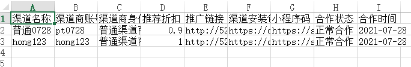

> 参考资料出于:[挥刀北上](https://cloud.tencent.com/developer/user/5837318)

# 前端如何将JSON数据导出为excel文件

>前端人员在开发时，有时为了满足用户需求，需要下载excel文件。这里通常有两种做法，一种是后端工程师将数据转化为excel，然后前端进行下载即可，还有一种方式，`前端请求需要下载的数据，在浏览器端生成excel文件，然后进行下载`
>
>此处就以前端导出excel的方式进行说明   -->本人用TS写法,但实际上只是多了类型声明,不用的删除即可

# Ⅰ-代码示例与注释

>```jsx
>//1、定义导出文件名称
>var filename = "write.xlsx";
>// 定义导出数据 此处需传入数组类型的数据
>var data = dataSource
>// 定义excel文档的名称
>var ws_name = "SheetJS";
>// 初始化一个excel文件
>var wb = XLSX.utils.book_new();
>// 初始化一个excel文档，此时需要传入数据
>var ws = XLSX.utils.aoa_to_sheet(data);
>// 将文档插入文件并定义名称
>XLSX.utils.book_append_sheet(wb, ws, ws_name);
>// 执行下载
>XLSX.writeFile(wb, filename);
>
>//自己模拟服务端数据
>const dataSource = [
>  {
>    agentTotalAmt: '999',
>    agentId: 'hongjilin',
>    name: '努力学习的汪',
>    cooperationStatus: 2,
>    month: '202106',
>    totalCompany: 666,
>    qty: 999,
>    increaQty: 666,
>    totalAmt: 9999,
>    incomeType: '收款方式',
>    algorithm: '帅的很',
>  },
>   {
>    agentTotalAmt: '888',
>    agentId: 'jilinhong',
>    name: '特别努力学习的单身汪',
>    cooperationStatus: 2,
>    month: '202107',
>    totalCompany: 666,
>    qty: 1111,
>    increaQty: 111,
>    totalAmt: 1111,
>    incomeType: '收款方式',
>    algorithm: '可怜得很',
>  },
>];
>```
>
>使用xlse导出文件时，json数据需要转换为数组，通常为二维数组，通常第一行为表头，如：***`['第一列','第二列','第三列']`\***，然后就是使用xlse的步骤了，通常分为如下几个步骤：
>
>1、调用XLSX.utils.book_new()初始化excel文件。
>
>2、调用XLSX.utils.aoa_to_sheet(data),初始化excel文档，此时需要传入数据，数据为二维数组，第一行通常为表头。
>
>3、调用XLSX.utils.book_append_sheet(wb, ws, ws_name)，将文档插入excel文件，并为文档命名。
>
>4、调用XLSX.writeFile(wb, filename)下载excel文件，并为excel文件命名。

# Ⅱ-本人在自己React中使用

## 1、直接将服务端JSON字段导出成表格

>本人项目代码中会多处使用该导出功能,所以会进行封装
>
>1. 工具包封装(函数实现主体)
>
> ```tsx
> import XLSX from 'xlsx';
> class Tool {
>   /**
>    * 导出成XLSX文件
>    * @param dataSource  传入的对象数组
>    * @param fileName  生成的文件名
>    * @param title 设置列名,如果不传入则默认将对象数组的key当作表头
>    */
>   OnExport = (dataSource: Array<object>, fileName: string, title?: any) => {
>     //当传入的数组长度为0,直接退出  此处加[?]是因为防错,防止真有人乱传参数 
>     //[!dataSource ]是防止传入undefined导致函数执行错误 -->即使已经用TS限制了,但有时服务端给的值还真不一定对
>     if (!dataSource || dataSource?.length == 0) return;
>     let data = dataSource;
>     let head = Object.keys(data[0]);
>     //取出json格式数据中的[value]值
>     data = data.map((e) => Object.values(e));
>     //如果不传入[title],则用keys当表头  
>     data.unshift(title || head);
>     //文件名
>     let filename = `${fileName}.xlsx`;
>     // let ws_name = "xxx";
>     let wb = XLSX.utils.book_new();
>     let ws = XLSX.utils.aoa_to_sheet(data);
>     XLSX.utils.book_append_sheet(wb, ws);
>     XLSX.writeFile(wb, filename);
>   };
> }
> export const tool = new Tool();
> export default Tool;
> ```
>
>2. 调用
>
> ```jsx
> //导入工具包
> import { Tool } from '~/utils';
> const tools = new Tool();
>
> //[this.manage.date]是一个时间数据
> //[this.datas]是要导出的数据  -->通常是服务端给定的数据,经过我们处理后成为如[Ⅰ]中示例代码的那种格式
>
>  exportXlsx = () => {
>      //用于拼接月份
>    const month = this.manage.date.format('MM');
>     //没有数据能导出时给出提示  -->此处调用的是封装好的[信息提示]组件,同学们可以忽略此行代码
>    if (this.datas?.length == 0)  SuperNotification.warning({  msg: '无数据可导出'});
>    //调用工具函数
>    tools.OnExport(toJS(this.datas), `${month}月份的数据表`);
>  };
>
> --------------- 将其绑定于点击事件上 ----------------------------------------
>  <Button type="primary"  onClick={() => { store.exportXlsx(); }} >
>    导出
>  </Button>
> ```
>
> [`this.manage.date`]是一个时间数据
> [`this.datas`]是要导出的数据  -->通常是服务端给定的数据,经过我们处理后成为如[`Ⅰ`]中示例代码的假数据那种格式
>
>3. 成功截图xlsx文件查看

## 2、筛选数据且列表头转换文字

>1. 定义:
>
>```ts
>import XLSX from 'xlsx';
>class Tool {
>/**
>   * @param data 需要处理的数组
>   * @param DICT 传入表头字段对应文字对象
>   *       test:  CHANNELADMIN:{name:'姓名', username:'用户名'}
>   *       const { dataSource, titles } = tools.FilterDataSource(toJS(this.source.tableList), CHANNELADMIN)
>   * @returns { dataSource, titles }
>   */
>  FilterDataSource = (
>    data: Array<object>,
>    DICT: object
>  ): { dataSource: Array<object>; titles: Array<string> } => {
>    //当传入的数组长度为0或者传入的参数错误,直接退出
>    if (!data || data?.length == 0) return;
>    let titles = new Array();
>    //取出第一列表头,去除无用列且转换为中文
>    Object.keys(data[0]).map((key) =>
>      !!DICT[key] ? titles.push(DICT[key]) : null
>    );
>    //过滤数据中的无用列
>    const dataSource = data.map((item) => {
>      // item =toJS(item) //Proxy不能直接删除,需要转为js对象,
>      Object.keys(item).map((key) => {
>        if (!DICT[key]) delete item[key];
>      });
>      return item;
>    });
>    return {
>      titles,
>      dataSource,
>    };
>  };
>  /** 导出成XLSX文件*/
>  OnExport = (dataSource: Array<object>, fileName: string, title?: any) => {
>  ...
>  };      
>     
>} 
>
>export const tool = new Tool();
>export default Tool;
>```
>
>2. 调用
>
>   ```jsx
>    //导入工具包
>    import { Tool } from '~/utils';
>    const tools = new Tool();
>    const CONSTS={  //需要自己写好一个与字段对应的对象  key:字段名 value:自定义文字
>        name:'努力学习的汪',
>        type:'永远的学生',
>        id:'学号'
>    }	
>   
>    exportXlsx = () => {
>   	//注意,需要传入的数组不能是Proxy类型的!!!
>       const { dataSource, titles } = tools.FilterDataSource(arr, CONSTS);
>         //调用导出XLSX文件函数
>       tools.OnExport(dataSource, `表格数据`, titles);
>     };
>   
>    --------------- 将其绑定于点击事件上 ----------------------------------------
>     <Button type="primary"  onClick={() => { store.exportXlsx(); }} >
>       导出
>     </Button>
>   ```
>
>3. 成功示例
>
>    


# Ⅲ-导出成功

>1. 点击导出下载成功
>
>   
>
> 当然,有的浏览器是直接下载不会给出下载提示
>
>3. OK了,其实不止在`React`中能使用,在`Vue`甚至原生js都可以调用这个函数


