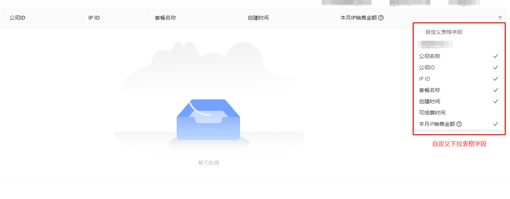

# #说明

>代码中使用到了`mobx`,其实如果只要部分功能,可以不使用`mobx`,但主要此处列出可以有借鉴效果

# 一、调用

>基本用法与正常antd的table一摸一样,只是多了几个个性化属性,可以满足个性化需求
>
>```jsx
>import React, { FC, useEffect } from 'react';
>import { observer } from 'mobx-react';
>import Store from '../store';
>import { Table } from 'antd';
>import columns from './columns';
>import style from '../style.scss';
>import { MyEmpty,MyTable } from '~/components';
>
>interface IProps {
>store: Store;
>}
>
>const PageTable: FC<IProps> = (props) => {
>const {
>source: { tableList, pageConfig, loading },
>getTableList,
>handleChangeTable,
>} = props.store;
>useEffect(() => {
>getTableList();
>}, []);
>
>return (
><div className={style.tableContainer}>
> <MyTable
>   scroll={{ x: 600, y: 'calc(100% - 72px)' }}
>   rowKey="hongjilin"
>   showId={false}
>   columns={columns(props.store)}
>   loading={loading}
>   dataSource={tableList}
>   pagination={pageConfig}
>   onChange={handleChangeTable}
>   locale={{
>     emptyText: <MyEmpty />, //此处调用的是,如果为空组件
>   }}
> />
></div>
>);
>};
>export default (PageTable);
>```

# 二、运行效果

>
>

# 三、封装

## Ⅰ-SCSS文件

>```scss
>//table.scss
>.tableWrapper {
>  :global {
>    .ant-table-row-expand-icon {
>      &::before {
>        top: 7px !important;
>        right: 2px !important;
>        left: 3px !important;
>        height: 2px !important;
>      }
>      &::after {
>        top: 3px !important;
>        bottom: 2px !important;
>        left: 7px !important;
>        width: 2px !important;
>      }
>    }
>    .react-resizable {
>      position: relative;
>      background-clip: padding-box;
>    }
>
>    .react-resizable-handle {
>      position: absolute;
>      right: 0px;
>      bottom: 0;
>      z-index: 1;
>      width: 5px;
>      height: 100%;
>      cursor: col-resize;
>    }
>  }
>}
>
>.filterBody {
>  width: 240px;
>  .filterTitle {
>    padding: 8px 32px;
>  }
>  .filterItem {
>    padding: 0px 15px;
>    width: 100%;
>    height: 100%;
>    display: flex;
>    align-items: center;
>    justify-content: space-between;
>    cursor: pointer;
>    color: #353535;
>    .filterText {
>      height: 30px;
>      line-height: 30px;
>    }
>    &.cursorItem {
>      cursor: not-allowed;
>    }
>  }
>  .filterItem:hover {
>    background: #f1f1f1;
>    color: rgba(53, 105, 253, 1);
>    border-radius: 2px;
>  }
>  .line {
>    width: 18px;
>    height: 1px;
>    background-color: #e8e8e8;
>    margin: 10px 16px;
>  }
>}
>
>```

## Ⅱ-resizable-title.tsx

>此处为可拖拽表格组件
>
>```jsx
>import React, { useLayoutEffect, useRef } from 'react';
>import { Resizable } from 'react-resizable';
>
>const ResizableTitle = (props) => {
>  const { onResize, width, ...restProps } = props;
>  const thRef = useRef<any>();
>
>  return (
>    <Resizable
>      width={width || thRef.current?.offsetWidth || 100}
>      height={0}
>      handle={
>        <span
>          className="react-resizable-handle"
>          onClick={(e) => {
>            e.stopPropagation();
>          }}
>        />
>      }
>      onResize={onResize}
>      draggableOpts={{ enableUserSelectHack: false }}
>    >
>      <th ref={thRef} {...restProps} />
>    </Resizable>
>  );
>};
>
>export default ResizableTitle;
>
>```

## Ⅲ-table.tsx

>```jsx
>import React, {
>  useCallback,
>  useEffect,
>  useMemo,
>  useRef,
>  useState,
>} from 'react';
>import { Table, TableProps } from 'antd';
>import { CheckOutlined } from '@ant-design/icons';
>import { inject, observer } from 'mobx-react';
>import style from './table.scss';
>import ResizableTitle from './resizable-title';
>import { ColumnsType } from 'antd/lib/table';
>
>interface SuperTableProps<RecordType> extends TableProps<RecordType> {
>  showId?: boolean;
>  //是否显示筛选自定义列表图标
>  showColumnFilter?: boolean;
>  menuStore?: any;
>  userStore?: any;
>  //首列ID是否浮动定位,传入为字符串类型,不传则为空不浮动
>  fixedType?: String | undefined;
>  //首列ID列的宽度
>  idWidth?: Number | undefined;
>  //是否需要默认渲染ID列-->true:隐藏
>  hidderIDColumns?: boolean;
>}
>
>function MyTable<RecordType extends object = any>(
>  props: SuperTableProps<RecordType>
>) {
>  const TABLE_CONFIG_KEY = `TABLE_COLUMNS_CONFIGS_${props.userStore.user.name}`;
>  const { showColumnFilter = true } = props;
>  const [hiddenColumns, setHiddenColumns] = useState([]);
>  const [columns, setColumns] = useState([]);
>  const [sorterColumn, setSorterColumn] = useState();
>  const handleResizeRef = useRef<Function>();
>
>  const [pagiConfig, setPagiConfig] = useState({});
>
>  useEffect(() => {
>    /**
>     * 初次进入页面时，从 localStorage 中读取数据，初始化 hiddenColumns
>     */
>    const oldTableColumnsConfigs = JSON.parse(
>      localStorage.getItem(TABLE_CONFIG_KEY)
>    );
>    if (!oldTableColumnsConfigs) {
>      return;
>    }
>
>    const oldHiddenColumns = oldTableColumnsConfigs[props.menuStore.activeKey];
>    if (oldHiddenColumns) {
>      setHiddenColumns(oldHiddenColumns);
>    }
>  }, [props.menuStore.activeKey, setHiddenColumns]);
>
>  handleResizeRef.current =
>    (index) =>
>      (e, { size }) => {
>        const nextColumns = [...columns];
>        nextColumns[index] = {
>          ...nextColumns[index],
>          width: size.width,
>        };
>        setColumns(nextColumns);
>      };
>
>  useEffect(() => {
>    const { pagination = {}, filters, sorter, otherParams } = pagiConfig;
>    if (pagination?.current > 1 && props?.dataSource?.length === 0) {
>      // 删除了最后一条数据应该返回上一页
>      let newPagi = {
>        ...pagination,
>        current: pagination.current - 1,
>      };
>      handleTableChange(newPagi, filters, sorter, ...otherParams);
>    }
>  }, [props?.dataSource?.length]);
>
>  useEffect(() => {
>    const { showId = true } = props;
>    let newColumns =
>      props.columns ||
>      React.Children.map(props.children, (child: any) => child?.props);
>    const hasIdField = newColumns.some(
>      (col) => col.dataIndex?.toLowerCase() === 'id'
>    );
>
>    if (!hasIdField && showId) {
>      //不传或者传入为false时,为不隐藏ID列
>      if (!props?.hidderIDColumns)
>        newColumns.unshift({
>          title: 'ID',
>          dataIndex: 'id',
>          //首列id宽度,如果不传入则默认150
>          width: props?.idWidth || 150,
>          //首列ID是否浮动定位,传入为字符串类型,不传则为空
>          fixed: props?.fixedType,
>        });
>    }
>
>    newColumns = newColumns.map((col, index) => ({
>      ...col,
>      onHeaderCell: (column) => ({
>        width: column.width,
>        onResize: handleResizeRef.current(index),
>      }),
>    }));
>    setColumns(newColumns);
>  }, [props.columns, props.children, handleResizeRef]);
>
>  const filteredColumns = useMemo(() => {
>    //此处根据传入数组
>    function applySorterToColumns(columns: ColumnsType) {
>      return columns.map((item) => {
>        if ('sorter' in item) {
>          return {
>            ...item,
>            key: item.key || item.dataIndex,
>            sortOrder:
>              sorterColumn?.field == item.dataIndex && sorterColumn?.order,
>          };
>        }
>
>        return {
>          ...item,
>          key: item.key || item.dataIndex,
>          isCustomSorter: true,
>          // sorter: (a, b) => {
>          //   return a[item.dataIndex] - b[item.dataIndex];
>          // },
>          // sortOrder:
>          //   sorterColumn?.field == item.dataIndex && sorterColumn?.order,
>        };
>      });
>    }
>
>    const filterColumns = columns.filter(
>      (columns) => !hiddenColumns.includes(columns.dataIndex)
>    );
>    const lastColumn = filterColumns[filterColumns.length - 1];
>    filterColumns[filterColumns.length - 1] = {
>      ...lastColumn,
>      filterDropdown: showColumnFilter
>        ? (...params) => {
>          if (lastColumn.filterDropdown) {
>            return lastColumn.filterDropdown(...params);
>          } else {
>            return filterDropdown(...params);
>          }
>        }
>        : undefined,
>    };
>    //此行控制列表为部筛选图标
>    return applySorterToColumns(filterColumns);
>  }, [columns, hiddenColumns, sorterColumn]);
>
>  function setTableField(dataIndex) {
>    let newHiddenColumns = [...hiddenColumns];
>    if (hiddenColumns.includes(dataIndex)) {
>      newHiddenColumns = hiddenColumns.filter((item) => item !== dataIndex);
>    } else {
>      newHiddenColumns = [...hiddenColumns, dataIndex];
>    }
>    //判断是否赋值
>    if (
>      columns.some((value) => value.title == '操作') &&
>      columns.length - 1 == newHiddenColumns.length
>    ) {
>      return;
>    }
>    if (columns.length == newHiddenColumns.length) {
>      return;
>    }
>    setHiddenColumns(newHiddenColumns);
>    if (!localStorage.getItem(TABLE_CONFIG_KEY)) {
>      localStorage.setItem(
>        TABLE_CONFIG_KEY,
>        JSON.stringify({
>          [props.menuStore.activeKey]: newHiddenColumns,
>        })
>      );
>    } else {
>      const oldTableColumnsConfigs = JSON.parse(
>        localStorage.getItem(TABLE_CONFIG_KEY)
>      );
>      localStorage.setItem(
>        TABLE_CONFIG_KEY,
>        JSON.stringify({
>          ...oldTableColumnsConfigs,
>          [props.menuStore.activeKey]: newHiddenColumns,
>        })
>      );
>    }
>  }
>
>  function filterDropdown(...params) {
>    return (
>      <div className={style.filterBody}>
>        <div className={style.filterTitle}>自定义表格字段</div>
>
>        {columns?.map((column, index) => {
>          //不将`操作`放入自定义下拉框中--->暂时将最后一列隐藏,后续再改
>          if (columns?.length - 1 != index || column?.title != '操作')
>            return (
>              <div
>                key={index}
>                className={style.filterItem}
>                onClick={() => setTableField(column.dataIndex)}
>              >
>                <div className={style.filterText}>{column.title}</div>
>                {!hiddenColumns.includes(column.dataIndex) && <CheckOutlined />}
>              </div>
>            );
>        })}
>      </div>
>    );
>  }
>
>  function handleTableChange(pagination, filters, sorter, ...otherParams) {
>    setPagiConfig({ pagination, filters, sorter, otherParams });
>    console.log(sorter, 'sorter');
>
>    setSorterColumn({ field: sorter?.field, order: sorter?.order });
>
>    /**
>     * 前端排序的字段，在 onChange 时清空 sorter
>     * 避免外部捕获 sorter 后传给接口报错
>     */
>    if (sorter?.column?.isCustomSorter) {
>      sorter.field = '';
>      sorter.order = '';
>    }
>
>    if (props.onChange) {
>      props.onChange(pagination, filters, sorter, ...otherParams);
>    }
>  }
>  // debugger
>  return (
>    <Table
>      {...props}
>      className={style.tableWrapper}
>      columns={filteredColumns}
>      onChange={handleTableChange}
>      components={{
>        header: {
>          cell: ResizableTitle,
>        },
>        ...(props.components || {}),
>      }}
>    />
>  );
>}
>
>export default inject('menuStore', 'userStore')(observer(MyTable));
>```

