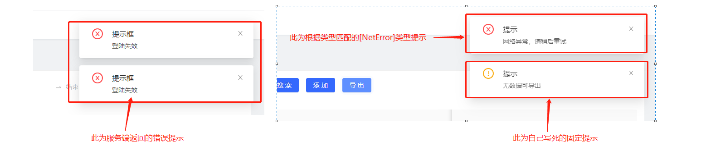

# #说明

>[antd原生Notification通知提醒框地址](https://ant.design/components/notification-cn/)
>
>此组件为二次封装[`antd原生Notification通知提醒框`],方便项目使用.也能起到一定的借鉴与记录作用

# Ⅰ-封装的组件代码

>```ts
>import { notification } from 'antd';
>//此处根据自己需求定义,也可以不进行匹配
>const  NotificationType= {
>    NetError: -1,
>    ServerError: -2,
>    OtherError: -3,
>  }
>
>interface NotificationConfig {
>  msg?;
>  duration?: number;
>}
>
>const HongNotification = {
>  //配置默认[config],此处可修改
>  defaultConfig: () => ({
>    message: '提示框',
>    duration: 2, //默认自动关闭延时，单位秒
>  }),
>  // 二次确认
>  base: (type, beforeConfig) => {
>    let config = beforeConfig;
>    //当传入的提示内容为空,提示写死的内容
>    if (config.msg === '') {
>      config = {
>        msg: '请稍候重试',
>      };
>    }
>    config.description = config.msg;
>    delete config.msg;
>
>    notification[type](
>      { ...HongNotification.defaultConfig(), ...config }
>    );
>  },
>  success: (config: NotificationConfig = {}) => {
>    if (!config.msg) {
>      config.msg = ''
>    }
>    HongNotification.base('success', config);
>  },
>  info: config => {
>    HongNotification.base('info', config);
>  },
>  warning: config => {
>    HongNotification.base('warning', config);
>  },
>  error: config => {
>    console.log(config);
>    // 传入的错误信息为-1 固定都是提示网络问题
>    if (config.msg == NotificationType.NetError) {
>      config.msg = '网络异常，请检查网络环境后重试';
>     //传入为-2,提示为服务器繁忙，请稍后重试错误 
>    } else if (config.msg == NotificationType.ServerError) {
>      config.msg = '服务器繁忙，请稍后重试';
>      //传入为-3,其他某种错误提示[可以自己定]
>    } else if (config.msg == NotificationType.OtherError) {
>      config.msg = '请稍候重试'
>    }
>    //调用二次确认函数
>    HongNotification.base('error', config);
>    //,如果不需要写死的数据,这样调用即可
>    //  HongNotification.base('error', {{msg:"努力学习的汪!!"}});
>  },
>  open: config => {
>    HongNotification.base('open', config);
>  },
>};
>
>export default HongNotification;
>
>```

# Ⅱ-调用场景

>```tsx
>------------------  提示写死的数据方式:具体效果看下方[实现效果]  --------------------------;
>//此为自己写死的固定提示
> HongNotification.warning({ msg: '无数据可导出' });
>
>// [res?.message]为服务端传来的,
>//如果其值匹配代码中[NotificationType],则提示相应写死的提示内容 -->如下方的网络异常
>//如果没匹配上,直接显示服务端给的msg
> HongNotification.error({ msg: res?.message });
>                                             
>------------------- 具体场景示例代码  ----------------------------------------------- ;                        
>  getData = async (params) => {
>    try {
>      //当你进行请求时-->[HTTP]泛指如axios ajax等请求  
>   	 const res =await  HTTP.get('/api/请求的接口',{params})
>      if (res.code == 200 )  this.datas = res?.data;
>      //如果服务端返回的状态码不是[200]则将其返回的错误信息以提示框显示  
>      else  HongNotification.error({ msg: res?.message });
>    } catch (error) {
>      HongNotification.error({ msg: error });//如果发生异常,将异常信息捕捉并传入提示框
>    } finally {
>      ....
>    }
>  };
>```

# Ⅲ-实现效果

>
>
>